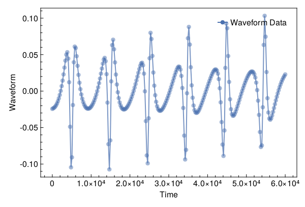
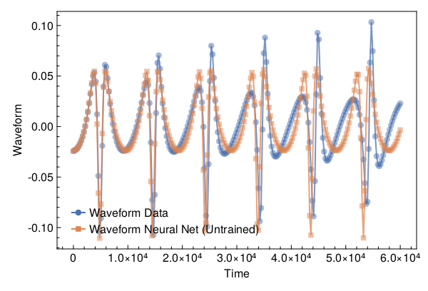
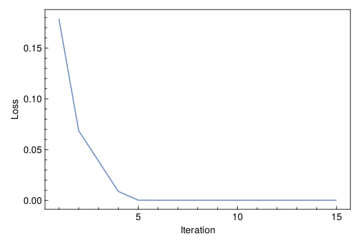
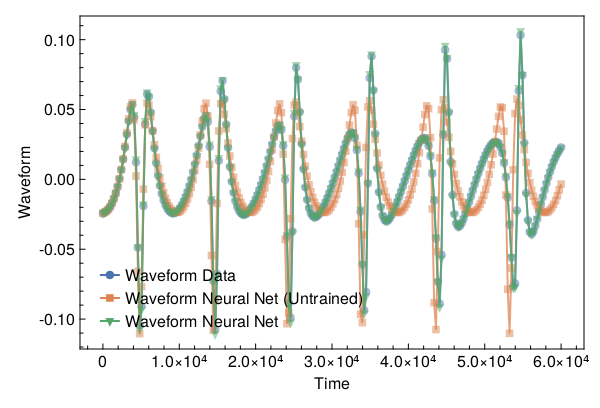

<a id='Training-a-Neural-ODE-to-Model-Gravitational-Waveforms'></a>

# Training a Neural ODE to Model Gravitational Waveforms


This code is adapted from [Astroinformatics/ScientificMachineLearning](https://github.com/Astroinformatics/ScientificMachineLearning/blob/c93aac3a460d70b4cce98836b677fd9b732e94b7/neuralode_gw.ipynb)


The code has been minimally adapted from [Keith et. al. 2021](https://arxiv.org/abs/2102.12695) which originally used Flux.jl


<a id='Package-Imports'></a>

## Package Imports


```julia
using Lux, ComponentArrays, LineSearches, LuxAMDGPU, LuxCUDA, OrdinaryDiffEq,
    Optimization, OptimizationOptimJL, Random, SciMLSensitivity
using CairoMakie, MakiePublication
CUDA.allowscalar(false)
```


<a id='Define-some-Utility-Functions'></a>

## Define some Utility Functions


::: tip


This section can be skipped. It defines functions to simulate the model, however, from a scientific machine learning perspective, isn't super relevant.


:::


We need a very crude 2-body path. Assume the 1-body motion is a newtonian 2-body position vector $r = r_1 - r_2$ and use Newtonian formulas to get $r_1$, $r_2$ (e.g. Theoretical Mechanics of Particles and Continua 4.3)


```julia
function one2two(path, m₁, m₂)
    M = m₁ + m₂
    r₁ = m₂ / M .* path
    r₂ = -m₁ / M .* path
    return r₁, r₂
end
```


```
one2two (generic function with 1 method)
```


Next we define a function to perform the change of variables: $(\chi(t),\phi(t)) \mapsto (x(t),y(t))$


```julia
@views function soln2orbit(soln, model_params=nothing)
    @assert size(soln, 1) ∈ [2, 4] "size(soln,1) must be either 2 or 4"

    if size(soln, 1) == 2
        χ = soln[1, :]
        ϕ = soln[2, :]

        @assert length(model_params)==3 "model_params must have length 3 when size(soln,2) = 2"
        p, M, e = model_params
    else
        χ = soln[1, :]
        ϕ = soln[2, :]
        p = soln[3, :]
        e = soln[4, :]
    end

    r = p ./ (1 .+ e .* cos.(χ))
    x = r .* cos.(ϕ)
    y = r .* sin.(ϕ)

    orbit = vcat(x', y')
    return orbit
end
```


```
soln2orbit (generic function with 2 methods)
```


This function uses second-order one-sided difference stencils at the endpoints; see https://doi.org/10.1090/S0025-5718-1988-0935077-0


```julia
function d_dt(v::AbstractVector, dt)
    a = -3 / 2 * v[1] + 2 * v[2] - 1 / 2 * v[3]
    b = (v[3:end] .- v[1:(end - 2)]) / 2
    c = 3 / 2 * v[end] - 2 * v[end - 1] + 1 / 2 * v[end - 2]
    return [a; b; c] / dt
end
```


```
d_dt (generic function with 1 method)
```


This function uses second-order one-sided difference stencils at the endpoints; see https://doi.org/10.1090/S0025-5718-1988-0935077-0


```julia
function d2_dt2(v::AbstractVector, dt)
    a = 2 * v[1] - 5 * v[2] + 4 * v[3] - v[4]
    b = v[1:(end - 2)] .- 2 * v[2:(end - 1)] .+ v[3:end]
    c = 2 * v[end] - 5 * v[end - 1] + 4 * v[end - 2] - v[end - 3]
    return [a; b; c] / (dt^2)
end
```


```
d2_dt2 (generic function with 1 method)
```


Now we define a function to compute the trace-free moment tensor from the orbit


```julia
function orbit2tensor(orbit, component, mass=1)
    x = orbit[1, :]
    y = orbit[2, :]

    Ixx = x .^ 2
    Iyy = y .^ 2
    Ixy = x .* y
    trace = Ixx .+ Iyy

    if component[1] == 1 && component[2] == 1
        tmp = Ixx .- trace ./ 3
    elseif component[1] == 2 && component[2] == 2
        tmp = Iyy .- trace ./ 3
    else
        tmp = Ixy
    end

    return mass .* tmp
end

function h_22_quadrupole_components(dt, orbit, component, mass=1)
    mtensor = orbit2tensor(orbit, component, mass)
    mtensor_ddot = d2_dt2(mtensor, dt)
    return 2 * mtensor_ddot
end

function h_22_quadrupole(dt, orbit, mass=1)
    h11 = h_22_quadrupole_components(dt, orbit, (1, 1), mass)
    h22 = h_22_quadrupole_components(dt, orbit, (2, 2), mass)
    h12 = h_22_quadrupole_components(dt, orbit, (1, 2), mass)
    return h11, h12, h22
end

function h_22_strain_one_body(dt::T, orbit) where {T}
    h11, h12, h22 = h_22_quadrupole(dt, orbit)

    h₊ = h11 - h22
    hₓ = T(2) * h12

    scaling_const = √(T(π) / 5)
    return scaling_const * h₊, -scaling_const * hₓ
end

function h_22_quadrupole_two_body(dt, orbit1, mass1, orbit2, mass2)
    h11_1, h12_1, h22_1 = h_22_quadrupole(dt, orbit1, mass1)
    h11_2, h12_2, h22_2 = h_22_quadrupole(dt, orbit2, mass2)
    h11 = h11_1 + h11_2
    h12 = h12_1 + h12_2
    h22 = h22_1 + h22_2
    return h11, h12, h22
end

function h_22_strain_two_body(dt::T, orbit1, mass1, orbit2, mass2) where {T}
    # compute (2,2) mode strain from orbits of BH 1 of mass1 and BH2 of mass 2

    @assert abs(mass1 + mass2 - 1.0)<1e-12 "Masses do not sum to unity"

    h11, h12, h22 = h_22_quadrupole_two_body(dt, orbit1, mass1, orbit2, mass2)

    h₊ = h11 - h22
    hₓ = T(2) * h12

    scaling_const = √(T(π) / 5)
    return scaling_const * h₊, -scaling_const * hₓ
end

function compute_waveform(dt::T, soln, mass_ratio, model_params=nothing) where {T}
    @assert mass_ratio≤1 "mass_ratio must be <= 1"
    @assert mass_ratio≥0 "mass_ratio must be non-negative"

    orbit = soln2orbit(soln, model_params)
    if mass_ratio > 0
        m₂ = inv(T(1) + mass_ratio)
        m₁ = mass_ratio * m₂

        orbit₁, orbit₂ = one2two(orbit, m₁, m₂)
        waveform = h_22_strain_two_body(dt, orbit1, mass1, orbit2, mass2)
    else
        waveform = h_22_strain_one_body(dt, orbit)
    end
    return waveform
end
```


```
compute_waveform (generic function with 2 methods)
```


<a id='Simulating-the-True-Model'></a>

## Simulating the True Model


`RelativisticOrbitModel` defines system of odes which describes motion of point like particle in schwarzschild background, uses


$$
u[1] = \chi
$$


$$
u[2] = \phi
$$


where, $p$, $M$, and $e$ are constants


```julia
function RelativisticOrbitModel(u, (p, M, e), t)
    χ, ϕ = u

    numer = (p - 2 - 2 * e * cos(χ)) * (1 + e * cos(χ))^2
    denom = sqrt((p - 2)^2 - 4 * e^2)

    χ̇ = numer * sqrt(p - 6 - 2 * e * cos(χ)) / (M * (p^2) * denom)
    ϕ̇ = numer / (M * (p^(3 / 2)) * denom)

    return [χ̇, ϕ̇]
end

mass_ratio = 0.0         # test particle
u0 = Float64[π, 0.0]     # initial conditions
datasize = 250
tspan = (0.0f0, 6.0f4)   # timespace for GW waveform
tsteps = range(tspan[1], tspan[2]; length=datasize)  # time at each timestep
dt_data = tsteps[2] - tsteps[1]
dt = 100.0
const ode_model_params = [100.0, 1.0, 0.5]; # p, M, e
```


Let's simulate the true model and plot the results using `OrdinaryDiffEq.jl`


```julia
prob = ODEProblem(RelativisticOrbitModel, u0, tspan, ode_model_params)
soln = Array(solve(prob, RK4(); saveat=tsteps, dt, adaptive=false))
waveform = first(compute_waveform(dt_data, soln, mass_ratio, ode_model_params))

fig = with_theme(theme_web()) do
    fig = Figure()
    ax = CairoMakie.Axis(fig[1, 1]; xlabel="Time", ylabel="Waveform")

    l = lines!(ax, tsteps, waveform; linewidth=2, alpha=0.75)
    s = scatter!(ax, tsteps, waveform; markershape=:circle, markeralpha=0.25, alpha=0.5)

    axislegend(ax, [[l, s]], ["Waveform Data"])

    return fig
end
```





<a id='Defiing-a-Neural-Network-Model'></a>

## Defiing a Neural Network Model


Next, we define the neural network model that takes 1 input (time) and has two outputs. We'll make a function `ODE_model` that takes the initial conditions, neural network parameters and a time as inputs and returns the derivatives.


It is typically never recommended to use globals but incase you do use them, make sure to mark them as `const`.


We will deviate from the standard Neural Network initialization and use `WeightInitializers.jl`,


```julia
const nn = Chain(Base.Fix1(broadcast, cos),
    Dense(1 => 32, cos; init_weight=truncated_normal(; std=1e-4)),
    Dense(32 => 32, cos; init_weight=truncated_normal(; std=1e-4)),
    Dense(32 => 2; init_weight=truncated_normal(; std=1e-4)))
ps, st = Lux.setup(MersenneTwister(), nn)
```


```
((layer_1 = NamedTuple(), layer_2 = (weight = Float32[6.396977f-5; 3.9120907f-5; 0.00010523416; 0.0001769109; -3.745628f-5; -8.138149f-5; 3.076014f-5; -4.251887f-5; 0.00016035013; -0.00013088972; 0.00013295171; -8.3578394f-5; -1.63314f-5; 0.0001133611; -7.2370654f-5; 0.00011722957; -7.264322f-6; -0.00015125942; 0.00011865064; 3.2282336f-5; -6.653947f-5; -4.4933284f-5; 2.0376f-6; -9.037567f-5; 3.361048f-5; -8.0108846f-5; -3.287015f-5; 8.606588f-5; 3.8844864f-5; -0.0001482548; -0.00015109312; -3.9717987f-5;;], bias = Float32[0.0; 0.0; 0.0; 0.0; 0.0; 0.0; 0.0; 0.0; 0.0; 0.0; 0.0; 0.0; 0.0; 0.0; 0.0; 0.0; 0.0; 0.0; 0.0; 0.0; 0.0; 0.0; 0.0; 0.0; 0.0; 0.0; 0.0; 0.0; 0.0; 0.0; 0.0; 0.0;;]), layer_3 = (weight = Float32[3.89734f-5 6.267338f-5 -8.352866f-5 -2.9177214f-5 5.0353792f-5 -3.508316f-5 0.00014060558 -0.00018102967 1.3793633f-5 4.1083298f-5 0.000117577074 3.7765352f-5 -0.00025229657 -0.00011110807 -1.6859698f-5 0.000118798715 -4.326197f-5 0.000104366605 0.00015077055 -7.056443f-5 -3.506441f-5 0.0001017123 -0.0001201497 -2.8861592f-5 0.00017456265 3.2172113f-5 -3.4916502f-5 -0.00022030025 -3.7583017f-5 2.8278382f-5 -4.149483f-5 8.321471f-5; -7.822508f-6 1.832579f-5 -3.2039658f-5 -0.00016306908 -2.526724f-5 7.7224584f-5 0.00011656351 -0.00015213096 2.5380139f-5 -0.00013933518 -0.00010088344 3.864487f-5 -6.6636065f-5 0.0001260422 0.000100601756 3.0448628f-5 -3.001595f-5 6.538516f-5 0.00021952616 -3.0949643f-5 0.00011654365 -2.1978592f-5 1.8604605f-5 8.4244486f-5 8.467554f-5 -0.00010625685 -5.097812f-6 -2.5009536f-5 -2.3607186f-5 8.9671434f-5 -9.1571565f-5 8.360967f-5; -4.303915f-5 -3.6342633f-5 -0.0002106554 -7.303581f-5 -0.00014175645 -0.00017250646 1.5554988f-5 -0.00014337411 -0.00016515591 0.00016861182 4.703494f-5 -0.00017358056 -0.00010490448 1.6020085f-5 -0.00010942982 5.537077f-5 6.1183437f-6 5.2898264f-5 3.8037808f-5 -8.4107574f-5 -9.985313f-5 0.0001251023 -9.595435f-5 7.511876f-6 -2.7385024f-5 -5.909204f-5 0.00011484618 -4.2213996f-5 1.0295607f-5 0.00010412788 -0.00022221876 8.896583f-5; -1.6747443f-5 8.2822946f-5 -0.00014641676 3.1100175f-5 -8.03482f-5 -0.0001332856 9.680388f-5 9.6550275f-6 3.7312017f-5 -5.2156116f-5 -2.0501601f-7 -0.00015757902 0.00012520287 -6.3505504f-5 -1.33757285f-5 -2.5495632f-5 -1.8755516f-5 -0.00011093507 0.0001991905 1.067004f-5 -0.00013366369 0.00017688518 0.00014544044 -5.0896855f-5 4.986804f-5 8.277302f-5 9.525109f-5 -2.678915f-5 1.0786078f-5 -0.00011535728 -0.000112140675 8.6651715f-5; -0.00018244032 0.00015480623 3.100463f-5 3.1054074f-5 -1.18283515f-5 0.00015293353 0.00024488493 -6.477055f-5 -0.00021742393 -5.715812f-5 0.000111745205 3.9416574f-7 3.958148f-5 0.00016149101 2.1381713f-5 0.0001842032 1.3993215f-5 -1.2367367f-5 4.1645635f-5 7.4468626f-5 7.925042f-5 1.047935f-5 0.00014699058 4.3971555f-5 1.521975f-6 9.130472f-5 -8.9837726f-5 -5.1553052f-5 -5.862961f-5 -2.8476454f-5 3.3651868f-5 2.0973535f-5; -0.0001359678 -5.539485f-6 -0.00011553754 3.207882f-5 0.0001642928 0.00012048456 1.8121413f-5 -7.2477837f-6 0.00010014878 -8.9470064f-5 -0.00012066407 -1.9889912f-5 0.00020280085 -3.808709f-5 9.260134f-5 8.566779f-6 -0.00023431184 -4.9173435f-5 -1.4043097f-5 3.1859723f-5 8.5997955f-5 -7.63863f-5 0.000128806 0.00015127256 0.00015905578 -0.00015652324 -0.000111474365 1.2203672f-5 5.5906374f-5 -3.0042022f-5 1.2699312f-6 -6.770515f-5; -6.012214f-5 -0.00020658824 5.432479f-5 -9.33136f-5 -1.6398359f-5 -0.0001485457 0.00023143945 -9.6365744f-5 0.00015926066 2.7332288f-5 8.494849f-5 0.00023064628 -5.415299f-5 6.3271524f-5 3.7318106f-5 0.00012043635 6.045248f-5 -4.1501575f-5 5.4390952f-5 7.170985f-5 1.438971f-5 -3.78072f-5 7.311039f-5 -0.00013398824 6.4054235f-5 0.00010143666 -0.0001907012 3.656432f-5 -4.450507f-5 8.8189896f-5 -0.00018788128 0.000111411704; 9.218082f-5 -0.00019075703 7.773294f-6 -3.474061f-5 -8.662649f-5 -7.402015f-5 -5.937568f-5 9.624625f-5 4.8998765f-5 2.165098f-5 -8.116709f-5 -3.7086713f-5 6.1220024f-5 -1.2729923f-5 -0.0001504827 0.00014810333 -0.0001287708 0.00011989407 2.7787895f-5 0.00014517344 -7.153171f-5 6.1778774f-5 9.718704f-6 1.781297f-5 -2.4978737f-5 -8.552323f-6 0.00017008018 -2.3614992f-5 2.4752308f-5 -0.00010141396 -5.043773f-5 2.68025f-5; -3.4311404f-6 -7.740775f-5 -4.47216f-5 -0.00022372977 4.4253742f-5 -2.2029044f-5 -0.00011747044 -9.305377f-5 6.432223f-5 -7.46934f-5 2.9552643f-8 5.6098692f-5 -0.00014704932 -0.00017675066 -0.00010520885 -4.4294444f-5 0.00013511968 8.3218394f-5 -0.00012934544 1.9477891f-5 -1.04326f-5 5.1734904f-5 -3.9036888f-5 -0.000107755455 -0.00022413055 6.4305474f-5 1.7200247f-6 2.9092664f-5 2.133763f-5 -4.200346f-5 -6.09021f-5 -7.593168f-5; -8.87357f-6 5.164655f-6 1.1696803f-5 -5.6232027f-5 4.3004206f-5 0.00018881843 -3.4196586f-5 -6.9418726f-5 -8.689441f-5 7.550148f-5 9.8292716f-5 -7.956046f-5 -5.207496f-5 0.00010188197 -6.547373f-5 2.8057475f-6 3.809914f-5 0.00013075746 -5.192168f-5 9.978532f-5 -1.3727269f-5 7.6402335f-5 -1.1240933f-5 -0.00017031445 5.5643603f-5 -0.00012378964 -3.199552f-6 8.824201f-5 0.0001337428 3.615682f-5 -0.00015131517 7.367696f-5; 1.5111777f-5 5.8548405f-5 5.3595173f-5 -0.00020626644 -9.701441f-6 -4.45147f-5 3.6473477f-6 -3.1537755f-5 -8.5675274f-5 2.876276f-5 -8.199594f-6 -8.009287f-5 1.4271213f-6 0.00016669334 -0.00015034294 -2.2496382f-5 -0.00012933965 0.00023207226 -0.00017512402 -0.00020058698 9.710899f-6 -0.000106903535 -9.5032185f-5 -0.00012242008 -1.805875f-5 0.00011736791 -8.215797f-5 -0.00014021457 6.651377f-6 -2.2646977f-5 0.000120380646 -3.5867895f-5; 0.0002074828 -0.00020533826 -0.00012414866 -7.0485796f-5 4.7105546f-5 -0.00012144717 2.0997912f-5 3.2401604f-5 -4.485043f-5 8.637264f-5 -4.470654f-5 -3.2644468f-5 8.3307394f-5 -0.00017111223 7.639854f-5 9.815923f-6 3.8720867f-5 -7.6978016f-5 -0.00011419858 -0.00015423191 2.1409503f-5 -0.000117318064 3.2216612f-5 -0.00011367013 -3.058553f-5 0.00010807121 -4.0794333f-5 -6.0034094f-5 -8.245138f-5 -0.00024031574 6.226189f-5 0.00023904743; -9.774218f-6 9.837211f-6 -0.00013498007 0.00012564196 -0.00011619413 -0.00010613307 -7.268026f-5 -8.54664f-5 3.997653f-5 8.72502f-5 -2.677258f-5 0.00013571017 0.00019893004 0.00015067396 -7.0234724f-5 -6.69129f-5 -7.1955015f-5 -0.00014702095 -5.951995f-5 -6.597784f-5 0.00015600958 1.7468832f-5 -2.9483359f-5 -2.184597f-5 -0.00010174584 9.663697f-5 -5.617627f-6 -8.629352f-5 4.5315468f-5 9.6350006f-5 0.00010982629 -6.04443f-5; 7.5074764f-5 0.000113184076 5.7435165f-5 -9.10435f-5 -3.173029f-5 8.885235f-5 -1.6986432f-5 -6.539148f-5 0.00022214012 1.2381369f-5 3.8764738f-5 6.6252825f-5 1.8315124f-5 -2.880764f-5 -9.948373f-5 -9.34417f-5 8.299925f-5 6.266422f-5 7.007593f-5 -8.061025f-6 -4.0959f-5 0.00014565581 6.4944456f-5 -3.899023f-5 0.00010705743 -0.00022187245 0.0001284507 -0.00011403864 0.00018004734 -0.000126326 8.828776f-5 -0.00014462441; 7.4506795f-5 -8.5390784f-5 4.190694f-5 -1.1413225f-5 -8.4565174f-5 -0.00011225764 0.00010792713 -6.504308f-5 2.658494f-5 1.1215403f-5 -5.7711346f-5 -0.00018317786 9.458619f-6 -0.00015150884 4.6012796f-5 3.2167896f-5 -0.00010370206 -0.00019733876 0.00012432865 0.00017074047 0.0001473764 5.2182513f-5 0.000108638065 4.736225f-5 -4.1628104f-5 0.0001355308 4.0464097f-6 0.0001047853 -4.3401624f-6 0.00016478865 -0.00011939727 0.00021105167; -1.3396713f-5 5.3616357f-5 5.5770804f-5 -3.16837f-6 2.908755f-5 8.838271f-5 1.1525358f-5 -4.037253f-5 -4.0600346f-5 6.5136664f-5 3.6493984f-5 1.065826f-5 -1.8139564f-6 -2.052759f-5 -8.299095f-5 -8.936275f-5 -1.15372995f-5 4.812868f-5 0.0001120734 2.817648f-5 5.5078417f-5 6.550687f-5 6.5027314f-5 0.00011165844 -7.720421f-5 -0.00014490697 -7.4181764f-5 -0.00016479586 -0.0001586534 -8.451443f-5 0.0001353385 -3.9223933f-6; 0.00012377794 -0.00017979057 0.00013848118 1.697558f-5 1.835317f-5 0.00018303648 7.4716627f-6 0.00011058164 -0.000109851906 4.0425282f-5 -1.4650801f-5 6.931629f-5 5.2436055f-5 -1.8682382f-5 1.4723475f-5 3.646607f-5 8.25617f-5 -0.00010435625 9.7344484f-5 3.9334253f-5 2.430881f-5 -0.00017951013 0.000190143 8.804244f-5 1.0329252f-5 3.0263865f-7 -6.050145f-5 -7.477716f-6 -1.7547269f-5 -4.963331f-5 9.900445f-5 -3.997197f-5; 8.546585f-5 4.0293573f-5 -2.4187716f-6 -0.00014033493 4.5863468f-5 0.0001538745 2.3806459f-5 -4.9907936f-5 4.0023177f-5 -0.00015475812 0.00016071934 -5.6775105f-5 -0.000148335 -2.9128982f-5 4.4765526f-5 -1.5558042f-5 5.003178f-5 -6.7159686f-5 -0.00016488224 2.8341708f-5 -0.00014250794 -0.00012795719 -6.570527f-5 0.000118025855 -0.00021230595 5.907809f-5 7.689313f-5 -5.0805105f-5 8.033364f-5 -0.00014608294 -5.3398544f-5 -0.00022235839; -4.0507333f-5 -4.2158146f-5 -5.7203477f-5 0.00014713888 -7.6449476f-5 5.3846823f-5 0.00021426826 -0.00012786753 -1.0019577f-5 -0.000210595 -0.00016258414 -0.00011430246 -5.8709542f-5 0.00010397713 -1.9352163f-5 2.406694f-5 -3.767356f-5 0.00016401942 -1.44743435f-5 -0.00013432144 2.7222002f-5 -1.5336807f-5 -1.9807414f-5 -7.5561655f-7 2.5859802f-6 -4.3082127f-5 5.152466f-5 0.00013150857 0.00018624034 -3.4520002f-5 9.3624636f-5 4.580037f-5; 2.128545f-5 1.8197237f-5 0.00014315623 -5.165461f-5 0.00016476322 -0.00011848341 0.00016212101 -7.0423484f-5 -0.00010139148 -0.0001377762 -6.5894055f-5 -4.253346f-5 4.388902f-5 -1.15888f-5 1.719586f-5 -0.00013462144 -1.3111391f-5 -3.5410808f-6 0.00017711819 -9.433104f-5 -1.5939971f-5 -3.1362317f-6 2.9782783f-5 9.487713f-5 -3.5768036f-7 0.00020308408 -1.4109219f-5 -5.9180587f-5 7.908383f-6 0.00010771013 5.4892465f-5 3.5344336f-5; 1.4924788f-6 -0.00013132667 -0.00013863678 -2.4247414f-5 -0.00012625621 8.8915556f-5 1.1966722f-5 3.9935945f-5 8.5541564f-5 0.00014787036 -5.6204517f-5 4.692099f-5 -3.229486f-5 0.0001353807 6.8841364f-5 5.602848f-5 -0.00018256229 -0.00020838612 -4.0046016f-6 1.1464597f-5 1.1231852f-5 -2.0535128f-5 -1.9410836f-5 5.7165755f-5 -2.2188822f-5 0.000111288005 -4.291969f-5 6.0949013f-5 0.00010380669 5.2959836f-6 6.300338f-5 9.827602f-6; 9.4920484f-5 0.000102856684 -0.00020193915 0.00021449968 0.00015543019 -6.093556f-6 -0.00012505938 -5.7743786f-5 -0.00014160831 -0.00017419213 9.334273f-6 -1.01602855f-5 -1.6668417f-5 3.3221928f-5 0.00015290284 -0.00014070538 6.7262576f-5 1.8103103f-6 -2.0614727f-5 -0.00015277139 0.000133534 -4.2965632f-5 -1.4431708f-5 -4.9285452f-5 -7.218526f-5 1.5602898f-5 0.00012967232 -8.021478f-5 -0.00020803133 1.7109436f-5 -0.00012506115 -7.0775044f-5; -0.0001571336 1.3082036f-5 5.2323187f-5 4.1069055f-5 -3.222552f-5 -4.2279666f-5 0.00017740764 -7.069511f-5 8.2547376f-5 5.9953676f-5 2.068231f-5 0.00010099414 -0.00018186134 0.00012894168 5.8221063f-5 -0.000115600415 -0.00011371376 -0.00011277085 -6.753648f-5 2.0347083f-5 0.00023446747 -0.00018344758 5.8561065f-5 0.00012348028 0.00010179003 3.1771084f-5 0.00025848625 0.00020174005 1.5563275f-5 -4.9817358f-5 -2.7105985f-5 -7.989128f-5; -0.000116927906 7.54347f-5 -9.4758856f-5 1.1688529f-5 -4.840455f-5 -0.00010299863 -1.4135084f-5 -4.394134f-5 5.85028f-5 -2.2666567f-5 1.8372406f-5 -0.0002044045 -0.00020177437 -0.00010096911 8.066147f-5 0.00017454689 1.5612184f-5 2.2949764f-5 2.1221449f-5 -7.602101f-5 0.00026806985 -3.9802715f-5 0.00015974653 -0.00023949204 -4.4826706f-5 4.99141f-5 0.000106291955 -7.4366044f-6 -0.0001319334 3.4766097f-5 7.430284f-5 0.00010178857; 5.020128f-5 1.3652043f-5 -2.087476f-5 -2.3273022f-5 -0.00011180542 6.789215f-5 3.4929904f-5 2.1793643f-5 -6.420035f-5 8.0582395f-5 3.84311f-5 7.825762f-5 6.992944f-5 0.00013914879 0.00015687656 1.8969109f-5 3.80966f-5 0.00019687969 1.6138198f-5 -7.2404364f-5 -4.588116f-5 -6.908595f-5 8.7979235f-5 0.00011804577 -7.253087f-5 4.907418f-5 1.5671441f-5 0.00014424595 2.1143156f-5 -0.00013005389 5.044645f-5 5.6870344f-5; -0.00022207781 -4.1571835f-5 -5.5383483f-5 -0.00013716453 1.9384499f-5 2.5564228f-5 -3.877666f-5 0.000114815215 4.5755924f-6 0.00011971896 8.324674f-5 -0.00014286453 0.00010589469 2.4083398f-5 -3.6435926f-5 -4.8721668f-6 7.7514116f-5 0.00020733001 6.942865f-5 -1.0917065f-6 6.7229084f-5 1.3132329f-6 0.00010257188 -3.4788252f-5 -4.0350522f-5 2.1005886f-5 0.00014751419 -8.455104f-5 -6.621428f-5 0.00014122763 4.2720865f-5 8.13557f-5; 0.00011922229 -0.000112405396 -2.4233746f-6 -7.177393f-5 -9.702205f-5 -0.00014557075 -0.000110100926 1.780878f-5 -8.368964f-7 6.077248f-5 -3.827952f-5 0.00012144548 -4.6163263f-5 -0.00023482564 6.4277556f-5 -0.0001504573 -1.48657355f-5 4.548719f-5 -3.453821f-5 7.760328f-5 -3.5134264f-5 4.6760797f-5 0.00021918425 -7.011738f-5 -0.0002136326 2.2370501f-5 -6.2407045f-5 5.0796167f-5 4.6194644f-5 -4.4447865f-5 -3.748872f-5 7.767119f-6; 2.6088574f-5 6.544437f-5 0.00016751431 6.917695f-5 -7.3631945f-6 -4.798758f-5 0.00012960592 5.7831538f-5 -2.0871768f-5 -4.797206f-5 -5.6493514f-6 -0.00016442222 6.550765f-5 -6.0456066f-5 -0.0001214896 2.0720592f-5 2.3324481f-5 8.138882f-6 -0.00019275397 2.7317275f-5 0.000120409575 -0.00020787164 -2.32154f-5 -1.250875f-5 -7.481102f-6 0.000110757326 1.1414549f-5 -7.4888136f-5 5.4113723f-5 7.686137f-5 -4.345417f-5 -0.0001470472; -3.3072956f-5 8.186744f-5 -2.5132045f-5 -5.298118f-5 -0.00016868554 5.9563405f-5 6.7827928f-6 4.6289115f-5 -6.0630788f-5 -0.00012332633 3.3111588f-5 5.494611f-5 0.00010320287 -3.7620055f-5 -5.2093783f-5 6.777108f-5 1.610611f-5 0.0001338539 -3.87019f-5 6.54446f-5 -6.879532f-5 -5.2012143f-5 -0.0001022926 0.00011497855 -0.00016170338 -0.00013167335 -2.8482988f-5 5.7636113f-5 0.00011191239 -5.358562f-5 7.726244f-5 -3.0171528f-5; -6.527515f-5 2.3124514f-5 6.9157772f-6 0.00014966713 0.00023869149 0.000107011016 7.438226f-5 -1.8844052f-5 -4.896622f-5 5.119296f-5 -5.267723f-5 -7.462699f-5 9.363631f-5 0.00014309507 4.67683f-5 -6.329299f-5 0.00019560975 -0.00015633857 0.00013814885 2.6786145f-6 -0.000110646375 8.8288544f-7 3.296658f-6 0.00015133075 4.2329273f-5 -0.00017613686 0.0002274386 -5.0571987f-5 -4.7305753f-6 -1.5912312f-5 2.4447178f-5 6.120388f-5; 6.780537f-5 0.00018423729 1.9710304f-5 8.478931f-7 0.00012420112 1.1732366f-5 -8.567001f-5 -3.1119558f-5 -8.678981f-5 2.1847714f-5 0.00010552468 -1.7359373f-5 -0.00013223987 6.561434f-5 -0.00013828198 -2.003887f-6 9.72699f-6 0.00014137545 6.649466f-5 2.4053745f-5 -0.00013876821 -0.00014026849 0.00014137659 1.0817366f-5 1.6955633f-5 7.473188f-5 -4.883808f-5 -4.3014563f-5 0.00022913516 8.3924024f-5 -0.00010446453 0.0001662958; -0.0001119442 -9.779496f-5 -0.0002246779 4.8295795f-5 -0.00025939557 0.00013214051 5.0248702f-5 -0.00011866206 -8.132641f-5 -8.039166f-5 -1.4459486f-6 0.00010712365 -0.00020273688 0.00011870224 0.00012877148 0.00011585031 8.895736f-5 -3.4575798f-5 8.380633f-5 -5.4828935f-5 -9.616532f-5 -5.2426145f-5 -6.395477f-5 -6.184815f-5 3.0174342f-5 -6.863016f-5 -7.0796887f-6 0.00012381875 0.00011010405 8.093821f-5 -8.6875545f-5 9.922474f-5], bias = Float32[0.0; 0.0; 0.0; 0.0; 0.0; 0.0; 0.0; 0.0; 0.0; 0.0; 0.0; 0.0; 0.0; 0.0; 0.0; 0.0; 0.0; 0.0; 0.0; 0.0; 0.0; 0.0; 0.0; 0.0; 0.0; 0.0; 0.0; 0.0; 0.0; 0.0; 0.0; 0.0;;]), layer_4 = (weight = Float32[0.000119228804 5.193464f-5 3.5762692f-5 -3.8056474f-5 -0.00012149785 0.00022138546 -5.552242f-5 5.3707565f-5 -1.1092426f-5 -1.9487545f-5 -2.6940577f-5 3.5291414f-5 -3.098544f-5 -0.0001254111 0.0003495855 1.8148266f-5 8.753094f-5 -9.0262314f-5 -0.00013759833 -0.00013677958 -5.5764843f-7 -5.622037f-5 -7.7585195f-5 -7.9511345f-5 -4.5720026f-6 7.636462f-5 -4.8909296f-5 -8.9056026f-5 2.3954806f-5 -2.7561402f-5 0.00018421772 5.3376734f-5; 4.5063727f-5 -2.0227542f-5 -2.941633f-5 -0.00024555984 -0.00020121942 -7.2873605f-5 -0.00017391637 -0.00010505223 -9.59267f-5 -4.939909f-5 1.6043572f-5 3.1340653f-5 -8.9668574f-5 -8.121765f-5 0.00021055796 -3.0729625f-5 -3.5663674f-5 0.00014174575 -2.6802716f-5 1.975162f-5 3.2901375f-5 5.9234673f-5 -7.268002f-5 -8.140576f-5 -2.4508736f-6 5.1790663f-5 -6.253721f-5 -1.4930546f-5 0.00017723175 1.5718815f-5 9.677949f-5 8.559221f-6], bias = Float32[0.0; 0.0;;])), (layer_1 = NamedTuple(), layer_2 = NamedTuple(), layer_3 = NamedTuple(), layer_4 = NamedTuple()))
```


Similar to most DL frameworks, Lux defaults to using `Float32`, however, in this case we need Float64


```julia
const params = ComponentArray{Float64}(ps)
```


```
ComponentVector{Float64}(layer_1 = Float64[], layer_2 = (weight = [6.39697682345286e-5; 3.9120906876632944e-5; 0.00010523416131036356; 0.00017691089306026697; -3.7456280551850796e-5; -8.138149132719263e-5; 3.076014036196284e-5; -4.251887003192678e-5; 0.00016035012959036976; -0.00013088971900288016; 0.0001329517108388245; -8.357839396921918e-5; -1.63313998200465e-5; 0.00011336110037518665; -7.237065437948331e-5; 0.00011722956696758047; -7.264321993716294e-6; -0.00015125941717997193; 0.00011865064152516425; 3.228233617846854e-5; -6.653946911683306e-5; -4.493328378885053e-5; 2.0376000975375064e-6; -9.037567360792309e-5; 3.361047856742516e-5; -8.01088463049382e-5; -3.2870149880182e-5; 8.606587653048337e-5; 3.884486432070844e-5; -0.00014825479593127966; -0.00015109311789274216; -3.9717986510368064e-5;;], bias = [0.0; 0.0; 0.0; 0.0; 0.0; 0.0; 0.0; 0.0; 0.0; 0.0; 0.0; 0.0; 0.0; 0.0; 0.0; 0.0; 0.0; 0.0; 0.0; 0.0; 0.0; 0.0; 0.0; 0.0; 0.0; 0.0; 0.0; 0.0; 0.0; 0.0; 0.0; 0.0;;]), layer_3 = (weight = [3.89734013879206e-5 6.267338176257908e-5 -8.352866279892623e-5 -2.9177213946240954e-5 5.035379217588343e-5 -3.5083161492366344e-5 0.00014060558169148862 -0.00018102966714650393 1.379363311571069e-5 4.108329812879674e-5 0.00011757707397919148 3.7765352317364886e-5 -0.0002522965660318732 -0.0001111080709961243 -1.685969800746534e-5 0.0001187987145385705 -4.326197085902095e-5 0.00010436660522827879 0.00015077054558787495 -7.056442700559273e-5 -3.506441134959459e-5 0.0001017122995108366 -0.00012014969979645684 -2.8861591999884695e-5 0.0001745626504998654 3.2172112696571276e-5 -3.4916502045234665e-5 -0.00022030025138519704 -3.758301681955345e-5 2.827838216035161e-5 -4.149482992943376e-5 8.321471250383183e-5; -7.822508450772148e-6 1.8325790733797476e-5 -3.2039657526183873e-5 -0.00016306908219121397 -2.5267239834647626e-5 7.722458394709975e-5 0.00011656351125566289 -0.00015213096048682928 2.5380139049957506e-5 -0.00013933518494013697 -0.00010088343697134405 3.864487007376738e-5 -6.663606473011896e-5 0.00012604219955392182 0.00010060175554826856 3.044862751266919e-5 -3.001594996021595e-5 6.53851602692157e-5 0.00021952616225462407 -3.094964267802425e-5 0.00011654364789137617 -2.1978592485538684e-5 1.8604605429572985e-5 8.424448606092483e-5 8.467554289381951e-5 -0.00010625684808474034 -5.097811936138896e-6 -2.500953632988967e-5 -2.3607186449225992e-5 8.967143367044628e-5 -9.15715645533055e-5 8.360967331100255e-5; -4.303914829506539e-5 -3.63426333933603e-5 -0.000210655402042903 -7.303580787265673e-5 -0.00014175644901115447 -0.00017250646487809718 1.5554987840005197e-5 -0.00014337411266751587 -0.00016515591414645314 0.00016861181939020753 4.7034940507728606e-5 -0.00017358055629301816 -0.0001049044803949073 1.6020085240597837e-5 -0.00010942982044070959 5.5370768677676097e-5 6.118343662819825e-6 5.2898263675160706e-5 3.80378078261856e-5 -8.410757436649874e-5 -9.985313226934522e-5 0.00012510230590123683 -9.59543467615731e-5 7.511875992349815e-6 -2.738502371357754e-5 -5.9092039009556174e-5 0.0001148461815319024 -4.2213996493956074e-5 1.0295607353327796e-5 0.00010412788105895743 -0.0002222187613369897 8.896583312889561e-5; -1.6747442714404315e-5 8.282294584205374e-5 -0.00014641675807069987 3.110017496510409e-5 -8.034820348257199e-5 -0.0001332856045337394 9.680388029664755e-5 9.655027497501578e-6 3.7312016502255574e-5 -5.2156115998513997e-5 -2.0501600772604434e-7 -0.0001575790229253471 0.00012520287418738008 -6.350550393108279e-5 -1.3375728485698346e-5 -2.5495632144156843e-5 -1.8755516066448763e-5 -0.00011093507055193186 0.00019919050100725144 1.0670039955584798e-5 -0.00013366369239520282 0.00017688517982605845 0.00014544044097419828 -5.089685510029085e-5 4.986803833162412e-5 8.277301822090521e-5 9.525108907837421e-5 -2.678915006981697e-5 1.0786077837110497e-5 -0.00011535728117451072 -0.00011214067490072921 8.665171480970457e-5; -0.00018244031525682658 0.00015480622823815793 3.100463072769344e-5 3.105407449766062e-5 -1.1828351489384659e-5 0.00015293352771550417 0.0002448849263601005 -6.477055285358801e-5 -0.00021742393437307328 -5.7158118579536676e-5 0.0001117452047765255 3.941657382711128e-7 3.958147863158956e-5 0.00016149101429618895 2.1381712940637954e-5 0.00018420320702716708 1.3993215361551847e-5 -1.2367367162369192e-5 4.1645635064924136e-5 7.44686258258298e-5 7.925042154965922e-5 1.0479349839442875e-5 0.00014699058374390006 4.397155498736538e-5 1.521975036666845e-6 9.130471880780533e-5 -8.983772568171844e-5 -5.155305188964121e-5 -5.862960824742913e-5 -2.8476453735493124e-5 3.3651867852313444e-5 2.097353535646107e-5; -0.00013596779899671674 -5.539484845940024e-6 -0.00011553754302440211 3.2078820368042216e-5 0.00016429279639851302 0.00012048456119373441 1.812141272239387e-5 -7.247783742059255e-6 0.00010014878353103995 -8.947006426751614e-5 -0.00012066407361999154 -1.9889912437065504e-5 0.00020280084572732449 -3.808709152508527e-5 9.26013381103985e-5 8.566778888052795e-6 -0.0002343118394492194 -4.917343540000729e-5 -1.4043096598470584e-5 3.185972309438512e-5 8.599795546615496e-5 -7.638629904249683e-5 0.00012880600115749985 0.00015127255755942315 0.00015905578038655221 -0.0001565232378197834 -0.00011147436453029513 1.2203671758470591e-5 5.590637374552898e-5 -3.004202153533697e-5 1.2699312037511845e-6 -6.770515028620139e-5; -6.012213998474181e-5 -0.00020658824359998107 5.4324791562976316e-5 -9.331360342912376e-5 -1.6398358638980426e-5 -0.00014854570326860994 0.0002314394514542073 -9.636574395699427e-5 0.0001592606568010524 2.7332287572789937e-5 8.494849316775799e-5 0.00023064628476276994 -5.4152991651790217e-5 6.327152368612587e-5 3.7318106478778645e-5 0.00012043635069858283 6.0452479374362156e-5 -4.150157474214211e-5 5.4390951845562086e-5 7.170985190896317e-5 1.4389709576789755e-5 -3.780719998758286e-5 7.311038643820211e-5 -0.00013398824376054108 6.405423482647166e-5 0.00010143665713258088 -0.0001907012047013268 3.656432090792805e-5 -4.450506821740419e-5 8.818989590508863e-5 -0.00018788127636071295 0.00011141170398332179; 9.218081686412916e-5 -0.0001907570258481428 7.773293873469811e-6 -3.474060940789059e-5 -8.66264890646562e-5 -7.402015035040677e-5 -5.9375681303208694e-5 9.624625090509653e-5 4.89987651235424e-5 2.165097976103425e-5 -8.116709068417549e-5 -3.708671283675358e-5 6.122002378106117e-5 -1.2729922673315741e-5 -0.00015048269415274262 0.0001481033250456676 -0.00012877080007456243 0.00011989407357759774 2.778789530566428e-5 0.0001451734424335882 -7.15317073627375e-5 6.177877367008477e-5 9.718703950056806e-6 1.7812970327213407e-5 -2.497873720130883e-5 -8.552323379262816e-6 0.00017008018039632589 -2.3614991732756607e-5 2.475230758136604e-5 -0.00010141396342078224 -5.0437731260899454e-5 2.6802499633049592e-5; -3.4311403851461364e-6 -7.74077489040792e-5 -4.4721600716002285e-5 -0.0002237297740066424 4.425374208949506e-5 -2.2029043975635432e-5 -0.00011747043754439801 -9.305377170676365e-5 6.432223017327487e-5 -7.469340198440477e-5 2.955264299941973e-8 5.609869185718708e-5 -0.00014704931527376175 -0.00017675066192168742 -0.00010520884825382382 -4.4294443796388805e-5 0.00013511968427337706 8.321839413838461e-5 -0.0001293454406550154 1.947789132827893e-5 -1.0432599992782343e-5 5.1734903536271304e-5 -3.903688775608316e-5 -0.00010775545524666086 -0.00022413054830394685 6.430547364288941e-5 1.7200246702486766e-6 2.9092663680785336e-5 2.133762973244302e-5 -4.200345938443206e-5 -6.090210081310943e-5 -7.593168265884742e-5; -8.87356964085484e-6 5.164654794498347e-6 1.1696803085214924e-5 -5.6232027418445796e-5 4.300420550862327e-5 0.000188818434253335 -3.419658605707809e-5 -6.941872561583295e-5 -8.689441165188327e-5 7.55014771129936e-5 9.829271584749222e-5 -7.956045737955719e-5 -5.2074959967285395e-5 0.00010188196756644174 -6.547373050125316e-5 2.8057474992237985e-6 3.809914051089436e-5 0.00013075745664536953 -5.19216810062062e-5 9.978532034438103e-5 -1.3727269106311724e-5 7.640233525307849e-5 -1.1240933417866472e-5 -0.00017031445167958736 5.564360253629275e-5 -0.00012378963583614677 -3.1995521112548886e-6 8.824201358947903e-5 0.00013374279660638422 3.6156819987809286e-5 -0.0001513151655672118 7.367695798166096e-5; 1.5111777429410722e-5 5.854840492247604e-5 5.359517308534123e-5 -0.00020626644254662097 -9.701440831122454e-6 -4.4514701585285366e-5 3.6473477393883513e-6 -3.1537754693999887e-5 -8.567527402192354e-5 2.8762760848621838e-5 -8.199594049074221e-6 -8.009286830201745e-5 1.4271213331085164e-6 0.00016669333854224533 -0.0001503429375588894 -2.249638237117324e-5 -0.00012933964899275452 0.00023207225603982806 -0.00017512401973363012 -0.00020058697555214167 9.710898666526191e-6 -0.00010690353519748896 -9.503218461759388e-5 -0.00012242008233442903 -1.805875035643112e-5 0.00011736791202565655 -8.215796697186306e-5 -0.0001402145717293024 6.651377134403447e-6 -2.2646976503892802e-5 0.00012038064596708864 -3.586789534892887e-5; 0.00020748279348481447 -0.00020533826318569481 -0.00012414866068866104 -7.048579573165625e-5 4.710554640041664e-5 -0.00012144717038609087 2.099791163345799e-5 3.2401603675680235e-5 -4.485042882151902e-5 8.637263817945495e-5 -4.4706539483740926e-5 -3.2644467864884064e-5 8.33073936519213e-5 -0.00017111223132815212 7.639853720320389e-5 9.81592256721342e-6 3.8720867451047525e-5 -7.69780162954703e-5 -0.00011419857764849439 -0.00015423190779983997 2.1409503460745327e-5 -0.00011731806444004178 3.221661245333962e-5 -0.00011367013212293386 -3.058552829315886e-5 0.00010807120997924358 -4.0794333472149447e-5 -6.003409362165257e-5 -8.245137723861262e-5 -0.00024031574139371514 6.226188997970894e-5 0.00023904742556624115; -9.774217687663622e-6 9.837211109697819e-6 -0.0001349800731986761 0.00012564196367748082 -0.00011619413271546364 -0.00010613306949380785 -7.268026092788205e-5 -8.546640310669318e-5 3.997653038823046e-5 8.725019870325923e-5 -2.677258089534007e-5 0.00013571017188951373 0.0001989300362765789 0.00015067396452650428 -7.023472426226363e-5 -6.691290036542341e-5 -7.195501530077308e-5 -0.00014702095359098166 -5.951994899078272e-5 -6.597783794859424e-5 0.0001560095843160525 1.746883208397776e-5 -2.948335895780474e-5 -2.1845969968126155e-5 -0.00010174584167543799 9.663696982897818e-5 -5.61762681172695e-6 -8.629351941635832e-5 4.5315468014450744e-5 9.635000606067479e-5 0.00010982628737110645 -6.0444301198003814e-5; 7.507476402679458e-5 0.00011318407632643357 5.743516521761194e-5 -9.104349737754092e-5 -3.173029108438641e-5 8.885235001798719e-5 -1.698643245617859e-5 -6.539148307638243e-5 0.0002221401227870956 1.2381368833302986e-5 3.8764737837482244e-5 6.625282549066469e-5 1.8315124179935083e-5 -2.8807640774175525e-5 -9.948373190127313e-5 -9.344169666292146e-5 8.299924957100302e-5 6.266422133194283e-5 7.007592648733407e-5 -8.061025255301502e-6 -4.095899930689484e-5 0.0001456558093195781 6.494445551652461e-5 -3.899023067788221e-5 0.00010705742897698656 -0.00022187245485838503 0.00012845070159528404 -0.00011403863754821941 0.00018004734010901302 -0.00012632600555662066 8.82877575349994e-5 -0.00014462441322393715; 7.450679549947381e-5 -8.539078407920897e-5 4.190694016870111e-5 -1.141322536568623e-5 -8.456517389276996e-5 -0.00011225764319533482 0.00010792713146656752 -6.504308112198487e-5 2.658493940543849e-5 1.1215402992093004e-5 -5.771134601673111e-5 -0.00018317786452826113 9.458619388169609e-6 -0.00015150883700698614 4.601279579219408e-5 3.2167896279133856e-5 -0.00010370206291554496 -0.00019733875524252653 0.0001243286533281207 0.00017074047354981303 0.00014737639867234975 5.2182513172738254e-5 0.00010863806528504938 4.736224946100265e-5 -4.162810364505276e-5 0.00013553080498240888 4.04640968554304e-6 0.00010478530020918697 -4.340162377047818e-6 0.00016478865290991962 -0.00011939727119170129 0.00021105166524648666; -1.3396713256952353e-5 5.3616357035934925e-5 5.577080446528271e-5 -3.1683700854046037e-6 2.9087550501571968e-5 8.83827087818645e-5 1.1525357876962516e-5 -4.0372531657340005e-5 -4.0600345528218895e-5 6.51366644888185e-5 3.649398422567174e-5 1.0658260180207435e-5 -1.8139563735530828e-6 -2.0527590095298365e-5 -8.299094770336524e-5 -8.936275116866454e-5 -1.1537299542396795e-5 4.8128680646186695e-5 0.00011207340139662847 2.817648055497557e-5 5.50784170627594e-5 6.550687248818576e-5 6.502731412183493e-5 0.00011165843898197636 -7.720421126578003e-5 -0.00014490696776192635 -7.418176392093301e-5 -0.00016479585610795766 -0.00015865340537857264 -8.451443136436865e-5 0.000135338501422666 -3.922393261746038e-6; 0.00012377793609630316 -0.0001797905715648085 0.0001384811766911298 1.6975580365397036e-5 1.8353170162299648e-5 0.0001830364781199023 7.471662684110925e-6 0.0001105816409108229 -0.00010985190601786599 4.0425282350042835e-5 -1.4650800949311815e-5 6.931628740858287e-5 5.24360548297409e-5 -1.86823817784898e-5 1.4723475032951683e-5 3.6466070014284924e-5 8.256170258391649e-5 -0.0001043562515405938 9.734448394738138e-5 3.933425250579603e-5 2.4308810679940507e-5 -0.0001795101270545274 0.00019014299323316664 8.804244134807959e-5 1.0329252290830482e-5 3.0263865369306586e-7 -6.050145020708442e-5 -7.477715826098574e-6 -1.754726872604806e-5 -4.963330866303295e-5 9.900445002131164e-5 -3.9971968362806365e-5; 8.54658501339145e-5 4.0293572965310887e-5 -2.418771600787295e-6 -0.00014033493062015623 4.586346767609939e-5 0.00015387449820991606 2.3806458557373844e-5 -4.9907936045201495e-5 4.002317655249499e-5 -0.00015475811960641295 0.00016071934078354388 -5.677510489476845e-5 -0.00014833500608801842 -2.9128981623216532e-5 4.476552567211911e-5 -1.555804192321375e-5 5.003178011975251e-5 -6.715968629578128e-5 -0.00016488223627675325 2.8341708457446657e-5 -0.0001425079390173778 -0.0001279571879422292 -6.570527330040932e-5 0.00011802585504483432 -0.00021230595302768052 5.9078090998809785e-5 7.689312769798562e-5 -5.0805105274776e-5 8.03336370154284e-5 -0.00014608293713536114 -5.339854396879673e-5 -0.00022235838696360588; -4.050733332405798e-5 -4.21581462433096e-5 -5.7203476899303496e-5 0.00014713888231199235 -7.644947618246078e-5 5.3846822993364185e-5 0.00021426826424431056 -0.00012786753359250724 -1.0019576620834414e-5 -0.00021059499704279006 -0.00016258413961622864 -0.00011430245649535209 -5.870954191777855e-5 0.00010397713049314916 -1.935216278070584e-5 2.4066939658951014e-5 -3.767355883610435e-5 0.00016401942411903292 -1.4474343515757937e-5 -0.000134321438963525 2.7222002245252952e-5 -1.5336807337007485e-5 -1.9807413991657086e-5 -7.556165542155213e-7 2.585980155345169e-6 -4.308212737669237e-5 5.152466110303067e-5 0.0001315085683017969 0.00018624034419190139 -3.4520002373028547e-5 9.362463606521487e-5 4.580037057166919e-5; 2.1285450202412903e-5 1.819723729568068e-5 0.00014315622684080154 -5.165460970601998e-5 0.00016476321616210043 -0.00011848341091535985 0.00016212101036217064 -7.042348443064839e-5 -0.00010139148071175441 -0.00013777619460597634 -6.589405529666692e-5 -4.253345832694322e-5 4.388902016216889e-5 -1.1588799679884687e-5 1.719585998216644e-5 -0.000134621441247873 -1.3111391126585659e-5 -3.5410807868174743e-6 0.00017711818509269506 -9.43310369621031e-5 -1.5939971490297467e-5 -3.1362317258754047e-6 2.9782782803522423e-5 9.487712668487802e-5 -3.576803635496617e-7 0.00020308408420532942 -1.4109218682278879e-5 -5.9180587413720787e-5 7.908382940513548e-6 0.00010771013330668211 5.4892465414013714e-5 3.5344335628906265e-5; 1.4924787592462962e-6 -0.00013132666936144233 -0.00013863678032066673 -2.4247414330602624e-5 -0.0001262562145711854 8.89155562617816e-5 1.1966722013312392e-5 3.993594509665854e-5 8.554156374884769e-5 0.00014787036343477666 -5.620451702270657e-5 4.692099173553288e-5 -3.229486173950136e-5 0.00013538070197682828 6.884136382723227e-5 5.602847886621021e-5 -0.00018256228941027075 -0.00020838611817453057 -4.004601578344591e-6 1.1464597264421172e-5 1.123185211326927e-5 -2.053512798738666e-5 -1.9410836102906615e-5 5.716575469705276e-5 -2.2188822185853496e-5 0.00011128800542792305 -4.2919691622955725e-5 6.0949012549826875e-5 0.00010380669118603691 5.295983555697603e-6 6.300338282017037e-5 9.827602298173588e-6; 9.492048411630094e-5 0.00010285668395226821 -0.00020193915406707674 0.00021449968335218728 0.00015543018525931984 -6.093555839470355e-6 -0.00012505937775131315 -5.774378587375395e-5 -0.0001416083105141297 -0.00017419212963432074 9.334273272543214e-6 -1.0160285455640405e-5 -1.6668416719767265e-5 3.322192787891254e-5 0.00015290283772628754 -0.00014070537872612476 6.726257561240345e-5 1.8103103229805129e-6 -2.0614726963685825e-5 -0.0001527713902760297 0.0001335340057266876 -4.296563201933168e-5 -1.4431708223128226e-5 -4.9285452405456454e-5 -7.218526297947392e-5 1.560289820190519e-5 0.00012967232032679021 -8.02147769718431e-5 -0.00020803132792934775 1.710943615762517e-5 -0.000125061153084971 -7.07750441506505e-5; -0.000157133603352122 1.3082036275591236e-5 5.2323186537250876e-5 4.106905544176698e-5 -3.222551822545938e-5 -4.227966564940289e-5 0.0001774076372385025 -7.069511048030108e-5 8.254737622337416e-5 5.995367610012181e-5 2.0682309695985168e-5 0.00010099414066644385 -0.00018186133820563555 0.00012894168321508914 5.822106322739273e-5 -0.00011560041457414627 -0.00011371375876478851 -0.00011277085286565125 -6.753647903678939e-5 2.034708268183749e-5 0.0002344674721825868 -0.0001834475842770189 5.856106508872472e-5 0.00012348027667030692 0.00010179002856602892 3.177108374075033e-5 0.0002584862522780895 0.00020174005476292223 1.556327515572775e-5 -4.9817357648862526e-5 -2.7105985282105394e-5 -7.989128062035888e-5; -0.00011692790576489642 7.543469837401062e-5 -9.475885599385947e-5 1.1688529411912896e-5 -4.840454857912846e-5 -0.00010299863060936332 -1.41350838021026e-5 -4.394134157337248e-5 5.850279922015034e-5 -2.266656701976899e-5 1.8372405975242145e-5 -0.00020440449588932097 -0.00020177436817903072 -0.00010096911137225106 8.066146983765066e-5 0.0001745468907756731 1.5612184142810293e-5 2.294976366101764e-5 2.1221449060249142e-5 -7.602100959047675e-5 0.00026806985260918736 -3.980271503678523e-5 0.00015974653069861233 -0.00023949204478412867 -4.482670556171797e-5 4.991409878130071e-5 0.00010629195458022878 -7.4366043918416835e-6 -0.00013193339691497386 3.476609708741307e-5 7.430284313159063e-5 0.00010178857337450609; 5.020128082833253e-5 1.3652042980538681e-5 -2.0874760593869723e-5 -2.3273021724889986e-5 -0.00011180542060174048 6.789214967284352e-5 3.492990435915999e-5 2.1793643099954352e-5 -6.420035060727969e-5 8.058239473029971e-5 3.843109880108386e-5 7.82576171332039e-5 6.992943963268772e-5 0.00013914878945797682 0.00015687655832152814 1.896910907817073e-5 3.809660120168701e-5 0.00019687968597281724 1.613819767953828e-5 -7.240436389110982e-5 -4.588115916703828e-5 -6.908595241839066e-5 8.797923510428518e-5 0.00011804576934082434 -7.253087096614763e-5 4.907418042421341e-5 1.5671441360609606e-5 0.0001442459470126778 2.114315611834172e-5 -0.00013005388609599322 5.044645149610005e-5 5.68703435419593e-5; -0.00022207781148608774 -4.157183502684347e-5 -5.538348341360688e-5 -0.0001371645339531824 1.9384498955332674e-5 2.556422805355396e-5 -3.877665949403308e-5 0.00011481521505629644 4.575592356559355e-6 0.00011971896310569718 8.324674126924947e-5 -0.00014286453370004892 0.00010589468729449436 2.4083397875074297e-5 -3.643592572188936e-5 -4.872166755376384e-6 7.751411612844095e-5 0.00020733001292683184 6.94286500220187e-5 -1.0917065083049238e-6 6.722908437950537e-5 1.31323292862362e-6 0.00010257188114337623 -3.478825237834826e-5 -4.03505218855571e-5 2.1005886083003134e-5 0.00014751419075764716 -8.45510367071256e-5 -6.621427746722475e-5 0.00014122763241175562 4.272086516721174e-5 8.135569805745035e-5; 0.0001192222916870378 -0.00011240539606660604 -2.423374553472968e-6 -7.177393126767129e-5 -9.702204988570884e-5 -0.0001455707533750683 -0.00011010092566721141 1.7808779375627637e-5 -8.368963904104021e-7 6.077247962821275e-5 -3.827951877610758e-5 0.00012144548236392438 -4.6163262595655397e-5 -0.00023482563847210258 6.427755579352379e-5 -0.00015045730106066912 -1.4865735465718899e-5 4.5487191528081894e-5 -3.453821045695804e-5 7.760328298900276e-5 -3.513426418066956e-5 4.67607969767414e-5 0.00021918425045441836 -7.011737761786208e-5 -0.0002136325929313898 2.2370501028490253e-5 -6.24070453341119e-5 5.079616676084697e-5 4.619464380084537e-5 -4.444786463864148e-5 -3.748872040887363e-5 7.767119313939475e-6; 2.6088573576998897e-5 6.544437201227993e-5 0.0001675143139436841 6.917695282027125e-5 -7.363194526988082e-6 -4.798758163815364e-5 0.00012960591993760318 5.783153756055981e-5 -2.087176835630089e-5 -4.797205838258378e-5 -5.6493513511668425e-6 -0.00016442222113255411 6.550765101565048e-5 -6.045606642146595e-5 -0.00012148959649493918 2.0720592146972194e-5 2.33244809351163e-5 8.138881639752071e-6 -0.00019275397062301636 2.7317275453242473e-5 0.00012040957517456263 -0.00020787163521163166 -2.321539977856446e-5 -1.2508749932749197e-5 -7.481101874873275e-6 0.00011075732618337497 1.141454868047731e-5 -7.488813571399078e-5 5.411372330854647e-5 7.686136814299971e-5 -4.345416891737841e-5 -0.00014704720524605364; -3.307295628474094e-5 8.186743798432872e-5 -2.5132045266218483e-5 -5.298118048813194e-5 -0.00016868553939275444 5.956340464763343e-5 6.782792752346722e-6 4.628911483450793e-5 -6.063078762963414e-5 -0.00012332633195910603 3.311158798169345e-5 5.494611104950309e-5 0.00010320286673959345 -3.762005508178845e-5 -5.209378286963329e-5 6.77710777381435e-5 1.610611070645973e-5 0.0001338539004791528 -3.870189902954735e-5 6.544459756696597e-5 -6.879532156744972e-5 -5.201214298722334e-5 -0.00010229260078631341 0.00011497855302877724 -0.00016170338494703174 -0.00013167335418984294 -2.848298754543066e-5 5.7636112615000457e-5 0.0001119123917305842 -5.358561975299381e-5 7.726244075456634e-5 -3.0171528123901226e-5; -6.527514779008925e-5 2.3124513973016292e-5 6.9157772486505564e-6 0.0001496671320637688 0.0002386914857197553 0.00010701101564336568 7.438226020894945e-5 -1.884405173768755e-5 -4.8966219765134156e-5 5.1192961109336466e-5 -5.2677230996778235e-5 -7.46269870433025e-5 9.363630670122802e-5 0.0001430950651410967 4.6768298489041626e-5 -6.329298776108772e-5 0.0001956097548827529 -0.00015633857401553541 0.0001381488546030596 2.678614464457496e-6 -0.00011064637510571629 8.828854447529011e-7 3.2966579510684824e-6 0.0001513307506684214 4.232927312841639e-5 -0.0001761368621373549 0.00022743860608898103 -5.057198723079637e-5 -4.7305752559623215e-6 -1.5912311937427148e-5 2.4447177565889433e-5 6.12038784311153e-5; 6.780536932637915e-5 0.00018423728761263192 1.9710303604369983e-5 8.478930908495386e-7 0.0001242011203430593 1.1732366147043649e-5 -8.567001350456849e-5 -3.111955811618827e-5 -8.678981248522177e-5 2.1847714378964156e-5 0.00010552468302194029 -1.7359372577629983e-5 -0.0001322398748015985 6.561433838214725e-5 -0.0001382819755235687 -2.0038869479321875e-6 9.72699035628466e-6 0.00014137545076664537 6.64946564938873e-5 2.4053744709817693e-5 -0.00013876821321900934 -0.0001402684865752235 0.00014137658581603318 1.081736627384089e-5 1.6955633327597752e-5 7.473187724826857e-5 -4.8838079237611964e-5 -4.301456283428706e-5 0.0002291351556777954 8.392402378376573e-5 -0.00010446453234180808 0.00016629579477012157; -0.00011194420221727341 -9.779496031114832e-5 -0.00022467790404334664 4.829579484066926e-5 -0.0002593955723568797 0.0001321405143244192 5.024870188208297e-5 -0.0001186620575026609 -8.132641232805327e-5 -8.039166277740151e-5 -1.4459485555562424e-6 0.00010712364746723324 -0.00020273687550798059 0.00011870224261656404 0.00012877148401457816 0.0001158503073384054 8.895735663827509e-5 -3.457579805399291e-5 8.38063278933987e-5 -5.482893539010547e-5 -9.616532042855397e-5 -5.242614497547038e-5 -6.395477248588577e-5 -6.184814992593601e-5 3.017434210050851e-5 -6.863015732960775e-5 -7.079688657540828e-6 0.00012381875421851873 0.0001101040470530279 8.093821088550612e-5 -8.68755450937897e-5 9.922473691403866e-5], bias = [0.0; 0.0; 0.0; 0.0; 0.0; 0.0; 0.0; 0.0; 0.0; 0.0; 0.0; 0.0; 0.0; 0.0; 0.0; 0.0; 0.0; 0.0; 0.0; 0.0; 0.0; 0.0; 0.0; 0.0; 0.0; 0.0; 0.0; 0.0; 0.0; 0.0; 0.0; 0.0;;]), layer_4 = (weight = [0.00011922880366910249 5.193463948671706e-5 3.576269227778539e-5 -3.8056474295444787e-5 -0.00012149784743087366 0.0002213854604633525 -5.552242146222852e-5 5.370756480260752e-5 -1.1092425665992778e-5 -1.9487544705043547e-5 -2.6940577299683355e-5 3.52914139511995e-5 -3.098544038948603e-5 -0.00012541109754238278 0.0003495854907669127 1.8148266462958418e-5 8.75309415278025e-5 -9.026231418829411e-5 -0.00013759832654614002 -0.00013677957758773118 -5.576484340963361e-7 -5.6220371334347874e-5 -7.75851949583739e-5 -7.951134466566145e-5 -4.572002580971457e-6 7.636461668880656e-5 -4.890929631073959e-5 -8.905602589948103e-5 2.3954806238180026e-5 -2.7561402021092363e-5 0.00018421771528664976 5.3376734285848215e-5; 4.506372715695761e-5 -2.0227542336215265e-5 -2.9416329198284075e-5 -0.00024555984418839216 -0.00020121941633988172 -7.287360494956374e-5 -0.00017391637084074318 -0.00010505223326617852 -9.592669812263921e-5 -4.939908831147477e-5 1.604357203177642e-5 3.1340652640210465e-5 -8.96685742191039e-5 -8.121765131363645e-5 0.00021055796241853386 -3.0729624995728955e-5 -3.566367377061397e-5 0.00014174575335346162 -2.6802716092788614e-5 1.9751620129682124e-5 3.2901374652283266e-5 5.923467324464582e-5 -7.268002082128078e-5 -8.140575664583594e-5 -2.450873580528423e-6 5.17906628374476e-5 -6.253721221582964e-5 -1.4930546058167238e-5 0.00017723174823913723 1.5718815120635554e-5 9.67794912867248e-5 8.559220987081062e-6], bias = [0.0; 0.0;;]))
```


Now we define a system of odes which describes motion of point like particle with Newtonian physics, uses


$$
u[1] = \chi
$$


$$
u[2] = \phi
$$


where, $p$, $M$, and $e$ are constants


```julia
function ODE_model(u, nn_params, t)
    χ, ϕ = u
    p, M, e = ode_model_params

    # In this example we know that `st` is am empty NamedTuple hence we can safely ignore
    # it, however, in general, we should use `st` to store the state of the neural network.
    y = 1 .+ first(nn([first(u)], nn_params, st))

    numer = (1 + e * cos(χ))^2
    denom = M * (p^(3 / 2))

    χ̇ = (numer / denom) * y[1]
    ϕ̇ = (numer / denom) * y[2]

    return [χ̇, ϕ̇]
end
```


```
ODE_model (generic function with 1 method)
```


Let us now simulate the neural network model and plot the results. We'll use the untrained neural network parameters to simulate the model.


```julia
prob_nn = ODEProblem(ODE_model, u0, tspan, params)
soln_nn = Array(solve(prob_nn, RK4(); u0, p=params, saveat=tsteps, dt, adaptive=false))
waveform_nn = first(compute_waveform(dt_data, soln_nn, mass_ratio, ode_model_params))

fig = with_theme(theme_web()) do
    fig = Figure()
    ax = CairoMakie.Axis(fig[1, 1]; xlabel="Time", ylabel="Waveform")

    l1 = lines!(ax, tsteps, waveform; linewidth=2, alpha=0.75)
    s1 = scatter!(ax, tsteps, waveform; markershape=:circle, markeralpha=0.25, alpha=0.5)

    l2 = lines!(ax, tsteps, waveform_nn; linewidth=2, alpha=0.75)
    s2 = scatter!(ax, tsteps, waveform_nn; markershape=:circle, markeralpha=0.25, alpha=0.5)

    axislegend(ax, [[l1, s1], [l2, s2]],
        ["Waveform Data", "Waveform Neural Net (Untrained)"]; position=:lb)

    return fig
end
```





<a id='Setting-Up-for-Training-the-Neural-Network'></a>

## Setting Up for Training the Neural Network


Next, we define the objective (loss) function to be minimized when training the neural differential equations.


```julia
function loss(θ)
    pred = Array(solve(prob_nn, RK4(); u0, p=θ, saveat=tsteps, dt, adaptive=false))
    pred_waveform = first(compute_waveform(dt_data, pred, mass_ratio, ode_model_params))
    loss = sum(abs2, waveform .- pred_waveform)
    return loss, pred_waveform
end
```


```
loss (generic function with 1 method)
```


Warmup the loss function


```julia
loss(params)
```


```
(0.1781414170744819, [-0.02424462770868654, -0.02346098937402261, -0.022677351039358473, -0.021353237642915843, -0.019460917959076243, -0.01696013345648442, -0.013798017701642839, -0.00990612370887254, -0.005202675571599138, 0.00040780579050966236, 0.007025329883655819, 0.014733522869222233, 0.023552032511662817, 0.03330800765142569, 0.04335725308568186, 0.05192438129128911, 0.0547064071904757, 0.04259794601437425, 0.002049006803293329, -0.06619538257710493, -0.11016048418360141, -0.07631083026325713, -0.007184506392334768, 0.038341111839938505, 0.05389893570491118, 0.052748261931562304, 0.04480299082082968, 0.03491033900257276, 0.025109798286905818, 0.016168158037791848, 0.008308070252119614, 0.001535194570908032, -0.0042258782592927025, -0.00907214841232325, -0.01309876173109361, -0.016387553705926112, -0.019008319307770596, -0.021015609821577047, -0.022450805315516374, -0.023342926006045504, -0.02370954642824988, -0.023557099761433418, -0.022882068957242152, -0.021668701227552892, -0.019890939323690265, -0.017510105529918503, -0.014474016125718307, -0.010716299687284506, -0.006155446555147605, -0.000696099414901614, 0.005763794453789299, 0.013317528801116578, 0.0220017175405141, 0.031692633375413816, 0.04185125324364081, 0.050940450744038086, 0.05515377471782645, 0.04619262198930886, 0.010597608854660408, -0.05552978636482961, -0.10816434598816806, -0.08558290359152226, -0.017024580509414945, 0.03338753669288041, 0.05269303379484735, 0.05338928492177349, 0.046177503947845186, 0.036493407824367975, 0.02667259650626204, 0.017619402696367033, 0.009611043897202525, 0.002686937772035567, -0.003226973608873174, -0.008213850819292655, -0.012376963922113236, -0.015791089129729118, -0.01853407678537057, -0.020655242183288906, -0.02220277046688376, -0.023202827604100282, -0.023677018461029802, -0.023631884573224387, -0.02306437810775887, -0.021961778517660454, -0.020299176568331568, -0.01803616211523147, -0.015127690847562273, -0.011501598155028, -0.007085177164690596, -0.0017752063862123979, 0.004524366328629696, 0.011921115618101276, 0.020461339203598536, 0.03006983123243309, 0.04029450583812327, 0.04981682478646202, 0.05527964361591848, 0.049167361599500484, 0.018403040340312538, -0.04458998774189259, -0.10423931443706926, -0.09373734971857679, -0.027342225334793812, 0.027705976610576794, 0.05104641618689608, 0.053823208170824054, 0.047467817022670104, 0.038050393488086094, 0.028239462828743137, 0.019082345157089797, 0.010937776594105447, 0.0038573827363990085, -0.0022009773043124956, -0.0073354828346265345, -0.011629164262729844, -0.015174633043952732, -0.01803510907529702, -0.02027461689785613, -0.02193149071379424, -0.023041783585216913, -0.02362251141744799, -0.023684394674128913, -0.02322570447894602, -0.02223258574651798, -0.020684134890882826, -0.018540108306360898, -0.01575694921053712, -0.01226389281183869, -0.00798971939480722, -0.0028308786800138206, 0.0033090907997579393, 0.010544060090293092, 0.01893514744568329, 0.028442006871126198, 0.03869796768551653, 0.04857204918935334, 0.05511631285209364, 0.051570327254761676, 0.02542963083259504, -0.03361923169096595, -0.0985349369071198, -0.10050005654877203, -0.03798458339250519, 0.021275837889123295, 0.048919248824382804, 0.05402190040890544, 0.04866038098059133, 0.03957665983429105, 0.029800613613013994, 0.020563032642500968, 0.012279961247342092, 0.005053658662516361, -0.0011581104822006596, -0.00642823852723254, -0.01086157496507016, -0.01453294067119573, -0.017517653163719307, -0.01986852638825711, -0.02163991828131982, -0.02285833308364494, -0.023546686683572206, -0.023715307614290318, -0.023364433104250737, -0.022482085361023633, -0.021044569761223403, -0.01902320232607621, -0.016361826052239334, -0.013001200020526524, -0.00887062896848719, -0.0038633740787703914, 0.0021188750235544046, 0.009189755266525691, 0.01742218772398519, 0.026814589087568882, 0.037069279427855345, 0.0472224518952422, 0.05469943293869134, 0.0534426828435642, 0.03167829098331778, -0.022854356732600993, -0.09123881577978556, -0.10563787854634742, -0.048764804334349286, 0.01409925787977613, 0.04626105332199746, 0.053959749530756725, 0.049739610392700216, 0.041060619693686316, 0.03136230464261905, 0.022049537383039677, 0.013641720660605636, 0.006267441834872458, -8.443635734116506e-5, -0.005503772156962136, -0.010070180981520793, -0.013871098932801395, -0.016972258177760168, -0.019444240271729498, -0.021325863888897602, -0.02265364783903467, -0.023448301643586866, -0.02372476656523657, -0.023481306116527767, -0.022707608424164836, -0.02138678822629553, -0.019479840798806426, -0.01694403726556055, -0.013715370899810618, -0.009725902426240631, -0.004869832161734196, 0.0009521939008875441, 0.007856287044643558, 0.015928015713510085, 0.0251913278439092, 0.035414942389117667, 0.0457841731106641, 0.054056209126154074, 0.05483307721981979, 0.037153023727986956, -0.012472558459068228, -0.08260356946792063, -0.10896483748628273, -0.05944912020705569, 0.006179701967453368, 0.04303697579304163, 0.05360178671324764, 0.0506886642354878, 0.04249813951656046, 0.03291056405526797, 0.023546540112349412, 0.015020031982477701, 0.007504178761604171, 0.001006901136532412, -0.004554538065073826, -0.009255943270163701, -0.013185220163550945, -0.016407984557011975, -0.018996302792756114, -0.020990043252985386, -0.022426975438669363, -0.023328837089618616, -0.023712186231459657, -0.023576254765824128, -0.022912147341634277, -0.021703988466639162, -0.019914693340178723, -0.017502567182819888, -0.014405367083822123, -0.010556469682823928, -0.006707572281825755])
```


Now let us define a callback function to store the loss over time


```julia
const losses = Float64[]

function callback(θ, l, pred_waveform)
    push!(losses, l)
    println("Training || Iteration: $(length(losses)) || Loss: $(l)")
    return false
end
```


```
callback (generic function with 1 method)
```


<a id='Training-the-Neural-Network'></a>

## Training the Neural Network


Training uses the BFGS optimizers. This seems to give good results because the Newtonian model seems to give a very good initial guess


```julia
adtype = Optimization.AutoZygote()
optf = Optimization.OptimizationFunction((x, p) -> loss(x), adtype)
optprob = Optimization.OptimizationProblem(optf, params)
res = Optimization.solve(optprob,
    BFGS(; initial_stepnorm=0.01, linesearch=LineSearches.BackTracking());
    callback, maxiters=1000)
```


```
u: ComponentVector{Float64}(layer_1 = Float64[], layer_2 = (weight = [6.396976823461263e-5; 3.9120906876599855e-5; 0.00010523416131014565; 0.00017691089305999354; -3.7456280551814204e-5; -8.138149132703124e-5; 3.0760140361900105e-5; -4.251887003189877e-5; 0.0001603501295903401; -0.0001308897190028016; 0.00013295171083880765; -8.35783939691621e-5; -1.63313998200209e-5; 0.0001133611003749226; -7.237065437942077e-5; 0.00011722956696753115; -7.264321993714993e-6; -0.00015125941718007631; 0.00011865064152483332; 3.228233617842004e-5; -6.65394691167906e-5; -4.4933283788867024e-5; 2.037600097533005e-6; -9.03756736077408e-5; 3.3610478567346164e-5; -8.0108846304989e-5; -3.2870149880170966e-5; 8.606587653041056e-5; 3.8844864320688286e-5; -0.00014825479593117747; -0.0001510931178926151; -3.971798651033141e-5;;], bias = [-9.81829797255317e-17; 3.8721887009218135e-17; 2.513172077096834e-16; 3.16551946006932e-16; -4.2004246974457757e-17; -1.880752199563934e-16; 7.359005043315781e-17; -3.1888915718846286e-17; 3.224715977020772e-17; -8.894212942370106e-17; 2.1726410136049377e-17; -6.779308879649934e-17; -2.960568308586338e-17; 3.0857920820091156e-16; -7.294653770610903e-17; 5.874777618769265e-17; -1.540212577457348e-18; 1.2099156793835818e-16; 3.803966858079246e-16; 5.556106753069253e-17; -4.89431542875725e-17; 1.9124663481815372e-17; 5.168219744524319e-18; -2.107592271618667e-16; 9.163613426874115e-17; 5.940963758597454e-17; -1.2609217259924629e-17; 8.30865701823741e-17; 2.283837646569846e-17; -1.1330514829828168e-16; -1.485608835941286e-16; -4.125093653717524e-17;;]), layer_3 = (weight = [3.8973214128740415e-5 6.267319450339874e-5 -8.3528850058106e-5 -2.9177401205419468e-5 5.0353604916703084e-5 -3.508334875154637e-5 0.00014060539443230827 -0.00018102985440568423 1.3793445856531833e-5 4.108311086961736e-5 0.00011757688672001213 3.776516505818489e-5 -0.00025229675329105356 -0.00011110825825530395 -1.6859885266645453e-5 0.00011879852727939091 -4.326215811820137e-5 0.00010436641796909974 0.0001507703583286954 -7.056461426477309e-5 -3.5064598608774754e-5 0.00010171211225165628 -0.0001201498870556373 -2.8861779259064625e-5 0.00017456246324068506 3.217192543739124e-5 -3.4916689304415036e-5 -0.000220300438644377 -3.7583204078733787e-5 2.8278194901172525e-5 -4.1495017188612806e-5 8.321452524465149e-5; -7.821366598223405e-6 1.832693258634717e-5 -3.2038515673637737e-5 -0.00016306794033867536 -2.5266097982097884e-5 7.722572579964752e-5 0.0001165646531082128 -0.00015212981863427967 2.538128090249818e-5 -0.00013933404308759314 -0.0001008822951188004 3.864601192631504e-5 -6.663492287756878e-5 0.0001260433414064673 0.00010060289740081686 3.044976936521433e-5 -3.0014808107665702e-5 6.538630212175742e-5 0.0002195273041071691 -3.094850082547437e-5 0.00011654478974392477 -2.1977450632989172e-5 1.8605747282123248e-5 8.424562791347202e-5 8.467668474636936e-5 -0.00010625570623219248 -5.096670083589033e-6 -2.5008394477342164e-5 -2.3606044596676287e-5 8.967257552298835e-5 -9.157042270076376e-5 8.361081516355224e-5; -4.3043950634317895e-5 -3.634743573261683e-5 -0.00021066020438214453 -7.304061021186657e-5 -0.00014176125135041123 -0.00017251126721734567 1.5550185500747757e-5 -0.000143378915006772 -0.00016516071648567173 0.00016860701705097547 4.703013816849741e-5 -0.0001735853586322661 -0.0001049092827341658 1.601528290135907e-5 -0.0001094346227799603 5.5365966338438735e-5 6.113541323560984e-6 5.2893461335937676e-5 3.8033005486948766e-5 -8.411237670575601e-5 -9.985793460859721e-5 0.00012509750356198108 -9.595914910083202e-5 7.5070736531037045e-6 -2.738982605283469e-5 -5.909684134880503e-5 0.00011484137919264519 -4.221879883320337e-5 1.0290805014071237e-5 0.000104123078719733 -0.00022222356367621282 8.896103078963918e-5; -1.6747514497647893e-5 8.282287405881009e-5 -0.00014641682985394326 3.110010318186115e-5 -8.034827526581565e-5 -0.00013328567631698285 9.680380851340388e-5 9.654955714257948e-6 3.73119447190125e-5 -5.215618778175727e-5 -2.050877909693067e-7 -0.00015757909470859056 0.00012520280240413647 -6.350557571432616e-5 -1.3375800268941899e-5 -2.54957039274002e-5 -1.8755587849692436e-5 -0.000110935142335175 0.0001991904292240081 1.0669968172341149e-5 -0.00013366376417844634 0.00017688510804281487 0.00014544036919095468 -5.089692688353434e-5 4.986796654838047e-5 8.277294643766168e-5 9.525101729513054e-5 -2.6789221853060473e-5 1.078600605386686e-5 -0.00011535735295775389 -0.00011214074668397235 8.665164302646092e-5; -0.00018243655974266334 0.0001548099837523243 3.100838624184808e-5 3.105783001179042e-5 -1.1824595975218141e-5 0.00015293728322966427 0.00024488868187426757 -6.4766797339422e-5 -0.00021742017885893663 -5.715436306538947e-5 0.00011174896029067201 3.979212524307743e-7 3.9585234145757485e-5 0.0001614947698103414 2.1385468454799765e-5 0.00018420696254131848 1.399697087572002e-5 -1.2363611648229046e-5 4.1649390579075085e-5 7.447238133999677e-5 7.925417706382203e-5 1.0483105353608632e-5 0.00014699433925806826 4.3975310501523586e-5 1.5257305508336968e-6 9.130847432196568e-5 -8.983397016755153e-5 -5.1549296375482076e-5 -5.8625852733262754e-5 -2.847269822135187e-5 3.365562336645366e-5 2.0977290870627374e-5; -0.00013596739721400533 -5.539083063228277e-6 -0.00011553714124169162 3.207922215075009e-5 0.00016429319818122477 0.00012048496297644549 1.8121814505105687e-5 -7.247381959347547e-6 0.00010014918531374854 -8.946966248480641e-5 -0.0001206636718372819 -1.988951065435447e-5 0.0002028012475100364 -3.808668974237501e-5 9.260173989310976e-5 8.567180670762952e-6 -0.00023431143766650743 -4.917303361729833e-5 -1.404269481576047e-5 3.186012487709693e-5 8.599835724886631e-5 -7.638589725978516e-5 0.00012880640294021182 0.00015127295934213404 0.000159056182169264 -0.0001565228360370723 -0.00011147396274758332 1.2204073541181573e-5 5.590677552824072e-5 -3.0041619752627885e-5 1.270332986460158e-6 -6.770474850348966e-5; -6.012059892483144e-5 -0.00020658670254006942 5.432633262288315e-5 -9.331206236922707e-5 -1.639681757906871e-5 -0.0001485441622087008 0.00023144099251411925 -9.636420289708275e-5 0.00015926219786095182 2.733382863269374e-5 8.49500342276615e-5 0.0002306478258226789 -5.4151450591877934e-5 6.327306474603181e-5 3.7319647538688434e-5 0.00012043789175848831 6.0454020434274547e-5 -4.150003368224119e-5 5.439249290546743e-5 7.17113929688751e-5 1.4391250636699949e-5 -3.7805658927671454e-5 7.311192749811452e-5 -0.00013398670270063276 6.405577588638353e-5 0.00010143819819249006 -0.0001906996636414149 3.656586196783674e-5 -4.450352715749253e-5 8.819143696499e-5 -0.00018787973530081203 0.00011141324504323344; 9.218058077125264e-5 -0.0001907572619410195 7.773057780593834e-6 -3.4740845500765005e-5 -8.662672515753292e-5 -7.40203864432831e-5 -5.937591739608546e-5 9.624601481221985e-5 4.899852903066755e-5 2.1650743668158742e-5 -8.116732677705097e-5 -3.7086948929629885e-5 6.121978768818437e-5 -1.2730158766191583e-5 -0.00015048293024561902 0.0001481030889527918 -0.00012877103616743926 0.00011989383748472266 2.7787659212788533e-5 0.00014517320634071146 -7.1531943455614e-5 6.177853757720811e-5 9.718467857179977e-6 1.781273423433721e-5 -2.4978973294185576e-5 -8.552559472139153e-6 0.00017007994430344917 -2.3615227825632864e-5 2.4752071488489325e-5 -0.00010141419951365737 -5.043796735377452e-5 2.6802263540172888e-5; -3.4363161526899682e-6 -7.741292467162735e-5 -4.4726776483534316e-5 -0.00022373494977414029 4.424856632194669e-5 -2.203421974317498e-5 -0.00011747561331194716 -9.305894747431133e-5 6.43170544057676e-5 -7.469857775192655e-5 2.437687547855194e-8 5.609351608964815e-5 -0.00014705449104131208 -0.00017675583768921643 -0.0001052140240213657 -4.429961956391632e-5 0.00013511450850582638 8.321321837087254e-5 -0.00012935061642254235 1.947271556072994e-5 -1.0437775760325608e-5 5.172972776872397e-5 -3.9042063523633914e-5 -0.00010776063101419781 -0.00022413572407149572 6.43002978753495e-5 1.7148489026997538e-6 2.9087487913247105e-5 2.133245396489482e-5 -4.200863515194565e-5 -6.090727658062158e-5 -7.593685842639549e-5; -8.872407994877663e-6 5.165816440476497e-6 1.1697964731189445e-5 -5.623086577247896e-5 4.300536715460147e-5 0.00018881959589931121 -3.4195424411099716e-5 -6.941756396985491e-5 -8.689325000591431e-5 7.550263875896582e-5 9.829387749346422e-5 -7.955929573358111e-5 -5.207379832130677e-5 0.00010188312921241559 -6.547256885527639e-5 2.8069091451973064e-6 3.810030215687307e-5 0.00013075861829133957 -5.1920519360232817e-5 9.978648199035936e-5 -1.3726107460334675e-5 7.640349689905645e-5 -1.123977177188774e-5 -0.00017031329003361172 5.564476418227105e-5 -0.00012378847419017048 -3.1983904652765675e-6 8.824317523545495e-5 0.0001337439582523624 3.615798163377968e-5 -0.00015131400392124174 7.367811962763909e-5; 1.5107863624008918e-5 5.8544491117070955e-5 5.359125927994839e-5 -0.00020627035635198784 -9.70535463652771e-6 -4.451861539068391e-5 3.64343393398251e-6 -3.154166849940462e-5 -8.567918782729758e-5 2.8758847043236775e-5 -8.203507854458585e-6 -8.009678210741555e-5 1.4232075277018018e-6 0.00016668942473685477 -0.0001503468513642897 -2.2500296176562654e-5 -0.00012934356279816153 0.00023206834223445035 -0.00017512793353901908 -0.0002005908893575474 9.706984861124818e-6 -0.00010690744900289343 -9.503609842300091e-5 -0.0001224239961398256 -1.8062664161836728e-5 0.00011736399822025775 -8.216188077726872e-5 -0.00014021848553469996 6.647463328998328e-6 -2.265089030927164e-5 0.00012037673216171088 -3.587180915433389e-5; 0.0002074795612089595 -0.00020534149546155245 -0.0001241518929645086 -7.048902800748241e-5 4.710231412455882e-5 -0.00012145040266194315 2.0994679357599695e-5 3.239837139982287e-5 -4.485366109735111e-5 8.636940590361377e-5 -4.4709771759581516e-5 -3.264770014073597e-5 8.330416137606228e-5 -0.00017111546360399783 7.639530492735015e-5 9.812690291368667e-6 3.871763517518827e-5 -7.698124857130537e-5 -0.00011420180992433879 -0.00015423514007569813 2.140627118489072e-5 -0.00011732129671589896 3.221338017748032e-5 -0.0001136733643987845 -3.058876056901698e-5 0.00010806797770339109 -4.0797565748007614e-5 -6.0037325897504026e-5 -8.245460951447033e-5 -0.00024031897366955115 6.225865770387381e-5 0.00023904419329038356; -9.77450438596866e-6 9.836924411392537e-6 -0.0001349803598969805 0.00012564167697917832 -0.00011619441941376894 -0.00010613335619211267 -7.268054762618737e-5 -8.546668980499844e-5 3.997624368992745e-5 8.724991200495542e-5 -2.677286759364384e-5 0.00013570988519120896 0.0001989297495782735 0.00015067367782820005 -7.023501096056859e-5 -6.691318706372755e-5 -7.19553019990785e-5 -0.00014702124028928494 -5.9520235689086824e-5 -6.597812464689957e-5 0.0001560092976177475 1.7468545385672522e-5 -2.9483645656110166e-5 -2.1846256666430812e-5 -0.0001017461283737433 9.663668313067334e-5 -5.617913510032273e-6 -8.629380611466307e-5 4.531518131614546e-5 9.634971936237141e-5 0.00010982600067280315 -6.0444587896309094e-5; 7.507679815587831e-5 0.000113186110455519 5.7437199346690995e-5 -9.104146324847538e-5 -3.172825695530089e-5 8.885438414706923e-5 -1.698439832709276e-5 -6.538944894729718e-5 0.0002221421569161649 1.2383402962377997e-5 3.8766771966556896e-5 6.625485961974649e-5 1.831715830902136e-5 -2.880560664509765e-5 -9.948169777219016e-5 -9.343966253384418e-5 8.300128370008944e-5 6.2666255461014e-5 7.007796061641114e-5 -8.058991126215743e-6 -4.095696517781134e-5 0.00014565784344866323 6.494648964561107e-5 -3.8988196548801215e-5 0.00010705946310607225 -0.00022187042072930287 0.0001284527357243698 -0.00011403660341913788 0.0001800493742380985 -0.0001263239714275489 8.828979166407058e-5 -0.00014462237909485174; 7.450853706099584e-5 -8.538904251768549e-5 4.19086817302192e-5 -1.14114838041796e-5 -8.456343233124639e-5 -0.00011225590163381423 0.00010792887302809132 -6.504133956046155e-5 2.6586680966948285e-5 1.1217144553607658e-5 -5.770960445521677e-5 -0.00018317612296674072 9.460360949693814e-6 -0.00015150709544546907 4.6014537353715476e-5 3.216963784065044e-5 -0.00010370032135402065 -0.00019733701368101513 0.00012433039488963707 0.0001707422151113368 0.00014737814023387165 5.218425473426147e-5 0.00010863980684657371 4.7363991022522374e-5 -4.162636208352905e-5 0.0001355325465439296 4.048151247066785e-6 0.00010478704177070713 -4.338420815524317e-6 0.00016479039447143154 -0.00011939552963018983 0.00021105340680801013; -1.3396880423744912e-5 5.361618986914222e-5 5.577063729849053e-5 -3.168537252195678e-6 2.908738333477926e-5 8.838254161507208e-5 1.1525190710169782e-5 -4.0372698824132695e-5 -4.0600512695010264e-5 6.513649732202665e-5 3.649381705887993e-5 1.0658093013415033e-5 -1.8141235403458528e-6 -2.0527757262090448e-5 -8.299111487015773e-5 -8.936291833545656e-5 -1.1537466709189578e-5 4.812851347939516e-5 0.00011207323422983646 2.8176313388182842e-5 5.507824989596686e-5 6.55067053213931e-5 6.502714695504216e-5 0.00011165827181518404 -7.720437843257276e-5 -0.00014490713492871878 -7.418193108772573e-5 -0.00016479602327475006 -0.00015865357254536534 -8.451459853116022e-5 0.00013533833425587448 -3.922560428538736e-6; 0.00012378071335050452 -0.00017978779431060483 0.00013848395394532484 1.6978357619573764e-5 1.8355947416503444e-5 0.00018303925537410136 7.474439938315131e-6 0.00011058441816502634 -0.0001098491287636842 4.042805960423239e-5 -1.4648023695122754e-5 6.93190646627816e-5 5.243883208394572e-5 -1.8679604524296366e-5 1.4726252287152006e-5 3.646884726847754e-5 8.256447983812148e-5 -0.00010435347428640946 9.73472612015737e-5 3.933702976000014e-5 2.4311587934141565e-5 -0.00017950734980032415 0.0001901457704873717 8.804521860227726e-5 1.0332029545034522e-5 3.0541590789232017e-7 -6.049867295288034e-5 -7.474938571900216e-6 -1.7544491471844362e-5 -4.963053140884779e-5 9.900722727549604e-5 -3.996919110860272e-5; 8.546245320816791e-5 4.0290176039561416e-5 -2.422168526526057e-6 -0.0001403383275458723 4.586007075034977e-5 0.00015387110128417227 2.3803061631623713e-5 -4.991133297095066e-5 4.001977962677266e-5 -0.0001547615165321449 0.00016071594385781251 -5.67785018205118e-5 -0.00014833840301376933 -2.91323785489533e-5 4.476212874637381e-5 -1.5561438848949512e-5 5.002838319400138e-5 -6.716308322150679e-5 -0.00016488563320248866 2.8338311531696634e-5 -0.000142511335943124 -0.00012796058486797815 -6.57086702261605e-5 0.00011802245811909229 -0.00021230934995343048 5.90746940730658e-5 7.688973077223564e-5 -5.080850220051888e-5 8.033024008967889e-5 -0.00014608633406108763 -5.34019408945223e-5 -0.0002223617838893553; -4.050722788004478e-5 -4.215804079929632e-5 -5.720337145529055e-5 0.00014713898775600462 -7.644937073844751e-5 5.3846928437377285e-5 0.00021426836968832386 -0.00012786742814849397 -1.0019471176821973e-5 -0.0002105948915987773 -0.00016258403417221588 -0.000114302351051339 -5.870943647376522e-5 0.00010397723593716203 -1.935205733669269e-5 2.4067045102963863e-5 -3.767345339209101e-5 0.0001640195295630455 -1.4474238071745093e-5 -0.0001343213335195117 2.722210768926613e-5 -1.5336701892994223e-5 -1.9807308547643756e-5 -7.555111102024733e-7 2.586085599358461e-6 -4.3082021932679257e-5 5.152476654704397e-5 0.00013150867374581 0.00018624044963591466 -3.451989692901598e-5 9.362474150922739e-5 4.5800476015682474e-5; 2.1286832924883703e-5 1.8198620018152638e-5 0.00014315760956326915 -5.16532269835616e-5 0.00016476459888457244 -0.0001184820281928902 0.00016212239308464283 -7.042210170817655e-5 -0.00010139009798929347 -0.0001377748118835115 -6.589267257420232e-5 -4.2532075604473744e-5 4.389040288464144e-5 -1.1587416957417887e-5 1.719724270463671e-5 -0.0001346200585254066 -1.3110008404113022e-5 -3.5396980643552447e-6 0.00017711956781516131 -9.432965423963089e-5 -1.593858876782683e-5 -3.134849003403665e-6 2.9784165525995083e-5 9.487850940734697e-5 -3.5629764107751675e-7 0.00020308546692779914 -1.410783595980671e-5 -5.917920469125151e-5 7.90976566298552e-6 0.00010771151602914475 5.489384813647597e-5 3.534571835137821e-5; 1.4929235383632655e-6 -0.000131326224582325 -0.0001386363355415508 -2.4246969551489622e-5 -0.00012625576979206806 8.891600104089822e-5 1.1967166792429819e-5 3.993638987577584e-5 8.554200852796153e-5 0.0001478708082138917 -5.6204072243591574e-5 4.6921436514649426e-5 -3.2294416960383836e-5 0.000135381146755944 6.884180860634906e-5 5.602892364532577e-5 -0.00018256184463115322 -0.00020838567339541634 -4.004156799229079e-6 1.1465042043538584e-5 1.123229689238619e-5 -2.0534683208269388e-5 -1.941039132378905e-5 5.716619947616914e-5 -2.2188377406736093e-5 0.00011128845020703968 -4.291924684383832e-5 6.094945732894337e-5 0.00010380713596515427 5.2964283348119636e-6 6.30038275992846e-5 9.828047077290923e-6; 9.491811124299623e-5 0.00010285431107896151 -0.00020194152694037601 0.00021449731047890383 0.00015542781238601306 -6.0959287127730865e-6 -0.00012506175062462028 -5.774615874706044e-5 -0.00014161068338741753 -0.0001741945025076153 9.33190039924911e-6 -1.0162658328942852e-5 -1.6670789593074956e-5 3.3219555005614676e-5 0.00015290046485298375 -0.000140707751599422 6.72602027390956e-5 1.8079374496904713e-6 -2.061709983698274e-5 -0.00015277376314933678 0.0001335316328533832 -4.2968004892638004e-5 -1.4434081096436122e-5 -4.928782527875799e-5 -7.218763585278093e-5 1.5600525328602298e-5 0.00012966994745348316 -8.02171498451452e-5 -0.00020803370080265448 1.7107063284334425e-5 -0.00012506352595826112 -7.077741702395716e-5; -0.00015713136316350643 1.3084276464208674e-5 5.23254267258613e-5 4.107129563036256e-5 -3.2223278036841854e-5 -4.2277425460789194e-5 0.0001774098774271204 -7.069287029168385e-5 8.254961641197386e-5 5.9955916288727785e-5 2.0684549884590746e-5 0.0001009963808550573 -0.00018185909801701717 0.0001289439234036983 5.822330341600745e-5 -0.0001155981743855378 -0.00011371151857617 -0.00011276861267704948 -6.753423884818116e-5 2.0349322870455284e-5 0.00023446971237120207 -0.00018344534408840183 5.856330527734328e-5 0.00012348251685891947 0.00010179226875464665 3.177332392936416e-5 0.0002584884924667073 0.00020174229495153534 1.5565515344345198e-5 -4.981511746026011e-5 -2.7103745093503597e-5 -7.988904043174149e-5; -0.00011692879254108623 7.543381159782009e-5 -9.475974277004724e-5 1.1687642635731005e-5 -4.8405435355319044e-5 -0.00010299951738555238 -1.413597057829331e-5 -4.3942228349562946e-5 5.850191244396682e-5 -2.2667453795954998e-5 1.83715191990563e-5 -0.00020440538266550993 -0.00020177525495522163 -0.0001009699981484383 8.066058306146119e-5 0.0001745460039994861 1.561129736661932e-5 2.2948876884833304e-5 2.1220562284062247e-5 -7.602189636666744e-5 0.00026806896583299767 -3.980360181297563e-5 0.00015974564392242136 -0.00023949293156031728 -4.482759233790863e-5 4.991321200511159e-5 0.0001062910678040381 -7.4374911680305166e-6 -0.0001319342836911644 3.476521031122848e-5 7.430195635540628e-5 0.00010178768659831556; 5.0205221916847635e-5 1.3655984069057092e-5 -2.087081950536363e-5 -2.3269080636410005e-5 -0.00011180147951322188 6.789609076135536e-5 3.4933845447679156e-5 2.179758418847241e-5 -6.419640951879249e-5 8.058633581879797e-5 3.8435039889581425e-5 7.826155822171525e-5 6.993338072120777e-5 0.00013915273054648062 0.00015688049941004178 1.8973050166673376e-5 3.8100542290207325e-5 0.00019688362706130806 1.6142138768040498e-5 -7.240042280259077e-5 -4.5877218078523604e-5 -6.908201132987289e-5 8.798317619280556e-5 0.00011804971042933418 -7.252692987762869e-5 4.9078121512725514e-5 1.5675382449128595e-5 0.00014424988810118859 2.114709720686016e-5 -0.00013004994500750124 5.045039258459098e-5 5.687428463047766e-5; -0.00022207551702528014 -4.1569540566033973e-5 -5.538118895280455e-5 -0.00013716223949239526 1.9386793416142262e-5 2.5566522514359632e-5 -3.877436503322315e-5 0.00011481750951710572 4.577886817350699e-6 0.00011972125756649498 8.324903573004685e-5 -0.00014286223923924354 0.0001058969817553048 2.4085692335875293e-5 -3.643363126108266e-5 -4.869872294576058e-6 7.751641058925153e-5 0.00020733230738762532 6.943094448281877e-5 -1.089412047495067e-6 6.723137884031268e-5 1.315527389432744e-6 0.00010257417560418686 -3.478595791754375e-5 -4.034822742474731e-5 2.100818054380895e-5 0.00014751648521845698 -8.454874224632052e-5 -6.621198300641525e-5 0.0001412299268725498 4.2723159628005236e-5 8.13579925182598e-5; 0.00011921973180983135 -0.00011240795594381464 -2.4259344306735683e-6 -7.177649114485493e-5 -9.702460976291754e-5 -0.00014557331325227264 -0.0001101034855444205 1.7806219498419266e-5 -8.394562675987308e-7 6.076991975101723e-5 -3.8282078653302645e-5 0.00012144292248672035 -4.616582247286506e-5 -0.0002348281983493017 6.42749959163183e-5 -0.0001504598609378675 -1.4868295342928742e-5 4.548463165089119e-5 -3.4540770334156115e-5 7.760072311179377e-5 -3.513682405787573e-5 4.6758237099533205e-5 0.0002191816905772085 -7.011993749506512e-5 -0.00021363515280859875 2.2367941151285755e-5 -6.240960521132087e-5 5.0793606883643294e-5 4.619208392363675e-5 -4.445042451583293e-5 -3.7491280286064375e-5 7.764559436730914e-6; 2.6087958124471797e-5 6.544375655975234e-5 0.00016751369849115843 6.917633736774967e-5 -7.363809979515724e-6 -4.7988197090680224e-5 0.0001296053044850754 5.783092210803224e-5 -2.0872383808823617e-5 -4.797267383510824e-5 -5.649966803691194e-6 -0.00016442283658508068 6.55070355631226e-5 -6.0456681873991277e-5 -0.00012149021194746605 2.0719976694447052e-5 2.332386548258838e-5 8.138266187228773e-6 -0.00019275458607554148 2.7316660000714756e-5 0.0001204089597220356 -0.00020787225066415922 -2.3216015231092388e-5 -1.2509365385275472e-5 -7.481717327400972e-6 0.00011075671073084834 1.1413933227949603e-5 -7.488875116651719e-5 5.4113107856018836e-5 7.686075269047624e-5 -4.3454784369901726e-5 -0.0001470478206985813; -3.3073736442614485e-5 8.186665782645451e-5 -2.5132825424090233e-5 -5.29819606459985e-5 -0.00016868631955062864 5.956262448976054e-5 6.78201259447237e-6 4.628833467663379e-5 -6.0631567787502124e-5 -0.00012332711211697625 3.311080782382339e-5 5.494533089163028e-5 0.00010320208658171893 -3.7620835239659746e-5 -5.209456302750654e-5 6.777029758027245e-5 1.6105330548585146e-5 0.00013385312032128407 -3.870267918741833e-5 6.544381740909164e-5 -6.879610172532316e-5 -5.201292314509742e-5 -0.000102293380944188 0.00011497777287090473 -0.00016170416510490602 -0.00013167413434771587 -2.8483767703304985e-5 5.763533245712776e-5 0.00011191161157271 -5.358639991086276e-5 7.726166059669761e-5 -3.0172308281775414e-5; -6.527127282643234e-5 2.312838893667645e-5 6.919652212298579e-6 0.00014967100702739113 0.00023869536068341562 0.00010701489060701937 7.438613517261034e-5 -1.884017677402774e-5 -4.8962344801504734e-5 5.119683607297679e-5 -5.26733560331386e-5 -7.462311207964929e-5 9.364018166488979e-5 0.00014309894010474243 4.6772173452697076e-5 -6.328911279744308e-5 0.00019561362984641496 -0.00015633469905190238 0.0001381527295667038 2.6824894281182737e-6 -0.00011064250014205982 8.867604084124369e-7 3.30053291473058e-6 0.0001513346256320731 4.2333148092077056e-5 -0.00017613298717370098 0.00022744248105264177 -5.0568112267143676e-5 -4.726700292302137e-6 -1.5908436973792987e-5 2.4451052529522507e-5 6.12077533947754e-5; 6.780789898263384e-5 0.00018423981726888874 1.9712833260618928e-5 8.504227470817993e-7 0.0001242036499993162 1.1734895803296265e-5 -8.566748384831121e-5 -3.1117028459931684e-5 -8.678728282898489e-5 2.1850244035208107e-5 0.00010552721267818379 -1.7356842921377664e-5 -0.0001322373451453406 6.561686803839473e-5 -0.0001382794458673149 -2.001357291685445e-6 9.729520012542696e-6 0.0001413779804228846 6.649718615013377e-5 2.405627436607491e-5 -0.0001387656835627549 -0.0001402659569189671 0.00014137911547229125 1.081989593009223e-5 1.6958162983854897e-5 7.473440690452137e-5 -4.883554958135477e-5 -4.301203317803509e-5 0.00022913768533405226 8.392655344000569e-5 -0.00010446200268556884 0.00016629832442637837; -0.00011194581198244241 -9.779657007631867e-5 -0.00022467951380851197 4.829418507551459e-5 -0.00025939718212205016 0.00013213890455925155 5.0247092116912326e-5 -0.00011866366726783112 -8.132802209321086e-5 -8.039327254256366e-5 -1.4475583207180897e-6 0.00010712203770206576 -0.0002027384852731516 0.00011870063285139966 0.0001287698742494098 0.00011584869757324149 8.895574687310395e-5 -3.457740781915203e-5 8.380471812823496e-5 -5.483054515527607e-5 -9.61669301937228e-5 -5.2427754740640466e-5 -6.395638225105693e-5 -6.184975969110288e-5 3.017273233533796e-5 -6.863176709477553e-5 -7.0812984227114084e-6 0.00012381714445335149 0.00011010243728785755 8.093660112034656e-5 -8.687715485894883e-5 9.922312714886833e-5], bias = [-1.8725918043061136e-10; 1.1418525502651824e-9; -4.8023392589253354e-9; -7.178324367514903e-11; 3.755514168238735e-9; 4.0178271194382663e-10; 1.5410599124181807e-9; -2.360928768288881e-10; -5.175767550749338e-9; 1.161645978732304e-9; -3.913805407056979e-9; -3.2322758592949477e-9; -2.8669830542359387e-10; 2.034129086455963e-9; 1.7415615243552774e-9; -1.6716679278481784e-10; 2.777254205063787e-9; -3.396925751191632e-9; 1.0544401333140045e-10; 1.3827224726599231e-9; 4.4477911756599085e-10; -2.372873307901978e-9; 2.2401886185587064e-9; -8.867761909863134e-10; 3.941088520388438e-9; 2.2944608106392283e-9; -2.5598772098851913e-9; -6.154525279259632e-10; -7.80157874594712e-10; 3.8749636621026565e-9; 2.529656258079152e-9; -1.6097651711488793e-9;;]), layer_4 = (weight = [-0.0005784717337854506 -0.0006457658724838278 -0.0006619373808244522 -0.0007357570123400191 -0.0008191980918152163 -0.000476315074639171 -0.0007532229110808966 -0.0006439929722386024 -0.0007087924194330074 -0.0007171880551979763 -0.0007246407982062935 -0.0006624089119415003 -0.000728685976854967 -0.0008231115481111757 -0.00034811499064529736 -0.000679552271118645 -0.0006101694438716825 -0.0007879626042877296 -0.0008352988644565754 -0.0008344800745970744 -0.0006982581825135335 -0.0007539207910739101 -0.000775285628502306 -0.0007772118664296162 -0.0007022722222013582 -0.0006213358157103625 -0.000746609699029586 -0.0007867565560650452 -0.0006737457192751575 -0.0007252616291398705 -0.0005134826981847967 -0.0006443237516792066; 0.00029598205836067434 0.0002306907797380835 0.00022150183565786642 5.358487226720414e-6 4.969880989364627e-5 0.00017804472541140478 7.700194322827037e-5 0.00014586609778947755 0.00015499143832298456 0.00020151923323420446 0.00026696178984339633 0.0002822589080545853 0.00016124975663035107 0.00016970064876969623 0.0004614762735391397 0.00022018870625353012 0.00021525460295878 0.0003926639959556441 0.00022411561527427217 0.00027066993684696374 0.00028381970464698734 0.00031015296228223784 0.00017823827316233728 0.000169512568937677 0.00024846734376798743 0.00030270895640480534 0.00018838107072498882 0.00023598778253474257 0.00042815007516507975 0.00026663703515761484 0.0003476977780682092 0.00025947753374504635], bias = [-0.0006977005381483572; 0.0002509183314522821;;]))
```


<a id='Visualizing-the-Results'></a>

## Visualizing the Results


Let us now plot the loss over time


```julia
fig = with_theme(theme_web()) do
    fig = Figure()
    ax = CairoMakie.Axis(fig[1, 1]; xlabel="Iteration", ylabel="Loss")

    lines!(ax, losses; linewidth=2, alpha=0.75)

    return fig
end
```





Finally let us visualize the results


```julia
prob_nn = ODEProblem(ODE_model, u0, tspan, res.u)
soln_nn = Array(solve(prob_nn, RK4(); u0, p=res.u, saveat=tsteps, dt, adaptive=false))
waveform_nn_trained = first(compute_waveform(dt_data, soln_nn, mass_ratio,
    ode_model_params))

fig = with_theme(theme_web()) do
    fig = Figure()
    ax = CairoMakie.Axis(fig[1, 1]; xlabel="Time", ylabel="Waveform")

    l1 = lines!(ax, tsteps, waveform; linewidth=2, alpha=0.75)
    s1 = scatter!(ax, tsteps, waveform; markershape=:circle, markeralpha=0.25, alpha=0.5)

    l2 = lines!(ax, tsteps, waveform_nn; linewidth=2, alpha=0.75)
    s2 = scatter!(ax, tsteps, waveform_nn; markershape=:circle, markeralpha=0.25, alpha=0.5)

    l3 = lines!(ax, tsteps, waveform_nn_trained; linewidth=2, alpha=0.75)
    s3 = scatter!(ax, tsteps, waveform_nn_trained; markershape=:circle, markeralpha=0.25,
        alpha=0.5)

    axislegend(ax, [[l1, s1], [l2, s2], [l3, s3]],
        ["Waveform Data", "Waveform Neural Net (Untrained)", "Waveform Neural Net"];
        position=:lb)

    return fig
end
```





---


*This page was generated using [Literate.jl](https://github.com/fredrikekre/Literate.jl).*

