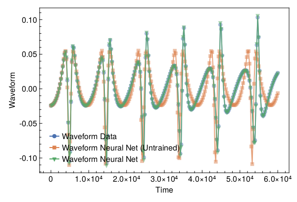

<a id='Training-a-Neural-ODE-to-Model-Gravitational-Waveforms'></a>

# Training a Neural ODE to Model Gravitational Waveforms


This code is adapted from [Astroinformatics/ScientificMachineLearning](https://github.com/Astroinformatics/ScientificMachineLearning/blob/c93aac3a460d70b4cce98836b677fd9b732e94b7/neuralode_gw.ipynb)


The code has been minimally adapted from [Keith et. al. 2021](https://arxiv.org/abs/2102.12695) which originally used Flux.jl


<a id='Package-Imports'></a>

## Package Imports


```julia
using Lux, ComponentArrays, LineSearches, LuxAMDGPU, LuxCUDA, OrdinaryDiffEq,
    Optimization, OptimizationOptimJL, Random, SciMLSensitivity
using CairoMakie, MakiePublication
CUDA.allowscalar(false)
```


<a id='Define-some-Utility-Functions'></a>

## Define some Utility Functions


::: tip


This section can be skipped. It defines functions to simulate the model, however, from a scientific machine learning perspective, isn't super relevant.


:::


We need a very crude 2-body path. Assume the 1-body motion is a newtonian 2-body position vector $r = r_1 - r_2$ and use Newtonian formulas to get $r_1$, $r_2$ (e.g. Theoretical Mechanics of Particles and Continua 4.3)


```julia
function one2two(path, m₁, m₂)
    M = m₁ + m₂
    r₁ = m₂ / M .* path
    r₂ = -m₁ / M .* path
    return r₁, r₂
end
```


```
one2two (generic function with 1 method)
```


Next we define a function to perform the change of variables: $(\chi(t),\phi(t)) \mapsto (x(t),y(t))$


```julia
@views function soln2orbit(soln, model_params=nothing)
    @assert size(soln, 1) ∈ [2, 4] "size(soln,1) must be either 2 or 4"

    if size(soln, 1) == 2
        χ = soln[1, :]
        ϕ = soln[2, :]

        @assert length(model_params)==3 "model_params must have length 3 when size(soln,2) = 2"
        p, M, e = model_params
    else
        χ = soln[1, :]
        ϕ = soln[2, :]
        p = soln[3, :]
        e = soln[4, :]
    end

    r = p ./ (1 .+ e .* cos.(χ))
    x = r .* cos.(ϕ)
    y = r .* sin.(ϕ)

    orbit = vcat(x', y')
    return orbit
end
```


```
soln2orbit (generic function with 2 methods)
```


This function uses second-order one-sided difference stencils at the endpoints; see https://doi.org/10.1090/S0025-5718-1988-0935077-0


```julia
function d_dt(v::AbstractVector, dt)
    a = -3 / 2 * v[1] + 2 * v[2] - 1 / 2 * v[3]
    b = (v[3:end] .- v[1:(end - 2)]) / 2
    c = 3 / 2 * v[end] - 2 * v[end - 1] + 1 / 2 * v[end - 2]
    return [a; b; c] / dt
end
```


```
d_dt (generic function with 1 method)
```


This function uses second-order one-sided difference stencils at the endpoints; see https://doi.org/10.1090/S0025-5718-1988-0935077-0


```julia
function d2_dt2(v::AbstractVector, dt)
    a = 2 * v[1] - 5 * v[2] + 4 * v[3] - v[4]
    b = v[1:(end - 2)] .- 2 * v[2:(end - 1)] .+ v[3:end]
    c = 2 * v[end] - 5 * v[end - 1] + 4 * v[end - 2] - v[end - 3]
    return [a; b; c] / (dt^2)
end
```


```
d2_dt2 (generic function with 1 method)
```


Now we define a function to compute the trace-free moment tensor from the orbit


```julia
function orbit2tensor(orbit, component, mass=1)
    x = orbit[1, :]
    y = orbit[2, :]

    Ixx = x .^ 2
    Iyy = y .^ 2
    Ixy = x .* y
    trace = Ixx .+ Iyy

    if component[1] == 1 && component[2] == 1
        tmp = Ixx .- trace ./ 3
    elseif component[1] == 2 && component[2] == 2
        tmp = Iyy .- trace ./ 3
    else
        tmp = Ixy
    end

    return mass .* tmp
end

function h_22_quadrupole_components(dt, orbit, component, mass=1)
    mtensor = orbit2tensor(orbit, component, mass)
    mtensor_ddot = d2_dt2(mtensor, dt)
    return 2 * mtensor_ddot
end

function h_22_quadrupole(dt, orbit, mass=1)
    h11 = h_22_quadrupole_components(dt, orbit, (1, 1), mass)
    h22 = h_22_quadrupole_components(dt, orbit, (2, 2), mass)
    h12 = h_22_quadrupole_components(dt, orbit, (1, 2), mass)
    return h11, h12, h22
end

function h_22_strain_one_body(dt::T, orbit) where {T}
    h11, h12, h22 = h_22_quadrupole(dt, orbit)

    h₊ = h11 - h22
    hₓ = T(2) * h12

    scaling_const = √(T(π) / 5)
    return scaling_const * h₊, -scaling_const * hₓ
end

function h_22_quadrupole_two_body(dt, orbit1, mass1, orbit2, mass2)
    h11_1, h12_1, h22_1 = h_22_quadrupole(dt, orbit1, mass1)
    h11_2, h12_2, h22_2 = h_22_quadrupole(dt, orbit2, mass2)
    h11 = h11_1 + h11_2
    h12 = h12_1 + h12_2
    h22 = h22_1 + h22_2
    return h11, h12, h22
end

function h_22_strain_two_body(dt::T, orbit1, mass1, orbit2, mass2) where {T}
    # compute (2,2) mode strain from orbits of BH 1 of mass1 and BH2 of mass 2

    @assert abs(mass1 + mass2 - 1.0)<1e-12 "Masses do not sum to unity"

    h11, h12, h22 = h_22_quadrupole_two_body(dt, orbit1, mass1, orbit2, mass2)

    h₊ = h11 - h22
    hₓ = T(2) * h12

    scaling_const = √(T(π) / 5)
    return scaling_const * h₊, -scaling_const * hₓ
end

function compute_waveform(dt::T, soln, mass_ratio, model_params=nothing) where {T}
    @assert mass_ratio≤1 "mass_ratio must be <= 1"
    @assert mass_ratio≥0 "mass_ratio must be non-negative"

    orbit = soln2orbit(soln, model_params)
    if mass_ratio > 0
        m₂ = inv(T(1) + mass_ratio)
        m₁ = mass_ratio * m₂

        orbit₁, orbit₂ = one2two(orbit, m₁, m₂)
        waveform = h_22_strain_two_body(dt, orbit1, mass1, orbit2, mass2)
    else
        waveform = h_22_strain_one_body(dt, orbit)
    end
    return waveform
end
```


```
compute_waveform (generic function with 2 methods)
```


<a id='Simulating-the-True-Model'></a>

## Simulating the True Model


`RelativisticOrbitModel` defines system of odes which describes motion of point like particle in schwarzschild background, uses


$$
u[1] = \chi
$$


$$
u[2] = \phi
$$


where, $p$, $M$, and $e$ are constants


```julia
function RelativisticOrbitModel(u, (p, M, e), t)
    χ, ϕ = u

    numer = (p - 2 - 2 * e * cos(χ)) * (1 + e * cos(χ))^2
    denom = sqrt((p - 2)^2 - 4 * e^2)

    χ̇ = numer * sqrt(p - 6 - 2 * e * cos(χ)) / (M * (p^2) * denom)
    ϕ̇ = numer / (M * (p^(3 / 2)) * denom)

    return [χ̇, ϕ̇]
end

mass_ratio = 0.0         # test particle
u0 = Float64[π, 0.0]     # initial conditions
datasize = 250
tspan = (0.0f0, 6.0f4)   # timespace for GW waveform
tsteps = range(tspan[1], tspan[2]; length=datasize)  # time at each timestep
dt_data = tsteps[2] - tsteps[1]
dt = 100.0
const ode_model_params = [100.0, 1.0, 0.5]; # p, M, e
```


Let's simulate the true model and plot the results using `OrdinaryDiffEq.jl`


```julia
prob = ODEProblem(RelativisticOrbitModel, u0, tspan, ode_model_params)
soln = Array(solve(prob, RK4(); saveat=tsteps, dt, adaptive=false))
waveform = first(compute_waveform(dt_data, soln, mass_ratio, ode_model_params))

fig = with_theme(theme_web()) do
    fig = Figure()
    ax = CairoMakie.Axis(fig[1, 1]; xlabel="Time", ylabel="Waveform")

    l = lines!(ax, tsteps, waveform; linewidth=2, alpha=0.75)
    s = scatter!(ax, tsteps, waveform; markershape=:circle, markeralpha=0.25, alpha=0.5)

    axislegend(ax, [[l, s]], ["Waveform Data"])

    return fig
end
```


<a id='Defiing-a-Neural-Network-Model'></a>

## Defiing a Neural Network Model


Next, we define the neural network model that takes 1 input (time) and has two outputs. We'll make a function `ODE_model` that takes the initial conditions, neural network parameters and a time as inputs and returns the derivatives.


It is typically never recommended to use globals but incase you do use them, make sure to mark them as `const`.


We will deviate from the standard Neural Network initialization and use `WeightInitializers.jl`,


```julia
const nn = Chain(Base.Fix1(broadcast, cos),
    Dense(1 => 32, cos; init_weight=truncated_normal(; std=1e-4)),
    Dense(32 => 32, cos; init_weight=truncated_normal(; std=1e-4)),
    Dense(32 => 2; init_weight=truncated_normal(; std=1e-4)))
ps, st = Lux.setup(MersenneTwister(), nn)
```


```
((layer_1 = NamedTuple(), layer_2 = (weight = Float32[0.00010365777; 4.910341f-6; 4.6463538f-5; -3.617797f-5; -8.505658f-6; -1.617053f-5; -0.00017369958; -8.6696135f-5; 9.654974f-5; -0.00012191007; -8.454817f-5; -0.00013658377; -6.9068425f-5; 2.241588f-5; -1.5617477f-5; -0.00017566116; 2.680854f-5; -0.00012982333; 0.00021123851; 5.102744f-5; 2.894749f-5; 0.00020186849; -8.835573f-5; 0.00010422891; 5.094223f-5; 6.924248f-5; 1.1374277f-6; 9.566203f-5; -0.00012689472; -0.00014330308; -4.0643117f-5; 0.000111712965;;], bias = Float32[0.0; 0.0; 0.0; 0.0; 0.0; 0.0; 0.0; 0.0; 0.0; 0.0; 0.0; 0.0; 0.0; 0.0; 0.0; 0.0; 0.0; 0.0; 0.0; 0.0; 0.0; 0.0; 0.0; 0.0; 0.0; 0.0; 0.0; 0.0; 0.0; 0.0; 0.0; 0.0;;]), layer_3 = (weight = Float32[-4.1911964f-5 -0.00026908488 -6.744065f-5 2.943169f-6 -8.6721244f-5 -0.000113825576 -6.505031f-5 2.1228998f-5 -9.143463f-5 0.00016655539 -1.7331185f-7 0.00014136174 -1.5402207f-5 -0.00014068375 0.00013979989 0.00010809822 -5.710433f-5 -3.3327888f-5 -9.047475f-5 -9.081741f-5 2.6660573f-5 -1.2350385f-5 2.9816052f-5 3.982348f-5 -0.00023765002 8.04168f-5 -1.0195638f-5 -6.717669f-5 -1.5895517f-5 -0.0001554643 -0.00017809351 -0.00010201778; 8.3805564f-5 7.3245516f-5 -0.00010240995 -3.9084072f-5 -0.00014156403 7.026746f-5 -5.5808963f-5 -1.7130662f-5 -4.6465266f-5 -8.1503014f-5 -8.632106f-5 -1.2692388f-5 -5.487798f-5 1.46688935f-5 5.6754114f-5 -0.00010650605 -3.7051537f-5 7.424757f-5 -0.0001137238 -4.1976477f-6 -3.1300133f-6 -4.6712237f-5 -0.00012148679 9.1266826f-5 6.766551f-5 5.1064373f-5 -0.00027585696 -2.7577511f-5 -6.10098f-6 -0.000102590646 6.1452214f-5 -3.4740006f-5; 7.5167714f-5 1.7431847f-5 -0.00014723916 -2.9036026f-5 7.1762415f-6 0.00028486355 7.494506f-5 -2.3696608f-5 -3.9348328f-5 5.382254f-5 3.383875f-5 0.00020626896 -3.2978318f-5 2.6998975f-6 -2.6266194f-5 9.480727f-5 3.4718803f-5 8.682317f-5 -5.85655f-5 0.0001259997 -0.0001233078 7.31447f-5 -6.584713f-5 4.3951444f-5 0.00010367705 0.00015179098 1.6930959f-5 0.00022017426 4.4379038f-5 -2.5063155f-5 -0.00013479513 4.6184072f-5; 5.3251217f-5 -2.4033014f-5 -0.00010263845 5.3952244f-5 -4.3959444f-6 5.1169025f-7 -0.000103746526 3.7978483f-5 3.349159f-5 -0.00014837229 8.95406f-6 -2.0325331f-5 -0.00021627614 0.00015406289 -3.145184f-5 -8.1320504f-5 6.665461f-5 -7.6534154f-5 -6.843021f-5 -1.4306776f-6 -9.3517f-5 6.999974f-5 -6.7446126f-5 3.1391126f-5 3.1382588f-5 -9.982218f-6 -2.9075674f-5 -9.921442f-5 2.6541882f-5 -4.1400857f-5 -0.00018913722 -8.1696395f-5; -0.00010424984 4.0069637f-5 4.114137f-5 3.787294f-5 7.5104945f-5 -6.9215785f-5 8.111277f-5 -0.00024335814 0.000111449786 5.444185f-5 -2.7604547f-5 -0.00011466049 -9.826762f-6 4.35717f-5 -9.743498f-5 3.7692516f-5 -5.7650966f-5 -4.478964f-5 -7.769926f-5 -9.936396f-5 -0.00014517044 7.185186f-5 1.5935917f-5 -6.934277f-5 -6.624981f-5 -4.9368504f-5 0.00010464782 0.00012995336 4.225163f-6 3.4653334f-5 0.00013577272 -5.0532913f-6; 4.6044956f-5 -1.950536f-5 -1.1638745f-6 -5.459242f-5 0.00011079287 -0.00019351194 -0.00011112164 -4.3770175f-5 -8.7821856f-5 0.00016398272 -0.00011532828 -3.6112484f-5 -1.5264186f-5 5.9444235f-5 4.68862f-5 3.2577816f-5 2.4835997f-5 -3.2429976f-5 -4.005633f-5 1.4964963f-5 0.0001844175 0.00016219834 0.00014004906 7.467231f-5 0.00013748044 -8.405077f-6 -9.092855f-6 -3.7560407f-5 6.964152f-6 -0.00019189887 0.00012368272 -4.8130456f-5; -0.00010158226 -4.1513493f-5 0.00016318042 2.7852222f-5 8.408872f-5 -0.00017166254 -3.4771525f-5 4.703661f-5 -9.456278f-6 0.00012479516 0.00010509921 1.8425288f-5 -0.00015794317 -3.1438208f-7 -0.0001089025 -5.4111915f-6 -2.285835f-5 1.7117532f-5 0.000116506526 -0.00016144931 7.835758f-5 -0.00015220494 9.349031f-5 3.1985026f-5 -3.76673f-5 0.000120661476 0.00021124714 1.6385911f-5 -6.3127f-5 -1.9338646f-5 0.00030381177 2.2231156f-6; 0.00019898887 0.0001651447 -2.4089733f-5 1.4727765f-5 -6.769001f-5 0.00013096408 2.8185418f-6 -9.2107584f-5 4.617217f-5 0.00017747095 -4.089093f-5 0.00016511712 -5.688773f-5 -1.3163202f-5 8.400284f-5 3.6622663f-5 -5.1951603f-5 -4.9908278f-5 7.7601144f-5 -4.8085436f-5 5.722741f-5 1.7431862f-6 -4.209839f-5 7.0369235f-5 -0.000298917 -1.2426958f-5 0.00014263393 3.320879f-5 6.427149f-5 -6.193743f-5 3.3172873f-6 -0.00010097081; -1.1414278f-5 -0.00018646968 -2.5557343f-5 0.0001338487 1.7587901f-5 -0.00011091992 -0.00013060095 0.00013206572 -1.7044243f-6 4.841896f-5 -0.00011218479 -9.181132f-5 -5.0540104f-5 0.00016013392 8.2245315f-5 -5.5538003f-5 -3.0948326f-5 -8.6408f-6 3.7866004f-5 -0.00013537862 -6.714419f-5 7.291519f-5 -1.6890552f-5 -3.961454f-5 9.284045f-5 -6.987152f-5 6.1953375f-7 -6.611637f-6 -3.7883245f-5 2.7623793f-5 2.8488123f-5 8.656858f-5; 2.648057f-5 -5.657553f-5 -1.4722358f-5 -0.00019670856 -0.000129364 -8.8238885f-5 -8.970279f-5 2.600059f-6 -8.8920744f-5 0.0001166574 -2.4641033f-5 -0.00021071425 0.00018911506 9.338373f-5 2.9911409f-5 -0.00011808908 -2.4341836f-5 0.00014762666 -4.5770208f-5 -6.8702175f-5 4.1515414f-5 -3.8578775f-5 0.00010795902 -7.572972f-5 2.2212222f-5 8.1727856f-5 -7.1602306f-5 8.8794495f-6 2.3374534f-5 -1.1766095f-5 -9.871322f-6 -0.00016673592; 0.00012751667 0.00012913404 -4.1339154f-6 8.3689294f-5 0.00013180864 4.510848f-5 -2.9631383f-5 5.147338f-5 6.4834545f-5 5.3584514f-5 5.8058868f-5 -3.7368824f-5 0.00016700418 -0.0001278515 5.790251f-5 4.90606f-5 -3.6394737f-5 -0.000119015574 -4.795379f-5 -0.00015903768 7.9632526f-5 0.00021854184 0.00011730219 1.2190426f-5 1.9123685f-5 -4.7302055f-5 0.00012887522 -8.107358f-5 -0.00012995767 0.00014638761 -0.00010959049 8.161136f-5; 0.00010785815 -5.492307f-5 -1.2964265f-5 -0.00017546052 8.759021f-5 -0.00014624833 -0.00013840436 -0.00015264127 -0.00014677897 0.00012461912 -0.00011746555 0.00010024988 -0.00012876122 -4.1581414f-5 3.4348028f-5 6.604037f-5 6.092969f-5 -4.6457113f-5 6.0994425f-5 -9.87952f-5 6.149665f-5 -0.00014416 9.99661f-5 -9.210272f-6 -0.00017017826 -1.8135679f-6 -6.676006f-5 0.00014024045 3.2997472f-5 -1.1444836f-5 -0.00029989463 4.5137335f-6; -9.8446384f-5 4.2590153f-5 -0.00014199025 0.0001579257 -2.7337592f-5 0.00015750853 -0.00016851645 -6.338615f-5 -2.380775f-5 0.00011116753 3.812527f-6 -0.0002463702 -2.4218212f-5 0.0001465464 -0.000110693894 -4.9004895f-5 3.5385943f-5 -0.00015847305 -9.306939f-5 -7.8481324f-5 -3.5094443f-5 0.000101281075 8.996423f-6 -6.137954f-5 0.000103607155 -5.952769f-5 -5.1405164f-5 -0.00010483094 2.0415391f-5 0.00019509233 7.4460695f-5 0.00017891213; -6.649514f-5 -0.00014184702 0.00012589818 0.000114578186 -9.012475f-6 1.1114736f-5 9.787639f-6 3.3711356f-5 0.0002178211 -8.255822f-5 0.00020996956 3.408652f-5 -3.502673f-5 5.1076324f-5 -0.00017668985 5.6009812f-5 1.9750645f-5 0.00010657779 0.00015832491 -6.694173f-6 -1.010424f-5 7.811143f-5 0.00011821104 2.9771445f-5 -8.461731f-5 -4.100869f-6 -9.305916f-5 -7.188721f-5 0.00010430605 -0.00016110955 0.00017613954 -0.000116907075; -2.920637f-5 -1.5188824f-5 -4.004289f-5 -1.7514254f-5 -6.456909f-5 0.00015986535 -4.5809367f-5 0.000119557415 -0.000106497566 -0.000109016604 0.00010694228 -5.341488f-5 5.1915216f-5 -8.843031f-6 -3.7293183f-5 0.00015986213 -6.629957f-5 7.720051f-5 9.420946f-5 2.3794962f-6 -9.721408f-5 -8.651213f-5 -0.00011515959 9.03199f-5 -8.657956f-6 -0.00012284271 -9.940397f-5 -5.0669605f-5 5.147239f-5 6.269371f-5 -7.761915f-5 -4.5877376f-5; 2.4193394f-6 4.4341585f-5 4.9690843f-5 -2.8951292f-5 1.5334807f-6 -0.00014111747 -7.9549754f-5 -0.0001014809 -6.377227f-5 9.166622f-5 1.4891296f-5 -3.3236076f-5 2.8147411f-5 -0.00012927181 -0.00010981176 2.6627135f-5 2.8161527f-5 -3.5387886f-5 8.90403f-5 -7.677717f-6 3.665109f-6 3.7245103f-5 -0.0001732096 -3.1078307f-6 -0.00024421216 -0.00019200429 2.4711546f-5 -0.00013174271 -3.554142f-5 -4.4992892f-5 4.0706993f-5 2.9534733f-5; -6.0919512f-5 2.5548452f-5 0.000116573174 7.9028134f-5 6.0209946f-5 -3.5465328f-5 2.656064f-5 -7.043225f-5 -4.467887f-5 -2.8101995f-5 0.00011867088 -7.8695244f-5 -1.9939594f-5 -5.8490885f-5 3.4986762f-5 1.1005601f-5 -6.155796f-5 1.6327888f-6 0.00027008943 -1.5411551f-5 -4.2882377f-5 0.00012284143 -0.000135033 4.685792f-5 0.00010192501 6.598356f-5 5.6551227f-5 -3.561591f-5 -0.0002089417 -2.1292633f-5 9.066722f-5 -4.650076f-6; -0.00013994199 7.7175275f-5 0.000119434764 -0.00010681331 -0.00013468017 -7.300713f-5 4.0722447f-5 -8.910708f-5 0.00011062329 -1.3385768f-5 1.707302f-5 8.8988876f-5 0.00012027033 -0.00022930214 0.000112203736 0.0001542589 -0.00013069391 -0.00020871215 -0.0001474977 8.247413f-5 7.820194f-5 -0.00012578565 3.294128f-5 4.193401f-6 4.172171f-5 -3.7264483f-5 9.399856f-5 7.710333f-5 2.4210458f-5 4.855259f-5 5.599499f-5 -5.0784234f-5; -9.17179f-5 -5.211206f-5 -0.00015866855 -0.00012511623 6.092451f-5 1.8648236f-5 -6.710133f-5 0.0001417057 0.00015268545 6.724171f-5 0.00030658772 -0.00030442094 2.9606968f-5 1.6290249f-5 6.241133f-5 0.00010012466 -2.3104812f-6 -2.9568788f-5 2.7451822f-5 -0.00013860561 7.811495f-5 0.00010809098 4.8676546f-5 9.7528406f-5 -3.734649f-5 6.3917454f-5 -1.7502663f-5 0.0001563613 -9.622066f-5 6.9062284f-5 0.00012127536 6.2816696f-5; 2.2309321f-5 6.0097946f-6 5.19987f-5 3.6239773f-5 -2.7808923f-5 -2.4022864f-5 0.00015636445 -1.0504949f-5 -6.6215354f-5 -0.00024220537 -3.6555983f-5 2.12503f-5 -6.440273f-5 3.1409178f-5 0.00016252612 1.578226f-5 -2.4626464f-5 -2.5279016f-6 5.7459976f-5 0.00011257833 3.2231655f-5 0.00021906196 -1.1973102f-5 -8.161866f-5 3.3822995f-5 0.00015339325 2.4270124f-5 -0.00011937308 4.36134f-5 -1.099081f-5 -0.00013140343 -0.00016023277; 0.00014941301 -0.00012312394 8.325815f-5 -4.138204f-5 -0.00014048284 5.2257445f-5 4.6892972f-5 -0.00018746486 4.223288f-5 0.0001211725 -4.92278f-5 -3.7943704f-5 3.410289f-5 0.00010779899 6.224466f-5 -3.3761113f-5 6.31305f-5 6.9672074f-6 -0.00014373493 2.7484062f-5 2.8260469f-5 -6.237437f-5 2.6185784f-5 8.8823486f-5 3.1651678f-5 -0.00011151092 -5.915008f-5 8.592644f-5 4.2629745f-5 -3.0784387f-5 8.2950595f-5 -1.7254938f-6; -1.482374f-5 5.7300953f-5 0.000116684074 3.7699738f-5 -0.00012352377 -3.3909924f-5 -5.899482f-5 -0.00028291595 2.58831f-5 -2.7321681f-5 4.2058622f-5 8.568451f-5 -0.00011873447 -2.8644281f-5 2.91668f-5 2.9570412f-5 0.00020130095 -6.8422465f-5 -6.678101f-5 -0.00011196153 -1.7808083f-5 5.0946008f-5 -3.9864798f-7 -7.766371f-5 4.6772733f-5 4.6083664f-5 -3.9117873f-5 4.525518f-5 -2.7021695f-6 -9.277214f-5 -2.8672426f-5 -1.172331f-5; -6.9789794f-6 0.00016522584 4.9797738f-5 -1.8563045f-5 0.00013577429 -2.4279696f-5 5.074297f-5 0.000114140494 8.328034f-5 6.787465f-5 0.00011431716 -0.00010918989 0.00013818285 0.00018045261 -3.3073586f-5 -1.1573898f-6 6.758855f-5 9.5739924f-5 -5.897203f-5 1.6539775f-6 -9.118569f-5 8.528817f-5 0.00012328096 -6.20042f-5 0.00024027232 -2.3265102f-5 -1.0225273f-6 1.1543256f-5 6.8711183f-6 -1.4248937f-5 3.3909513f-5 -0.00013621402; 2.8099632f-5 -0.00011857233 5.370173f-5 1.4106502f-5 0.0002722438 -2.1398497f-5 -8.1432685f-5 0.0001499579 1.3916393f-5 -1.3849806f-5 0.00014923779 -1.2809882f-6 -8.128718f-6 3.1316874f-6 7.065944f-5 2.979371f-6 2.3897153f-5 4.816569f-5 0.0002254983 4.902356f-5 0.00019570884 2.1761729f-5 6.126901f-5 -6.826041f-6 -0.00011591914 -0.00011629726 0.00015510134 6.243453f-5 7.1371906f-5 1.8698529f-5 -0.0001687257 1.4042041f-5; 6.107787f-5 -1.9555036f-5 2.3750516f-5 6.839596f-5 -0.00017423887 0.00015592498 0.00014624311 -3.0347297f-5 1.6600217f-5 0.00011505197 8.714754f-5 0.00012369653 3.0168902f-5 -2.8980303f-5 1.8853481f-5 7.2405564f-5 6.0612114f-5 -7.63501f-5 9.716223f-5 5.5905253f-5 0.00012825077 4.3873722f-5 -0.00012043098 -4.2506475f-5 7.0771425f-6 0.00012408546 -1.2840999f-5 -0.00017637714 -0.00011529958 -1.9600511f-5 -0.000115292205 -3.0707604f-5; -7.80435f-5 0.00014664012 5.786997f-5 0.00014928686 -3.3281267f-5 0.00011848975 6.56004f-6 8.62584f-5 -6.402174f-6 -6.4629756f-5 -3.5746887f-6 3.8466005f-5 7.649216f-6 -0.00012830112 -5.9342434f-5 9.6706775f-5 -0.0001924378 -3.0390072f-5 8.898488f-5 -0.00014319638 4.8895352f-5 -4.508798f-6 -3.782694f-5 -7.185255f-5 0.00019415804 -7.678266f-5 8.6914726f-5 -0.000109239474 8.531194f-5 -7.232361f-5 7.541003f-5 -4.7685146f-5; 9.669695f-5 3.5839916f-5 7.688646f-5 9.111606f-5 6.465126f-5 -0.00016642288 0.0001638292 2.6223173f-5 -5.9403308f-5 -0.00011544422 -3.0376146f-5 0.0001507039 -3.028119f-5 -8.3638326f-5 -0.00010326818 2.7338523f-5 8.8066394f-5 -3.400422f-5 2.8929262f-5 -6.4712774f-5 -6.042041f-5 -0.00010327776 -0.00020328468 -1.7857448f-5 -0.00013421994 -0.00011542031 8.052912f-5 -2.5577926f-6 8.95695f-5 0.00022252474 0.00021769728 -3.375722f-5; -9.387725f-6 6.4948814f-5 5.836157f-7 4.3422875f-5 0.00023886986 -0.00017481661 7.8733334f-5 4.1115454f-5 -0.00014366116 0.0001500494 3.5426285f-5 -0.000117821444 -0.00015463858 -0.00018883105 8.097678f-5 -0.0002078035 -1.0393603f-5 8.494459f-5 0.00011042873 0.00013283639 -0.0001784127 -8.801277f-5 8.214084f-5 -0.00016497445 0.00010671414 -0.00013336679 -1.5102045f-5 -4.017324f-5 2.3368546f-5 -2.9160658f-5 -7.384264f-5 5.4365868f-5; -0.00020507818 -0.0001553954 -8.342092f-5 -1.19114675f-5 3.5905374f-5 5.14303f-5 0.000104055296 -8.350943f-5 0.00011892292 0.00020317911 3.9428636f-5 -7.933697f-5 -0.0001488414 0.00023798653 -6.126717f-5 -1.456228f-5 -0.00013771278 -7.708065f-5 -0.00010937785 1.005901f-5 0.00019500744 -0.00014830817 0.00027067194 -0.00015909296 9.392519f-5 -4.862014f-5 -7.199184f-5 -0.00018985974 0.00014163552 -0.00010718695 -9.3101466f-5 8.289135f-5; -0.00015800624 -7.742033f-5 0.00012321817 9.1990274f-5 7.741912f-5 -2.3630417f-5 0.000115312076 4.1735425f-6 1.7023693f-5 0.00016530791 -1.0736157f-5 0.00015019176 8.8907655f-5 1.6013304f-5 7.95687f-5 -2.7478043f-5 -1.7672788f-5 -0.00011422376 4.2022195f-5 -1.4913021f-5 -3.7561338f-5 0.0001397252 5.836432f-5 -6.545256f-5 0.00019784748 5.2559073f-5 7.226307f-5 4.5967492f-5 -0.0001299658 7.048212f-5 -4.1056237f-6 -4.6088513f-5; 1.3429488f-5 -3.2867752f-5 -0.00016636658 -5.0339004f-5 3.7023663f-5 -0.00018368829 0.00010703777 0.00013687818 -3.9782597f-5 -1.7608689f-5 -5.023033f-5 0.00024054109 0.00019487776 -4.4959565f-5 -0.00010369168 -7.902454f-5 6.3225976f-5 6.820983f-5 -0.00012215797 -3.8136735f-5 8.9978465f-5 -5.296894f-5 -2.896863f-6 5.2623138f-5 0.00011229923 -6.2773784f-6 0.00010693979 -0.00011141159 -5.8776935f-5 2.8519555f-5 -9.709886f-5 -6.189957f-5; -6.0911203f-5 7.606119f-5 -3.9844897f-5 -0.00013557544 -0.00016853091 -4.326105f-5 -0.00011967407 8.162324f-5 -4.923532f-5 5.3790078f-5 1.020435f-5 2.5693209f-5 0.00018110817 -6.947284f-5 -5.26555f-5 0.00012077305 7.915891f-5 -0.00013873473 -3.087288f-5 -6.483027f-5 -5.2169366f-5 2.6572648f-5 -5.2055526f-5 -0.0001257114 -0.00020333755 -3.177193f-5 0.00016085374 -0.00010508467 3.1045547f-5 -0.00031525295 3.5894595f-6 0.00011789685], bias = Float32[0.0; 0.0; 0.0; 0.0; 0.0; 0.0; 0.0; 0.0; 0.0; 0.0; 0.0; 0.0; 0.0; 0.0; 0.0; 0.0; 0.0; 0.0; 0.0; 0.0; 0.0; 0.0; 0.0; 0.0; 0.0; 0.0; 0.0; 0.0; 0.0; 0.0; 0.0; 0.0;;]), layer_4 = (weight = Float32[-0.00016254651 -7.1632155f-7 -6.72951f-5 -1.136748f-5 6.5379165f-5 -1.9296474f-6 0.00010378262 -0.0002154337 5.389025f-5 6.759137f-5 -0.00010258847 2.6812628f-5 -0.00012826634 -2.8762948f-5 -0.00039825225 -0.00010423163 3.5784353f-5 4.117988f-5 -0.00010951986 9.218255f-5 -0.00022634384 -0.00011759229 2.1426687f-5 0.0002332325 0.0001070657 -6.508551f-5 5.8040372f-5 -4.9252052f-5 -4.14854f-6 -8.893477f-5 -2.7133607f-5 7.875912f-5; -8.935362f-5 -9.478015f-5 7.4631644f-5 6.272034f-5 -0.00013847549 1.2772249f-5 5.3799748f-5 -4.5945573f-5 0.00025347315 -1.1059956f-5 -1.5224831f-6 -0.00012414265 4.4718134f-5 -0.00011776697 -8.203641f-6 5.975459f-6 8.439154f-5 7.73549f-5 1.4151975f-6 7.863051f-5 2.8570068f-5 -3.418648f-5 -3.5457404f-5 0.00012314288 9.870518f-5 -0.0001780591 0.00018646782 2.8498578f-5 -0.00010490091 3.3775537f-5 0.00021032925 9.176073f-5], bias = Float32[0.0; 0.0;;])), (layer_1 = NamedTuple(), layer_2 = NamedTuple(), layer_3 = NamedTuple(), layer_4 = NamedTuple()))
```


Similar to most DL frameworks, Lux defaults to using `Float32`, however, in this case we need Float64


```julia
const params = ComponentArray{Float64}(ps)
```


```
ComponentVector{Float64}(layer_1 = Float64[], layer_2 = (weight = [0.00010365776688558981; 4.910340976493899e-6; 4.646353772841394e-5; -3.617797119659372e-5; -8.505658115609549e-6; -1.6170530216186307e-5; -0.00017369957640767097; -8.669613453093916e-5; 9.654973837314174e-5; -0.00012191006680950522; -8.454816997982562e-5; -0.00013658376701641828; -6.90684246364981e-5; 2.241587935714051e-5; -1.561747740197461e-5; -0.0001756611600285396; 2.6808540496858768e-5; -0.00012982332555111498; 0.0002112385118380189; 5.102744034957141e-5; 2.894749013648834e-5; 0.0002018684899667278; -8.83557295310311e-5; 0.00010422890773043036; 5.0942231609951705e-5; 6.924248009454459e-5; 1.1374277164577506e-6; 9.566202788846567e-5; -0.0001268947235075757; -0.00014330308476928622; -4.064311724505387e-5; 0.00011171296500833705;;], bias = [0.0; 0.0; 0.0; 0.0; 0.0; 0.0; 0.0; 0.0; 0.0; 0.0; 0.0; 0.0; 0.0; 0.0; 0.0; 0.0; 0.0; 0.0; 0.0; 0.0; 0.0; 0.0; 0.0; 0.0; 0.0; 0.0; 0.0; 0.0; 0.0; 0.0; 0.0; 0.0;;]), layer_3 = (weight = [-4.1911964217433706e-5 -0.0002690848778001964 -6.744064739905298e-5 2.9431689654302318e-6 -8.672124386066571e-5 -0.00011382557568140328 -6.505031342385337e-5 2.1228997866273858e-5 -9.143463103100657e-5 0.0001665553863858804 -1.7331184665181354e-7 0.00014136174286250025 -1.5402207282022573e-5 -0.0001406837545800954 0.00013979988580103964 0.00010809821833390743 -5.7104331062873825e-5 -3.332788764964789e-5 -9.047475032275543e-5 -9.08174115465954e-5 2.6660572984837927e-5 -1.2350385077297688e-5 2.9816052119713277e-5 3.982348061981611e-5 -0.0002376500196987763 8.041680121095851e-5 -1.0195638424193021e-5 -6.717669020872563e-5 -1.589551720826421e-5 -0.00015546429494861513 -0.00017809351265896112 -0.00010201778059126809; 8.380556391784921e-5 7.324551552301273e-5 -0.00010240994743071496 -3.908407234121114e-5 -0.00014156402903608978 7.026745879556984e-5 -5.580896322499029e-5 -1.7130661944975145e-5 -4.646526576834731e-5 -8.150301437126473e-5 -8.6321058915928e-5 -1.2692387826973572e-5 -5.4877978982403874e-5 1.4668893527414184e-5 5.675411375705153e-5 -0.00010650604963302612 -3.705153721966781e-5 7.424756768159568e-5 -0.00011372379958629608 -4.1976477405114565e-6 -3.1300132832257077e-6 -4.671223723562434e-5 -0.0001214867879753001 9.126682562055066e-5 6.766551086911932e-5 5.1064373110421e-5 -0.0002758569607976824 -2.7577510991250165e-5 -6.100980044720927e-6 -0.00010259064583806321 6.1452214140445e-5 -3.474000550340861e-5; 7.516771438531578e-5 1.743184657243546e-5 -0.00014723915955983102 -2.9036025807727128e-5 7.176241524575744e-6 0.00028486354858614504 7.494506280636415e-5 -2.3696607968304306e-5 -3.934832784580067e-5 5.382253948482685e-5 3.3838750823633745e-5 0.00020626896002795547 -3.2978317904053256e-5 2.6998975499736844e-6 -2.6266194254276343e-5 9.480727021582425e-5 3.471880336292088e-5 8.68231727508828e-5 -5.856549978489056e-5 0.00012599969340953976 -0.0001233077928191051 7.31446998543106e-5 -6.584713264601305e-5 4.395144424051978e-5 0.0001036770481732674 0.00015179098409134895 1.6930958736338653e-5 0.00022017426090314984 4.437903771759011e-5 -2.506315468053799e-5 -0.0001347951329080388 4.618407183443196e-5; 5.325121674104594e-5 -2.403301368758548e-5 -0.0001026384488795884 5.395224434323609e-5 -4.395944415591657e-6 5.116902457302785e-7 -0.00010374652629252523 3.7978483305778354e-5 3.3491589420009404e-5 -0.0001483722880948335 8.954059921961743e-6 -2.032533120654989e-5 -0.00021627613750752062 0.0001540628873044625 -3.145184018649161e-5 -8.132050425047055e-5 6.665461114607751e-5 -7.653415377717465e-5 -6.843020673841238e-5 -1.4306775710792863e-6 -9.351700282422826e-5 6.999973993515596e-5 -6.744612619513646e-5 3.1391125958180055e-5 3.138258762191981e-5 -9.982218216464389e-6 -2.9075674319756217e-5 -9.921441960614175e-5 2.6541882107267156e-5 -4.140085729886778e-5 -0.00018913722306024283 -8.169639477273449e-5; -0.00010424984066048637 4.0069637179840356e-5 4.1141371184494346e-5 3.787293826462701e-5 7.510494469897822e-5 -6.921578460605815e-5 8.1112768384628e-5 -0.00024335813941434026 0.00011144978634547442 5.4441850807052106e-5 -2.7604546630755067e-5 -0.00011466049181763083 -9.82676192506915e-6 4.357170109869912e-5 -9.743498230818659e-5 3.76925163436681e-5 -5.765096648246981e-5 -4.4789638195652515e-5 -7.769926014589146e-5 -9.936396236298606e-5 -0.00014517044473905116 7.185185677371919e-5 1.5935916962916963e-5 -6.93427718942985e-5 -6.624981324421242e-5 -4.936850382364355e-5 0.00010464782099006698 0.00012995336146559566 4.225163138471544e-6 3.465333429630846e-5 0.00013577271602116525 -5.05329126099241e-6; 4.6044955524848774e-5 -1.9505359887261875e-5 -1.1638744581432547e-6 -5.459241947392002e-5 0.00011079286923632026 -0.0001935119362315163 -0.00011112164065707475 -4.377017467049882e-5 -8.782185614109039e-5 0.00016398272418882698 -0.00011532827920746058 -3.611248394008726e-5 -1.526418600406032e-5 5.944423537584953e-5 4.688620174420066e-5 3.2577816455159336e-5 2.483599746483378e-5 -3.242997627239674e-5 -4.0056329453364015e-5 1.4964963156671729e-5 0.00018441749853082 0.00016219833923969418 0.00014004905824549496 7.467230898328125e-5 0.00013748044148087502 -8.405077096540481e-6 -9.092855179915205e-6 -3.7560406781267375e-5 6.964151907595806e-6 -0.00019189887098036706 0.00012368272291496396 -4.8130455979844555e-5; -0.00010158226359635592 -4.1513492760714144e-5 0.0001631804188946262 2.7852222046931274e-5 8.408872236032039e-5 -0.00017166254110634327 -3.4771524951793253e-5 4.703661034000106e-5 -9.456278348807245e-6 0.0001247951586265117 0.00010509920684853569 1.842528763518203e-5 -0.00015794317005202174 -3.1438207770406734e-7 -0.00010890250268857926 -5.411191523307934e-6 -2.2858350348542444e-5 1.711753247946035e-5 0.0001165065259556286 -0.00016144930850714445 7.835758151486516e-5 -0.0001522049424238503 9.349030733574182e-5 3.198502599843778e-5 -3.766730151255615e-5 0.00012066147610312328 0.00021124714112374932 1.638591129449196e-5 -6.312700134003535e-5 -1.933864587044809e-5 0.00030381177202798426 2.223115643573692e-6; 0.0001989888696698472 0.00016514469461981207 -2.4089733415166847e-5 1.4727765119459946e-5 -6.769000901840627e-5 0.0001309640792896971 2.818541815940989e-6 -9.21075843507424e-5 4.617216836777516e-5 0.00017747095262166113 -4.0890929085435346e-5 0.00016511711874045432 -5.688772944267839e-5 -1.3163202311261557e-5 8.400283695664257e-5 3.662266317405738e-5 -5.195160338189453e-5 -4.990827801520936e-5 7.76011438574642e-5 -4.8085435992106795e-5 5.722741116187535e-5 1.7431862033845391e-6 -4.2098388803424314e-5 7.036923489067703e-5 -0.0002989170025102794 -1.2426958164724056e-5 0.000142633929499425 3.320879113744013e-5 6.427148764487356e-5 -6.193743320181966e-5 3.3172873372677714e-6 -0.00010097080667037517; -1.1414277651056182e-5 -0.00018646968237590045 -2.555734317866154e-5 0.00013384870544541627 1.7587901311344467e-5 -0.00011091992200817913 -0.00013060095079708844 0.0001320657174801454 -1.704424335002841e-6 4.841895861318335e-5 -0.000112184789031744 -9.181132190860808e-5 -5.0540103984531015e-5 0.00016013391723390669 8.224531484302133e-5 -5.5538002925459296e-5 -3.094832572969608e-5 -8.640799933345988e-6 3.786600427702069e-5 -0.00013537862105295062 -6.714418850606307e-5 7.29151870473288e-5 -1.6890551705728285e-5 -3.961454058298841e-5 9.284044790547341e-5 -6.987152301007882e-5 6.195337505232601e-7 -6.6116372181568295e-6 -3.78832446585875e-5 2.7623793357633986e-5 2.848812255251687e-5 8.656857971800491e-5; 2.6480569431441836e-5 -5.65755290153902e-5 -1.4722358173457906e-5 -0.00019670855544973165 -0.00012936399434693158 -8.823888492770493e-5 -8.970279304776341e-5 2.6000589059549384e-6 -8.892074401956052e-5 0.00011665740021271631 -2.4641032723593526e-5 -0.00021071424998808652 0.00018911506049335003 9.338372910860926e-5 2.991140900121536e-5 -0.00011808908311650157 -2.4341836251551285e-5 0.0001476266625104472 -4.5770208089379594e-5 -6.870217475807294e-5 4.151541361352429e-5 -3.857877527480014e-5 0.00010795902198879048 -7.572971662739292e-5 2.221222166554071e-5 8.172785601345822e-5 -7.160230597946793e-5 8.879449524101801e-6 2.337453406653367e-5 -1.1766094758058898e-5 -9.871321708487812e-6 -0.00016673591744620353; 0.0001275166723644361 0.00012913404498249292 -4.1339153540320694e-6 8.368929411517456e-5 0.00013180864334572107 4.5108481572242454e-5 -2.963138285849709e-5 5.14733801537659e-5 6.483454490080476e-5 5.358451380743645e-5 5.8058867580257356e-5 -3.736882354132831e-5 0.00016700418200343847 -0.00012785149738192558 5.790251088910736e-5 4.9060599849326536e-5 -3.639473652583547e-5 -0.00011901557445526123 -4.795378845301457e-5 -0.00015903767780400813 7.963252573972568e-5 0.00021854184160474688 0.00011730218830052763 1.219042587763397e-5 1.9123684978694655e-5 -4.730205546366051e-5 0.0001288752246182412 -8.1073580076918e-5 -0.00012995766883250326 0.00014638761058449745 -0.00010959048813674599 8.161136065609753e-5; 0.00010785814811242744 -5.4923071729717776e-5 -1.2964264897163957e-5 -0.00017546051822137088 8.759021147852764e-5 -0.00014624833420384675 -0.00013840435713063926 -0.00015264126705005765 -0.00014677896979264915 0.00012461912410799414 -0.00011746554810088128 0.00010024988296208903 -0.00012876122491434216 -4.1581413825042546e-5 3.434802783885971e-5 6.604036752833053e-5 6.092969124438241e-5 -4.6457113057840616e-5 6.09944254392758e-5 -9.879520075628534e-5 6.149664841359481e-5 -0.00014416000340133905 9.996609878726304e-5 -9.210271855408791e-6 -0.00017017826030496508 -1.813567905628588e-6 -6.676006159977987e-5 0.00014024044503457844 3.2997471862472594e-5 -1.144483576354105e-5 -0.00029989462927915156 4.51373352916562e-6; -9.844638407230377e-5 4.2590152588672936e-5 -0.00014199025463312864 0.00015792569320183247 -2.7337591745890677e-5 0.00015750853344798088 -0.0001685164461378008 -6.338614912237972e-5 -2.380775003985036e-5 0.0001111675301217474 3.8125269838928943e-6 -0.00024637021124362946 -2.42182122747181e-5 0.0001465464010834694 -0.00011069389438489452 -4.900489511783235e-5 3.538594319252297e-5 -0.00015847304894123226 -9.30693931877613e-5 -7.848132372600958e-5 -3.5094442864647135e-5 0.00010128107533091679 8.996423275675625e-6 -6.137954187579453e-5 0.00010360715532442555 -5.9527690609684214e-5 -5.1405164413154125e-5 -0.00010483094229130074 2.041539119090885e-5 0.00019509233243297786 7.446069503203034e-5 0.0001789121306501329; -6.649513670708984e-5 -0.00014184702013153583 0.00012589817924890667 0.00011457818618509918 -9.012474947667215e-6 1.1114735571027268e-5 9.787639100977685e-6 3.371135608176701e-5 0.0002178210997954011 -8.255821740021929e-5 0.00020996955572627485 3.4086519008269534e-5 -3.502672916511074e-5 5.10763238708023e-5 -0.00017668984946794808 5.600981239695102e-5 1.9750645151361823e-5 0.00010657779057510197 0.0001583249104442075 -6.694172952848021e-6 -1.0104239663633052e-5 7.811142859281972e-5 0.00011821104271803051 2.977144504257012e-5 -8.46173134050332e-5 -4.10086886404315e-6 -9.305916319135576e-5 -7.188721065176651e-5 0.00010430604743305594 -0.00016110955039039254 0.00017613953968975693 -0.00011690707469824702; -2.920637052739039e-5 -1.5188824363576714e-5 -4.004289075965062e-5 -1.7514254068373702e-5 -6.456908886320889e-5 0.00015986534708645195 -4.580936729325913e-5 0.00011955741501878947 -0.00010649756586644799 -0.00010901660425588489 0.00010694227967178449 -5.341487849364057e-5 5.1915216317866e-5 -8.843030627758708e-6 -3.729318268597126e-5 0.00015986213111318648 -6.629957351833582e-5 7.720050780335441e-5 9.420946298632771e-5 2.3794962089596083e-6 -9.721407695906237e-5 -8.651213283883408e-5 -0.00011515959340613335 9.031990339281037e-5 -8.657955731905531e-6 -0.00012284271360840648 -9.940397285390645e-5 -5.066960511612706e-5 5.147239062353037e-5 6.269371078815311e-5 -7.76191518525593e-5 -4.58773756690789e-5; 2.4193393528548768e-6 4.43415847257711e-5 4.9690843297867104e-5 -2.895129182434175e-5 1.5334807130784611e-6 -0.00014111747441347688 -7.954975444590673e-5 -0.00010148090223083273 -6.37722696410492e-5 9.166621748590842e-5 1.4891295904817525e-5 -3.323607597849332e-5 2.8147411285317503e-5 -0.00012927180796395987 -0.00010981175728375092 2.6627134502632543e-5 2.816152664308902e-5 -3.538788587320596e-5 8.904030255507678e-5 -7.677716894249897e-6 3.6651090340455994e-6 3.7245103158056736e-5 -0.00017320959887001663 -3.107830707449466e-6 -0.00024421216221526265 -0.00019200428505428135 2.471154584782198e-5 -0.00013174270861782134 -3.554141949280165e-5 -4.499289207160473e-5 4.070699287694879e-5 2.9534732675529085e-5; -6.091951217968017e-5 2.5548451958457008e-5 0.00011657317372737452 7.90281337685883e-5 6.020994624122977e-5 -3.546532752807252e-5 2.656063952599652e-5 -7.043225195957348e-5 -4.4678869016934186e-5 -2.810199475788977e-5 0.0001186708832392469 -7.869524415582418e-5 -1.9939594494644552e-5 -5.849088483955711e-5 3.498676232993603e-5 1.1005600754288025e-5 -6.155796290840954e-5 1.6327887806255603e-6 0.00027008942561224103 -1.5411551430588588e-5 -4.2882376874331385e-5 0.0001228414330398664 -0.00013503299851436168 4.685792009695433e-5 0.00010192501213168725 6.598355685127899e-5 5.655122731695883e-5 -3.561591074685566e-5 -0.00020894169574603438 -2.1292633391567506e-5 9.066722122952342e-5 -4.6500758799084e-6; -0.00013994198525324464 7.717527478234842e-5 0.00011943476420128718 -0.00010681331332307309 -0.0001346801727777347 -7.300713332369924e-5 4.0722447010921314e-5 -8.910708129405975e-5 0.00011062328849220648 -1.3385768397711217e-5 1.707301998976618e-5 8.898887608665973e-5 0.00012027032789774239 -0.00022930213890504092 0.00011220373562537134 0.0001542589016025886 -0.00013069390843156725 -0.00020871215383522213 -0.00014749770343769342 8.247412915807217e-5 7.820194150554016e-5 -0.0001257856492884457 3.2941279641818255e-5 4.193400855001528e-6 4.172170883975923e-5 -3.7264482671162114e-5 9.399856207892299e-5 7.710333011345938e-5 2.4210457922890782e-5 4.855258885072544e-5 5.599499127129093e-5 -5.078423419035971e-5; -9.171789861284196e-5 -5.2112060075160116e-5 -0.00015866855392232537 -0.00012511623208411038 6.092451076256111e-5 1.8648235709406435e-5 -6.710133311571553e-5 0.00014170570648275316 0.00015268544666469097 6.724170816596597e-5 0.000306587724480778 -0.00030442094430327415 2.9606968382722698e-5 1.629024882277008e-5 6.241133087314665e-5 0.00010012465645559132 -2.3104812498786487e-6 -2.956878779514227e-5 2.7451822461443953e-5 -0.00013860561011824757 7.811495015630499e-5 0.00010809097875608131 4.867654570261948e-5 9.75284056039527e-5 -3.7346489989431575e-5 6.391745409928262e-5 -1.7502663467894308e-5 0.00015636130410712212 -9.622066136216745e-5 6.906228372827172e-5 0.00012127536319894716 6.281669629970565e-5; 2.230932113889139e-5 6.009794560668524e-6 5.199870065553114e-5 3.623977318056859e-5 -2.780892282316927e-5 -2.4022863726713695e-5 0.00015636444732081145 -1.0504949386813678e-5 -6.621535430895165e-5 -0.0002422053657937795 -3.6555982660502195e-5 2.1250300051178783e-5 -6.44027313683182e-5 3.1409177609020844e-5 0.00016252612113021314 1.578225965204183e-5 -2.4626464437460527e-5 -2.5279016426793532e-6 5.7459976233076304e-5 0.00011257833102717996 3.2231655495706946e-5 0.00021906195615883917 -1.1973102118645329e-5 -8.161865844158456e-5 3.382299473742023e-5 0.00015339325182139874 2.4270124413305894e-5 -0.00011937307863263413 4.361339961178601e-5 -1.0990809641953092e-5 -0.00013140343071427196 -0.00016023276839405298; 0.00014941301196813583 -0.0001231239439221099 8.325814997078851e-5 -4.13820416724775e-5 -0.00014048283628653735 5.225744462222792e-5 4.689297202276066e-5 -0.000187464858754538 4.223288124194369e-5 0.00012117250298615545 -4.922780135530047e-5 -3.794370422838256e-5 3.4102889912901446e-5 0.00010779898730106652 6.224466051207855e-5 -3.37611127179116e-5 6.313050107564777e-5 6.967207355046412e-6 -0.00014373492740560323 2.74840622296324e-5 2.8260468752705492e-5 -6.23743690084666e-5 2.6185784008703195e-5 8.882348629413173e-5 3.1651678000343964e-5 -0.00011151091894134879 -5.9150079323444515e-5 8.592644007876515e-5 4.2629744712030515e-5 -3.0784387490712106e-5 8.295059524243698e-5 -1.7254938029509503e-6; -1.4823739547864534e-5 5.730095290346071e-5 0.00011668407387332991 3.769973773160018e-5 -0.0001235237723449245 -3.390992424101569e-5 -5.899482130189426e-5 -0.0002829159493558109 2.5883100533974357e-5 -2.732168104557786e-5 4.2058622057083994e-5 8.568450721213594e-5 -0.00011873446783283725 -2.864428097382188e-5 2.9166800231905654e-5 2.9570412152679637e-5 0.00020130095072090626 -6.842246511951089e-5 -6.678100908175111e-5 -0.0001119615335483104 -1.780808270268608e-5 5.0946007831953466e-5 -3.9864798395683465e-7 -7.766370981698856e-5 4.677273318520747e-5 4.608366361935623e-5 -3.911787280230783e-5 4.525517942965962e-5 -2.702169467738713e-6 -9.277214121539146e-5 -2.8672426196862943e-5 -1.1723310308298096e-5; -6.97897939971881e-6 0.00016522583609912544 4.979773802915588e-5 -1.856304515968077e-5 0.00013577428762800992 -2.4279695935547352e-5 5.074296859675087e-5 0.00011414049367886037 8.328034164151177e-5 6.78746509947814e-5 0.00011431716120569035 -0.00010918988846242428 0.00013818284787703305 0.00018045261094812304 -3.3073585655074567e-5 -1.1573897609196138e-6 6.75885530654341e-5 9.573992429068312e-5 -5.897202936466783e-5 1.6539775060664397e-6 -9.11856914171949e-5 8.528817124897614e-5 0.00012328095908742398 -6.20041973888874e-5 0.0002402723184786737 -2.3265101845026948e-5 -1.0225272717434564e-6 1.1543255823198706e-5 6.8711183303094e-6 -1.424893707735464e-5 3.3909513149410486e-5 -0.0001362140174023807; 2.8099631890654564e-5 -0.00011857233039336279 5.3701729484600946e-5 1.4106502021604683e-5 0.0002722438075579703 -2.139849675586447e-5 -8.143268496496603e-5 0.0001499578938819468 1.3916393072577193e-5 -1.3849806236976292e-5 0.00014923779235687107 -1.2809881582143134e-6 -8.128718036459759e-6 3.1316874355979962e-6 7.065943646011874e-5 2.9793709472869523e-6 2.389715336903464e-5 4.816568980459124e-5 0.00022549829736817628 4.9023561587091535e-5 0.00019570883887354285 2.176172893086914e-5 6.126901280367747e-5 -6.826041044405429e-6 -0.00011591913789743558 -0.00011629726213868707 0.0001551013410789892 6.243452662602067e-5 7.13719055056572e-5 1.8698528947425075e-5 -0.00016872570267878473 1.4042040675121825e-5; 6.107787339715287e-5 -1.9555036487872712e-5 2.375051553826779e-5 6.839595880592242e-5 -0.00017423887038603425 0.00015592497948091477 0.00014624311006627977 -3.0347297069965862e-5 1.660021735006012e-5 0.00011505196744110435 8.714754221728072e-5 0.00012369653268251568 3.0168901503202505e-5 -2.8980302886338905e-5 1.8853481378755532e-5 7.240556442411616e-5 6.061211388441734e-5 -7.635010115336627e-5 9.71622284851037e-5 5.59052532480564e-5 0.0001282507728319615 4.387372246128507e-5 -0.00012043098104186356 -4.250647543813102e-5 7.077142527123215e-6 0.00012408546172082424 -1.2840999261243269e-5 -0.0001763771433616057 -0.00011529958283063024 -1.960051122296136e-5 -0.00011529220500960946 -3.070760431000963e-5; -7.80435002525337e-5 0.00014664011541754007 5.7869969168677926e-5 0.00014928686141502112 -3.328126695123501e-5 0.00011848974827444181 6.560040219483199e-6 8.625839836895466e-5 -6.402174221875612e-6 -6.462975579779595e-5 -3.574688662411063e-6 3.846600520773791e-5 7.64921605878044e-6 -0.00012830112245865166 -5.934243381489068e-5 9.670677536632866e-5 -0.00019243780116084963 -3.0390072424779646e-5 8.898488158592954e-5 -0.0001431963755749166 4.889535193797201e-5 -4.508798156166449e-6 -3.782693966059014e-5 -7.185254798969254e-5 0.0001941580412676558 -7.678265683352947e-5 8.691472612554207e-5 -0.00010923947411356494 8.531194180250168e-5 -7.232360803755e-5 7.541003287769854e-5 -4.768514554598369e-5; 9.669695282354951e-5 3.5839915653923526e-5 7.688646292081103e-5 9.111606050282717e-5 6.465126352850348e-5 -0.0001664228766458109 0.0001638292014831677 2.622317333589308e-5 -5.940330811426975e-5 -0.0001154442215920426 -3.03761462419061e-5 0.00015070389781612903 -3.0281189538072795e-5 -8.363832603208721e-5 -0.00010326818301109597 2.7338523068465292e-5 8.806639380054548e-5 -3.4004220651695505e-5 2.8929262043675408e-5 -6.471277447417378e-5 -6.042041059117764e-5 -0.00010327775817131624 -0.00020328468235675246 -1.785744825610891e-5 -0.00013421993935480714 -0.00011542031279532239 8.052912016864866e-5 -2.5577926408004714e-6 8.956949750427157e-5 0.00022252474445849657 0.00021769727754872292 -3.375722008058801e-5; -9.387725185661111e-6 6.494881381513551e-5 5.836157015437493e-7 4.342287502367981e-5 0.0002388698630966246 -0.00017481661052443087 7.873333379393443e-5 4.1115454223472625e-5 -0.00014366116374731064 0.00015004939632490277 3.542628473951481e-5 -0.00011782144429162145 -0.0001546385756228119 -0.000188831050763838 8.097678073681891e-5 -0.00020780350314453244 -1.0393602678959724e-5 8.494459325447679e-5 0.00011042872938560322 0.0001328363869106397 -0.00017841269436758012 -8.801276999292895e-5 8.214083936763927e-5 -0.0001649744517635554 0.00010671414202079177 -0.00013336678966879845 -1.510204492660705e-5 -4.0173239540308714e-5 2.3368545953417197e-5 -2.916065750468988e-5 -7.384263881249353e-5 5.436586798168719e-5; -0.0002050781768048182 -0.00015539540618192405 -8.34209204185754e-5 -1.1911467481695581e-5 3.590537380659953e-5 5.143029920873232e-5 0.00010405529610579833 -8.350943244295195e-5 0.00011892292241100222 0.00020317910821177065 3.942863622796722e-5 -7.933696906547993e-5 -0.00014884139818605036 0.0002379865327384323 -6.126717198640108e-5 -1.4562279829988256e-5 -0.00013771277735941112 -7.708065095357597e-5 -0.00010937784827547148 1.0059009582619183e-5 0.00019500743655953556 -0.0001483081723563373 0.00027067193877883255 -0.0001590929605299607 9.392519132234156e-5 -4.862013884121552e-5 -7.199183892225847e-5 -0.00018985974020324647 0.00014163552259560674 -0.00010718694829847664 -9.310146560892463e-5 8.289134711958468e-5; -0.00015800623805262148 -7.742032903479412e-5 0.00012321816757321358 9.199027408612892e-5 7.741912122583017e-5 -2.3630416762898676e-5 0.0001153120756498538 4.173542492935667e-6 1.7023692635120824e-5 0.00016530790890101343 -1.0736156582424883e-5 0.00015019175771158189 8.89076545718126e-5 1.6013304048101418e-5 7.956870103953406e-5 -2.7478043193696067e-5 -1.767278808983974e-5 -0.00011422375973779708 4.2022194975288585e-5 -1.4913021004758775e-5 -3.756133810384199e-5 0.00013972520537208766 5.836431955685839e-5 -6.545255746459588e-5 0.000197847475646995 5.25590730831027e-5 7.22630720702e-5 4.596749204210937e-5 -0.00012996580335311592 7.048212137306109e-5 -4.105623702344019e-6 -4.608851304510608e-5; 1.3429487808025442e-5 -3.2867752452148125e-5 -0.00016636657528579235 -5.03390037920326e-5 3.702366302604787e-5 -0.00018368828750681132 0.00010703776933951303 0.0001368781813653186 -3.978259701398201e-5 -1.760868872224819e-5 -5.0230330089107156e-5 0.00024054109235294163 0.00019487776444293559 -4.495956454775296e-5 -0.00010369168012402952 -7.90245394455269e-5 6.322597619146109e-5 6.820983253419399e-5 -0.00012215797323733568 -3.8136735383886844e-5 8.997846452984959e-5 -5.296893868944608e-5 -2.896862952184165e-6 5.262313788989559e-5 0.0001122992325690575 -6.27737836111919e-6 0.00010693979129428044 -0.00011141158756799996 -5.8776935475179926e-5 2.8519554689410143e-5 -9.709886217024177e-5 -6.189956911839545e-5; -6.091120303608477e-5 7.606118742842227e-5 -3.984489740105346e-5 -0.00013557543570641428 -0.0001685309107415378 -4.3261050450382754e-5 -0.00011967407044721767 8.162324229488149e-5 -4.923532105749473e-5 5.379007779993117e-5 1.0204349564446602e-5 2.569320895418059e-5 0.00018110817472916096 -6.947283691260964e-5 -5.2655501349363476e-5 0.00012077305291313678 7.915891183074564e-5 -0.00013873472926206887 -3.087288132519461e-5 -6.483026663772762e-5 -5.2169365517329425e-5 2.657264849403873e-5 -5.205552588449791e-5 -0.00012571140541695058 -0.0002033375494647771 -3.177193138981238e-5 0.00016085374227259308 -0.00010508466948522255 3.10455470753368e-5 -0.0003152529534418136 3.5894595384888817e-6 0.00011789685231633484], bias = [0.0; 0.0; 0.0; 0.0; 0.0; 0.0; 0.0; 0.0; 0.0; 0.0; 0.0; 0.0; 0.0; 0.0; 0.0; 0.0; 0.0; 0.0; 0.0; 0.0; 0.0; 0.0; 0.0; 0.0; 0.0; 0.0; 0.0; 0.0; 0.0; 0.0; 0.0; 0.0;;]), layer_4 = (weight = [-0.00016254650836344808 -7.163215514083277e-7 -6.729509914293885e-5 -1.1367479601176456e-5 6.537916488014162e-5 -1.929647396536893e-6 0.0001037826223182492 -0.00021543369803112 5.389024954638444e-5 6.759136886103079e-5 -0.00010258847032673657 2.6812627766048536e-5 -0.00012826634338125587 -2.8762948204530403e-5 -0.0003982522466685623 -0.00010423162893857807 3.5784352803602815e-5 4.117987919016741e-5 -0.00010951986041618511 9.218254854204133e-5 -0.00022634383640252054 -0.00011759228800656274 2.1426687453640625e-5 0.00023323249479290098 0.00010706570174079388 -6.508550723083317e-5 5.80403720960021e-5 -4.9252052122028545e-5 -4.148540028836578e-6 -8.893477206584066e-5 -2.7133606636198238e-5 7.87591197877191e-5; -8.935361984185874e-5 -9.478015272179618e-5 7.463164365617558e-5 6.272034079302102e-5 -0.0001384754868922755 1.277224873774685e-5 5.379974754760042e-5 -4.594557321979664e-5 0.0002534731465857476 -1.1059955795644782e-5 -1.5224831031446229e-6 -0.00012414265074767172 4.471813372219913e-5 -0.00011776696919696406 -8.203641300497111e-6 5.975458861939842e-6 8.439154044026509e-5 7.735490362392738e-5 1.4151975165077602e-6 7.86305099609308e-5 2.857006802514661e-5 -3.418647975195199e-5 -3.5457404010230675e-5 0.000123142875963822 9.870518260868266e-5 -0.00017805909737944603 0.00018646781973075122 2.8498578103608452e-5 -0.00010490090789971873 3.377553730388172e-5 0.00021032924996688962 9.176073217531666e-5], bias = [0.0; 0.0;;]))
```


Now we define a system of odes which describes motion of point like particle with Newtonian physics, uses


$$
u[1] = \chi
$$


$$
u[2] = \phi
$$


where, $p$, $M$, and $e$ are constants


```julia
function ODE_model(u, nn_params, t)
    χ, ϕ = u
    p, M, e = ode_model_params

    # In this example we know that `st` is am empty NamedTuple hence we can safely ignore
    # it, however, in general, we should use `st` to store the state of the neural network.
    y = 1 .+ first(nn([first(u)], nn_params, st))

    numer = (1 + e * cos(χ))^2
    denom = M * (p^(3 / 2))

    χ̇ = (numer / denom) * y[1]
    ϕ̇ = (numer / denom) * y[2]

    return [χ̇, ϕ̇]
end
```


```
ODE_model (generic function with 1 method)
```


Let us now simulate the neural network model and plot the results. We'll use the untrained neural network parameters to simulate the model.


```julia
prob_nn = ODEProblem(ODE_model, u0, tspan, params)
soln_nn = Array(solve(prob_nn, RK4(); u0, p=params, saveat=tsteps, dt, adaptive=false))
waveform_nn = first(compute_waveform(dt_data, soln_nn, mass_ratio, ode_model_params))

fig = with_theme(theme_web()) do
    fig = Figure()
    ax = CairoMakie.Axis(fig[1, 1]; xlabel="Time", ylabel="Waveform")

    l1 = lines!(ax, tsteps, waveform; linewidth=2, alpha=0.75)
    s1 = scatter!(ax, tsteps, waveform; markershape=:circle, markeralpha=0.25, alpha=0.5)

    l2 = lines!(ax, tsteps, waveform_nn; linewidth=2, alpha=0.75)
    s2 = scatter!(ax, tsteps, waveform_nn; markershape=:circle, markeralpha=0.25, alpha=0.5)

    axislegend(ax, [[l1, s1], [l2, s2]],
        ["Waveform Data", "Waveform Neural Net (Untrained)"]; position=:lb)

    return fig
end
```


<a id='Setting-Up-for-Training-the-Neural-Network'></a>

## Setting Up for Training the Neural Network


Next, we define the objective (loss) function to be minimized when training the neural differential equations.


```julia
function loss(θ)
    pred = Array(solve(prob_nn, RK4(); u0, p=θ, saveat=tsteps, dt, adaptive=false))
    pred_waveform = first(compute_waveform(dt_data, pred, mass_ratio, ode_model_params))
    loss = sum(abs2, waveform .- pred_waveform)
    return loss, pred_waveform
end
```


```
loss (generic function with 1 method)
```


Warmup the loss function


```julia
loss(params)
```


```
(0.17244895335919855, [-0.024265184053154636, -0.023480269173608972, -0.02269535429406316, -0.021369149266988154, -0.019473983406517945, -0.016969697632023696, -0.013803579951621816, -0.009907419523198353, -0.005199791545109235, 0.00041426646227146237, 0.007034027508656063, 0.014742133296035308, 0.023557063410575094, 0.03330512330154166, 0.043343287068077906, 0.05190441236972231, 0.054712673796687726, 0.04272102211217948, 0.0023984921645571174, -0.0658447486261412, -0.11042740604871698, -0.07677542879625764, -0.006932912868443096, 0.03909610310314992, 0.05460706173122496, 0.05316170394828587, 0.044901462614651944, 0.034754969828284826, 0.024774483854072726, 0.01571757906437552, 0.007793427132923946, 0.000995575127681614, -0.004761031593719672, -0.00958072216020369, -0.013564117480401958, -0.016797170774636622, -0.019352775933602507, -0.021287874109316735, -0.022645733470811533, -0.023456927526614126, -0.023740377034065913, -0.023503756216190323, -0.022744845731589084, -0.02144919343675318, -0.019592372264627397, -0.017137647364093272, -0.014035335906427297, -0.010222358376518225, -0.0056216150149098094, -0.00014371574360543752, 0.006305349686508174, 0.013808150489313324, 0.02238776338359005, 0.03190537281734671, 0.04181185574261688, 0.05058618404687658, 0.05452038708803238, 0.045597026339994844, 0.010749929743894323, -0.05445645867998897, -0.10802526124371456, -0.08681683762141428, -0.017179313736462178, 0.034634574331046025, 0.05414308111274324, 0.054333575282112745, 0.04648042751485971, 0.03625439778266061, 0.026042355028848628, 0.016736051566861143, 0.008585123951811081, 0.0016029079895646247, -0.004305991460385548, -0.009240864466146834, -0.013317042246116304, -0.016618396037179524, -0.0192293713931963, -0.02120464202556816, -0.02259616108723282, -0.023433646191446722, -0.02374116819355426, -0.023528134411520032, -0.022793654260163304, -0.02152795700460274, -0.019709031387248308, -0.01730007239613132, -0.014260908582934112, -0.010525262883412547, -0.0060286778975115595, -0.0006787361650701344, 0.005605898353070113, 0.01291322057490636, 0.021264596005833126, 0.030555713145807267, 0.04031138373809046, 0.04922677329625037, 0.0540851914413236, 0.0478140159738716, 0.01809823978291773, -0.04300066209176016, -0.10334791653588912, -0.09554791920076162, -0.02819533712647124, 0.029248991435055702, 0.0532496931544152, 0.05539138478551118, 0.04807152408730457, 0.037802389745977674, 0.027364842628370335, 0.017796347944534666, 0.009415491291268516, 0.0022325033668604464, -0.0038283175827713263, -0.008891126440810363, -0.013058311020821204, -0.016436713132531495, -0.019100517564569767, -0.021121580267564825, -0.022544930442408247, -0.023411265946609115, -0.023742355480724495, -0.023552269695075262, -0.022843511987110945, -0.0216056453574846, -0.019822657007295567, -0.01745918053149615, -0.014478700555852429, -0.010818793865846091, -0.00641991184348239, -0.001193741471523853, 0.004935489788420297, 0.0120540189681034, 0.020187502837696016, 0.029253298490288484, 0.03884708098371746, 0.04784267940150448, 0.053450479943711424, 0.049461198205344774, 0.024457104794385464, -0.03180065590296187, -0.09665517815510932, -0.1025595223066465, -0.03977614068525875, 0.022863661815732822, 0.051851190457950905, 0.05629916743558514, 0.049664655945923016, 0.039400293792099625, 0.02873709640979175, 0.01890892682255155, 0.010278982523212845, 0.0028936617256125068, -0.0033367788370826214, -0.008521752814957732, -0.012793330821899209, -0.0162465823738643, -0.0189717766290743, -0.02103364742976305, -0.022494575765757984, -0.02338856210129182, -0.02374408649074797, -0.023577363389771216, -0.02289256170945076, -0.021683536119787638, -0.0199320461245359, -0.017616741370763737, -0.014689190571657084, -0.01110164867395509, -0.006797944656202019, -0.0016904189755459161, 0.0042929534849705095, 0.011230933185126418, 0.019151675237484875, 0.027998349575439653, 0.03742096780584206, 0.046446491784322974, 0.052659386022948104, 0.05061363271494667, 0.029882190337362533, -0.021134674661861298, -0.08827725268797425, -0.10751715302429982, -0.05164477174647679, 0.01543284729986144, 0.04985348594190718, 0.05701906781064806, 0.05124652203649991, 0.04104199562712778, 0.030171691860323632, 0.020065577301602078, 0.011183088871680565, 0.0035802283978609824, -0.0028158512073279108, -0.008143255939947802, -0.0125173981966512, -0.016052283372199667, -0.018834013565388736, -0.020947324515881337, -0.022442957798892486, -0.023366176626197954, -0.023746047400375513, -0.023602831201285906, -0.022941844612710625, -0.02175874966561601, -0.020044414584116592, -0.017766956844789204, -0.014894652874436563, -0.011376373163329708, -0.007161658723133137, -0.0021673037926661282, 0.003674805845564301, 0.010439497762917568, 0.018158731964996382, 0.02678971289573136, 0.036033889080456835, 0.04505015221042438, 0.05174246688862052, 0.05134634566178346, 0.03443542285440457, -0.011186473461513432, -0.07862279842475396, -0.11018378102508018, -0.06344031048399251, 0.006923832031195279, 0.04717160250610872, 0.05749903923593777, 0.05280080945255307, 0.042729485937329344, 0.03165947848438788, 0.0212761588057195, 0.012128061468604899, 0.004300093281410593, -0.0022770142586460446, -0.0077469404734180495, -0.012230648283306129, -0.01584967806275248, -0.018695254391626857, -0.02085731052910592, -0.022390574580238083, -0.023343712340216677, -0.023748717408596, -0.02362867183565161, -0.022991286730598776, -0.021834764959926152, -0.020152366440228917, -0.01791524414484228, -0.0150944535221147, -0.011642531421259473, -0.007512890865951722, -0.0033832503106439988])
```


Now let us define a callback function to store the loss over time


```julia
const losses = Float64[]

function callback(θ, l, pred_waveform)
    push!(losses, l)
    println("Training || Iteration: $(length(losses)) || Loss: $(l)")
    return false
end
```


```
callback (generic function with 1 method)
```


<a id='Training-the-Neural-Network'></a>

## Training the Neural Network


Training uses the BFGS optimizers. This seems to give good results because the Newtonian model seems to give a very good initial guess


```julia
adtype = Optimization.AutoZygote()
optf = Optimization.OptimizationFunction((x, p) -> loss(x), adtype)
optprob = Optimization.OptimizationProblem(optf, params)
res = Optimization.solve(optprob,
    BFGS(; initial_stepnorm=0.01, linesearch=LineSearches.BackTracking());
    callback, maxiters=1000)
```


```
u: ComponentVector{Float64}(layer_1 = Float64[], layer_2 = (weight = [0.00010365776688556482; 4.910340976489765e-6; 4.6463537728361925e-5; -3.617797119654907e-5; -8.505658115590633e-6; -1.6170530216156858e-5; -0.0001736995764073553; -8.669613453081505e-5; 9.654973837296757e-5; -0.00012191006680949632; -8.454816997964988e-5; -0.00013658376701635187; -6.906842463642418e-5; 2.2415879357127352e-5; -1.5617477401972836e-5; -0.00017566116002843747; 2.6808540496858995e-5; -0.00012982332555103694; 0.00021123851183769537; 5.1027440349542215e-5; 2.894749013646666e-5; 0.0002018684899663372; -8.83557295309456e-5; 0.00010422890773037029; 5.094223160983958e-5; 6.92424800944869e-5; 1.1374277164557455e-6; 9.566202788833099e-5; -0.0001268947235076618; -0.00014330308476906428; -4.0643117244997426e-5; 0.0001117129650083661;;], bias = [2.7772057689397003e-17; 4.75202091490849e-18; 5.727520386685311e-17; -4.9412830900230513e-17; -2.0702700499366878e-17; -3.270995476960612e-17; -3.495511857282197e-16; -1.3764929220801816e-16; 1.9501604589046161e-16; -8.625252372448659e-18; -1.9318883060634746e-16; -7.085081408481486e-17; -8.325614459964945e-17; 1.491500742871723e-17; -1.72178678876258e-18; -1.1101765353887329e-16; -2.360444961552826e-19; -8.494781208000569e-17; 3.5272330016823528e-16; 3.187717251033957e-17; 2.3167791744278515e-17; 4.3538762674760497e-16; -9.474395130548767e-17; 6.578114865018874e-17; 1.2517904913305902e-16; 6.365987035115345e-17; 2.2212791540205186e-18; 1.4855131390595112e-16; 9.547644772464169e-17; -2.4491484583012763e-16; -6.410414303586592e-17; -3.127153757059251e-17;;]), layer_3 = (weight = [-4.1916109620344685e-5 -0.0002690890232031219 -6.744479280197549e-5 2.939023562506539e-6 -8.672538926359105e-5 -0.00011382972108432838 -6.505445882673822e-5 2.1224852463358518e-5 -9.143877643391949e-5 0.00016655124098297497 -1.774572495676445e-7 0.0001413575974595999 -1.5406352684941606e-5 -0.00014068789998302015 0.00013979574039811452 0.00010809407293102351 -5.710847646579832e-5 -3.333203305255065e-5 -9.047889572562081e-5 -9.082155694951731e-5 2.6656427581913598e-5 -1.2354530480168282e-5 2.981190671679833e-5 3.9819335216905286e-5 -0.00023765416510169828 8.041265580803952e-5 -1.0199783827118478e-5 -6.718083561163877e-5 -1.5899662611167986e-5 -0.00015546844035151295 -0.0001780976580618843 -0.00010202192599417674; 8.380241603371365e-5 7.324236763886626e-5 -0.00010241309531485926 -3.9087220225356296e-5 -0.00014156717692023624 7.026431091142363e-5 -5.5812111109106155e-5 -1.7133809829114006e-5 -4.6468413652484325e-5 -8.150616225539613e-5 -8.632420680006722e-5 -1.2695535711101127e-5 -5.488112686654551e-5 1.4665745643268205e-5 5.675096587290529e-5 -0.0001065091975171413 -3.705468510381358e-5 7.424441979746628e-5 -0.00011372694747039728 -4.2007956246553035e-6 -3.1331611673713488e-6 -4.671538511972946e-5 -0.00012148993585943867 9.126367773641522e-5 6.766236298497544e-5 5.1061225226279383e-5 -0.0002758601086818288 -2.7580658875387365e-5 -6.104127928851072e-6 -0.00010259379372218884 6.144906625630016e-5 -3.474315338754243e-5; 7.517156550551769e-5 1.743569769265078e-5 -0.0001472353084396184 -2.9032174687513416e-5 7.180092644791002e-6 0.00028486739970636 7.494891392654172e-5 -2.3692756848098367e-5 -3.934447672559699e-5 5.3826390605023596e-5 3.3842601943840136e-5 0.0002062728111481475 -3.297446678384388e-5 2.703748670188404e-6 -2.62623431340613e-5 9.481112133600095e-5 3.472265448313532e-5 8.682702387107704e-5 -5.856164866473109e-5 0.00012600354452975185 -0.0001233039416988908 7.314855097447492e-5 -6.584328152580745e-5 4.3955295360721526e-5 0.00010368089929347948 0.00015179483521155827 1.6934809856553998e-5 0.00022017811202335375 4.4382888837785284e-5 -2.5059303560348355e-5 -0.00013479128178782549 4.618792295463168e-5; 5.3247929483183346e-5 -2.4036300945459496e-5 -0.00010264173613746012 5.394895708536343e-5 -4.3992316734656235e-6 5.084029878565135e-7 -0.00010374981355036713 3.7975196047912315e-5 3.3488302162145296e-5 -0.00014837557535269172 8.950772664095317e-6 -2.0328618464404055e-5 -0.00021627942476538958 0.00015405960004658895 -3.1455127444365394e-5 -8.132379150831171e-5 6.665132388820422e-5 -7.653744103503071e-5 -6.843349399623885e-5 -1.4339648289505546e-6 -9.352029008210142e-5 6.999645267732535e-5 -6.744941345300218e-5 3.1387838700317586e-5 3.137930036404853e-5 -9.98550547433332e-6 -2.9078961577630256e-5 -9.921770686400603e-5 2.6538594849410275e-5 -4.140414455671993e-5 -0.00018914051031811513 -8.169968203059524e-5; -0.00010425079761013321 4.006868023019021e-5 4.114041423484485e-5 3.7871981314977266e-5 7.510398774932808e-5 -6.921674155570823e-5 8.11118114349871e-5 -0.0002433590963639881 0.00011144882939582712 5.444089385740652e-5 -2.7605503580403025e-5 -0.00011466144876727523 -9.82771887471784e-6 4.357074414904913e-5 -9.743593925783669e-5 3.769155939402743e-5 -5.7651923432119746e-5 -4.479059514529748e-5 -7.770021709552792e-5 -9.936491931263545e-5 -0.00014517140168870106 7.185089982408155e-5 1.593496001326921e-5 -6.934372884394531e-5 -6.625077019386181e-5 -4.9369460773292223e-5 0.0001046468640404168 0.00012995240451594832 4.224206188826337e-6 3.465237734666461e-5 0.0001357717590715156 -5.0542482106387315e-6; 4.604596988847937e-5 -1.9504345523627747e-5 -1.162860094509833e-6 -5.459140511028631e-5 0.00011079388359995435 -0.00019351092186788225 -0.00011112062629345052 -4.376916030686716e-5 -8.78208417774593e-5 0.00016398373855245623 -0.0001153272648438288 -3.611146957645925e-5 -1.526317164042775e-5 5.944524973948349e-5 4.688721610783472e-5 3.257883081878333e-5 2.4837011828467675e-5 -3.2428961908768155e-5 -4.005531508974452e-5 1.4965977520305001e-5 0.00018441851289445385 0.00016219935360331497 0.00014005007260912655 7.467332334691182e-5 0.00013748145584450828 -8.404062732907925e-6 -9.091840816281075e-6 -3.755939241763626e-5 6.96516627122465e-6 -0.00019189785661673968 0.00012368373727859752 -4.812944161621453e-5; -0.00010158053659536069 -4.151176575971296e-5 0.0001631821458956262 2.7853949047931743e-5 8.409044936132154e-5 -0.00017166081410534227 -3.476979795080886e-5 4.703833734099807e-5 -9.454551347811244e-6 0.0001247968856275046 0.0001051009338495329 1.8427014636172833e-5 -0.00015794144305102318 -3.1265507670315246e-7 -0.00010890077568757819 -5.40946452232393e-6 -2.285662334754165e-5 1.7119259480452156e-5 0.00011650825295660494 -0.00016144758150614475 7.83593085158659e-5 -0.0001522032154228718 9.349203433673867e-5 3.1986752999432916e-5 -3.76655745115564e-5 0.00012066320310412181 0.00021124886812475048 1.6387638295488056e-5 -6.312527433904313e-5 -1.9336918869458335e-5 0.0003038134990289845 2.2248426445679347e-6; 0.0001989906345467575 0.00016514645949672856 -2.4087968538251592e-5 1.4729529996375687e-5 -6.768824414148983e-5 0.00013096584416661343 2.820306692840125e-6 -9.210581947383022e-5 4.617393324468629e-5 0.00017747271749856907 -4.0889164208522953e-5 0.00016511888361736004 -5.688596456576465e-5 -1.3161437434345353e-5 8.400460183355893e-5 3.662442805095612e-5 -5.194983850497843e-5 -4.9906513138302574e-5 7.760290873435501e-5 -4.808367111519179e-5 5.7229176038791383e-5 1.7449510802775884e-6 -4.209662392651231e-5 7.037099976758729e-5 -0.0002989152376333644 -1.2425193287810317e-5 0.00014263569437634142 3.321055601435136e-5 6.42732525217808e-5 -6.193566832491499e-5 3.3190522141833163e-6 -0.00010096904179346583; -1.1415235318015785e-5 -0.00018647064004286338 -2.555830084562382e-5 0.00013384774777845375 1.758694364438154e-5 -0.00011092087967514198 -0.000130601908464042 0.00013206475981318477 -1.7053820019628876e-6 4.8418000946225035e-5 -0.00011218574669870472 -9.181227957556522e-5 -5.0541061651492494e-5 0.0001601329595669439 8.224435717605847e-5 -5.5538960592412616e-5 -3.094928339665882e-5 -8.641757600303688e-6 3.786504661007165e-5 -0.00013537957871991274 -6.714514617302575e-5 7.291422938037854e-5 -1.689150937268881e-5 -3.961549824994797e-5 9.283949023851127e-5 -6.987248067704027e-5 6.185760835603098e-7 -6.6125948851169295e-6 -3.7884202325545435e-5 2.7622835690677436e-5 2.8487164885554432e-5 8.656762205104583e-5; 2.6478246816381582e-5 -5.6577851630458486e-5 -1.4724680788524587e-5 -0.00019671087806479896 -0.00012936631696199979 -8.824120754277304e-5 -8.970511566280913e-5 2.5977362908922707e-6 -8.892306663462183e-5 0.00011665507759765915 -2.4643355338656466e-5 -0.00021071657260314088 0.00018911273787828532 9.338140649354135e-5 2.990908638614725e-5 -0.00011809140573154675 -2.4344158866619044e-5 0.00014762433989539154 -4.5772530704414464e-5 -6.87044973731393e-5 4.1513090998456634e-5 -3.858109788983792e-5 0.00010795669937372803 -7.573203924245308e-5 2.220989905047436e-5 8.172553339839352e-5 -7.160462859453623e-5 8.877126909040358e-6 2.3372211451477434e-5 -1.1768417373111815e-5 -9.873644323554872e-6 -0.0001667382400612625; 0.0001275198153342749 0.0001291371879523427 -4.1307723841844746e-6 8.369243708502301e-5 0.00013181178631557078 4.511162454209198e-5 -2.962823988867809e-5 5.147652312360804e-5 6.483768787064502e-5 5.358765677727108e-5 5.806201055009986e-5 -3.736568057149755e-5 0.00016700732497328336 -0.0001278483544120763 5.790565385895691e-5 4.906374281914483e-5 -3.63915935559864e-5 -0.00011901243148542864 -4.7950645483210325e-5 -0.000159034534834161 7.963566870957462e-5 0.0002185449845745551 0.00011730533127036946 1.2193568847472678e-5 1.9126827948541804e-5 -4.72989124938156e-5 0.00012887836758809096 -8.107043710707757e-5 -0.00012995452586266992 0.0001463907535543263 -0.00010958734516689788 8.161450362593457e-5; 0.00010785458299250543 -5.4926636849652104e-5 -1.2967830017095837e-5 -0.00017546408334130373 8.758664635859334e-5 -0.0001462518993237808 -0.00013840792225053902 -0.0001526448321699834 -0.00014678253491257282 0.00012461555898807684 -0.00011746911322080743 0.00010024631784217608 -0.00012876479003427104 -4.158497894497633e-5 3.434446271892564e-5 6.603680240843157e-5 6.0926126124448876e-5 -4.646067817775564e-5 6.099086031939264e-5 -9.879876587621672e-5 6.14930832936614e-5 -0.00014416356852122665 9.996253366733763e-5 -9.213836975330688e-6 -0.00017018182542489647 -1.8171330255574468e-6 -6.676362671971425e-5 0.00014023687991465456 3.299390674255671e-5 -1.1448400883451847e-5 -0.0002998981943990841 4.51016840924558e-6; -9.844728575354893e-5 4.258925090742463e-5 -0.00014199115631437632 0.00015792479152058452 -2.7338493427138966e-5 0.00015750763176673263 -0.00016851734781904025 -6.33870508036258e-5 -2.3808651721095933e-5 0.00011116662844050347 3.8116253026466823e-6 -0.0002463711129248723 -2.4219113955965012e-5 0.0001465454994022212 -0.00011069479606614277 -4.90057967990716e-5 3.5385041511274874e-5 -0.00015847395062247566 -9.307029486899652e-5 -7.848222540725712e-5 -3.50953445458952e-5 0.00010128017364968046 8.995521594429609e-6 -6.138044355703965e-5 0.000103606253643178 -5.952859229093113e-5 -5.1406066094402435e-5 -0.00010483184397254635 2.041448950966527e-5 0.00019509143075173554 7.445979335078253e-5 0.00017891122896888817; -6.64929991431288e-5 -0.00014184488256756736 0.00012590031681287362 0.00011458032374906677 -9.010337383698819e-6 1.1116873134995537e-5 9.789776664925326e-6 3.371349364573028e-5 0.00021782323735936314 -8.25560798362611e-5 0.00020997169329023836 3.408865657222512e-5 -3.502459160114558e-5 5.1078461434770406e-5 -0.00017668771190397977 5.601194996089819e-5 1.9752782715329772e-5 0.0001065799281390588 0.00015832704800814517 -6.69203538888137e-6 -1.0102102099665185e-5 7.811356615676007e-5 0.00011821318028199357 2.977358260653108e-5 -8.461517584106654e-5 -4.098731300078007e-6 -9.30570256273873e-5 -7.188507308780437e-5 0.00010430818499701328 -0.00016110741282643825 0.0001761416772537242 -0.00011690493713428715; -2.9207437665307682e-5 -1.5189891501497768e-5 -4.0043957897570925e-5 -1.7515321206294304e-5 -6.457015600112994e-5 0.000159864279948531 -4.581043443116959e-5 0.00011955634788087105 -0.00010649863300436578 -0.00010901767139380073 0.00010694121253386593 -5.341594563155508e-5 5.191414917994662e-5 -8.844097765679597e-6 -3.7294249823892244e-5 0.00015986106397527627 -6.630064065625664e-5 7.719944066543928e-5 9.420839584842232e-5 2.3784290710394604e-6 -9.721514409698316e-5 -8.65131999767408e-5 -0.00011516066054405168 9.031883625489316e-5 -8.659022869825682e-6 -0.00012284378074632586 -9.940503999182753e-5 -5.06706722540449e-5 5.147132348561497e-5 6.269264365023927e-5 -7.76202189904798e-5 -4.5878442806995576e-5; 2.415674558510714e-6 4.433791993141418e-5 4.968717850351271e-5 -2.8954956618697157e-5 1.5298159187215877e-6 -0.00014112113920783354 -7.955341924022773e-5 -0.00010148456702518073 -6.377593443539506e-5 9.166255269156916e-5 1.4887631110469077e-5 -3.323974077282806e-5 2.8143746490966228e-5 -0.00012927547275831623 -0.00010981542207810762 2.6623469708312334e-5 2.8157861848732915e-5 -3.539155066754284e-5 8.903663776077298e-5 -7.681381688603753e-6 3.661444239689639e-6 3.7241438363748314e-5 -0.00017321326366436435 -3.1114955017934876e-6 -0.0002442158270096165 -0.00019200794984863262 2.470788105346502e-5 -0.00013174637341216745 -3.5545084287139435e-5 -4.4996556865937234e-5 4.070332808259378e-5 2.953106788118699e-5; -6.091840962552427e-5 2.5549554512616734e-5 0.00011657427628153348 7.902923632274758e-5 6.0211048795389485e-5 -3.546422497391288e-5 2.6561742080145483e-5 -7.043114940541643e-5 -4.467776646277779e-5 -2.8100892203735346e-5 0.00011867198579340408 -7.869414160167113e-5 -1.993849194048652e-5 -5.8489782285397554e-5 3.498786488409567e-5 1.100670330843674e-5 -6.155686035425006e-5 1.6338913347792757e-6 0.0002700905281663848 -1.5410448876429787e-5 -4.288127432017196e-5 0.00012284253559401157 -0.00013503189596020474 4.685902265111018e-5 0.00010192611468584607 6.598465940543702e-5 5.655232987111856e-5 -3.5614808192699194e-5 -0.00020894059319188042 -2.12915308374151e-5 9.066832378368256e-5 -4.648973325753122e-6; -0.0001399423694471589 7.717489058843285e-5 0.00011943438000737188 -0.0001068136975169885 -0.00013468055697165028 -7.300751751761477e-5 4.0722062817009495e-5 -8.910746548797438e-5 0.00011062290429829206 -1.338615259162494e-5 1.7072635795851495e-5 8.898849189274649e-5 0.00012026994370382741 -0.00022930252309895642 0.0001122033514314558 0.00015425851740867683 -0.00013069429262548273 -0.00020871253802913562 -0.00014749808763160345 8.247374496415693e-5 7.82015573116247e-5 -0.00012578603348235623 3.294089544790366e-5 4.193016661087307e-6 4.1721324645843997e-5 -3.726486686507708e-5 9.399817788500741e-5 7.710294591954494e-5 2.4210073728977215e-5 4.855220465681242e-5 5.599460707737557e-5 -5.078461838427373e-5; -9.171554952677403e-5 -5.2109710989084005e-5 -0.00015866620483625087 -0.00012511388299803522 6.092685984863718e-5 1.865058479548237e-5 -6.709898402966244e-5 0.00014170805556882352 0.00015268779575075992 6.724405725203073e-5 0.00030659007356684866 -0.0003044185952172122 2.960931746879519e-5 1.6292597908845836e-5 6.24136799592226e-5 0.00010012700554164391 -2.3081321638030654e-6 -2.9566438709079008e-5 2.745417154748602e-5 -0.0001386032610321734 7.811729924238044e-5 0.00010809332784212635 4.8678894788689646e-5 9.753075469002056e-5 -3.734414090335742e-5 6.391980318535508e-5 -1.7500314381818174e-5 0.00015636365319319126 -9.621831227610362e-5 6.906463281433216e-5 0.00012127771228502203 6.281904538577227e-5; 2.230992319321302e-5 6.01039661499223e-6 5.199930270985443e-5 3.6240375234892046e-5 -2.780832076884557e-5 -2.4022261672390036e-5 0.00015636504937512928 -1.0504347332491429e-5 -6.621475225462975e-5 -0.00024220476373945865 -3.655538060617987e-5 2.125090210549886e-5 -6.440212931399541e-5 3.140977966334445e-5 0.00016252672318453683 1.5782861706359536e-5 -2.4625862383136956e-5 -2.5272995883589197e-6 5.746057828739134e-5 0.00011257893308150314 3.223225755003049e-5 0.00021906255821315494 -1.1972500064323134e-5 -8.161805638726296e-5 3.382359679174345e-5 0.0001533938538757215 2.4270726467629606e-5 -0.0001193724765783122 4.361400166610659e-5 -1.0990207587633376e-5 -0.00013140282865994855 -0.00016023216633973168; 0.00014941356299678283 -0.00012312339289346098 8.325870099943707e-5 -4.138149064382881e-5 -0.00014048228525788845 5.225799565087679e-5 4.689352305140414e-5 -0.00018746430772589043 4.2233432270590925e-5 0.00012117305401480168 -4.9227250326652834e-5 -3.794315319973699e-5 3.41034409415495e-5 0.00010779953832971536 6.224521154072744e-5 -3.376056168926824e-5 6.313105210429659e-5 6.967758383692299e-6 -0.00014373437637696233 2.7484613258280854e-5 2.8261019781354265e-5 -6.237381797982504e-5 2.6186335037350713e-5 8.882403732277869e-5 3.1652229028992414e-5 -0.0001115103679127007 -5.914952829479559e-5 8.592699110741241e-5 4.2630295740676547e-5 -3.078383646206688e-5 8.295114627108562e-5 -1.724942774304275e-6; -1.4825118949158255e-5 5.729957350216219e-5 0.00011668269447203234 3.769835833030222e-5 -0.00012352515174622304 -3.39113036423141e-5 -5.899620070317928e-5 -0.0002829173287571061 2.588172113267999e-5 -2.732306044686974e-5 4.205724265578865e-5 8.568312781084573e-5 -0.00011873584723413366 -2.8645660375120192e-5 2.9165420830607225e-5 2.9569032751394923e-5 0.00020129957131960802 -6.842384452080189e-5 -6.678238848302965e-5 -0.00011196291294960778 -1.7809462103984244e-5 5.094462843067318e-5 -4.000273852518764e-7 -7.766508921828224e-5 4.677135378391009e-5 4.6082284218059844e-5 -3.911925220360635e-5 4.525380002836517e-5 -2.7035488690300393e-6 -9.277352061668082e-5 -2.867380559816074e-5 -1.1724689709591045e-5; -6.974701822525353e-6 0.00016523011367633372 4.9802015606361196e-5 -1.8558767582474277e-5 0.00013577856520521808 -2.4275418358339413e-5 5.074724617391751e-5 0.00011414477125605827 8.32846192187072e-5 6.78789285719692e-5 0.0001143214387828888 -0.00010918561088524174 0.00013818712545423474 0.00018045688852533063 -3.3069308077866615e-5 -1.1531121837539257e-6 6.759283064264138e-5 9.574420186786813e-5 -5.896775178752115e-5 1.6582550832711379e-6 -9.118141383998778e-5 8.529244882612817e-5 0.0001232852366646215 -6.199991981169412e-5 0.00024027659605587836 -2.3260824267825277e-5 -1.0182496945351642e-6 1.1547533400394364e-5 6.87539590749546e-6 -1.42446595001747e-5 3.3913790726616494e-5 -0.00013620973982518967; 2.8103541413323318e-5 -0.00011856842087068056 5.370563900728049e-5 1.4110411544285294e-5 0.0002722477170806525 -2.1394587233182544e-5 -8.142877544232172e-5 0.00014996180340461963 1.3920302595247731e-5 -1.3845896714312718e-5 0.00014924170187954438 -1.2770786355555106e-6 -8.124808513783497e-6 3.135596958279622e-6 7.06633459828007e-5 2.9832804699304137e-6 2.3901062891715992e-5 4.81695993272523e-5 0.00022550220689080246 4.902747110977052e-5 0.00019571274839622405 2.1765638453500157e-5 6.127292232634989e-5 -6.8221315217368295e-6 -0.00011591522837475658 -0.00011629335261601083 0.00015510525060167147 6.24384361486914e-5 7.137581502831921e-5 1.8702438470081513e-5 -0.00016872179315610458 1.404595019778839e-5; 6.107959573512222e-5 -1.95533141498974e-5 2.3752237876241917e-5 6.839768114389701e-5 -0.000174237148048059 0.00015592670181888995 0.0001462448324042383 -3.0345574731994718e-5 1.6601939688030258e-5 0.00011505368977907141 8.714926455525207e-5 0.0001236982550204806 3.0170623841175177e-5 -2.897858054836386e-5 1.8855203716730718e-5 7.240728676207432e-5 6.061383622239227e-5 -7.634837881540032e-5 9.716395082305422e-5 5.5906975586030285e-5 0.0001282524951699364 4.387544479923772e-5 -0.00012042925870389259 -4.250475310016174e-5 7.078864865097098e-6 0.00012408718405879687 -1.2839276923267944e-5 -0.00017637542102363546 -0.00011529786049266388 -1.9598788884997455e-5 -0.00011529048267163506 -3.0705881972041256e-5; -7.804304271942339e-5 0.0001466405729506519 5.787042670178948e-5 0.00014928731894813278 -3.328080941812315e-5 0.00011849020580755364 6.560497752590623e-6 8.625885590206544e-5 -6.401716688765112e-6 -6.462929826468625e-5 -3.5742311293002424e-6 3.846646274084703e-5 7.649673591891609e-6 -0.00012830066492553987 -5.934197628177885e-5 9.670723289943598e-5 -0.00019243734362773786 -3.038961489167026e-5 8.898533911903483e-5 -0.00014319591804180513 4.8895809471083755e-5 -4.508340623060586e-6 -3.782648212747942e-5 -7.185209045658225e-5 0.00019415849880076726 -7.678219930041829e-5 8.691518365865396e-5 -0.00010923901658045438 8.53123993356112e-5 -7.232315050444118e-5 7.541049041081018e-5 -4.7684688012873656e-5; 9.669731929678073e-5 3.584028212715604e-5 7.688682939404328e-5 9.111642697605952e-5 6.465163000173598e-5 -0.0001664225101725784 0.00016382956795639667 2.6223539809124703e-5 -5.9402941641038335e-5 -0.00011544385511881183 -3.0375779768674435e-5 0.00015070426428935932 -3.0280823064840846e-5 -8.363795955885476e-5 -0.00010326781653786349 2.733888954169414e-5 8.80667602737779e-5 -3.400385417846498e-5 2.8929628516902617e-5 -6.471240800094158e-5 -6.0420044117945226e-5 -0.00010327739169808856 -0.00020328431588352087 -1.7857081782877693e-5 -0.00013421957288157495 -0.00011541994632209045 8.052948664188116e-5 -2.557426167569044e-6 8.956986397750218e-5 0.00022252511093172667 0.00021769764402195524 -3.375685360735697e-5; -9.389149022594597e-6 6.494738997819707e-5 5.821918646062945e-7 4.3421451186741956e-5 0.0002388684392596862 -0.0001748180343613692 7.873190995700995e-5 4.111403038653764e-5 -0.00014366258758424476 0.00015004797248797117 3.5424860902579665e-5 -0.00011782286812855129 -0.00015463999945974818 -0.00018883247460077618 8.097535689988056e-5 -0.00020780492698145665 -1.0395026515897843e-5 8.494316941754613e-5 0.00011042730554868536 0.00013283496307370243 -0.00017841411820451817 -8.801419382984859e-5 8.213941553070443e-5 -0.00016497587560048883 0.00010671271818385454 -0.00013336821350573469 -1.5103468763545502e-5 -4.017466337724294e-5 2.3367122116486182e-5 -2.9162081341618845e-5 -7.38440626494312e-5 5.4364444144754506e-5; -0.00020507962094776615 -0.000155396850324877 -8.342236456152732e-5 -1.1912911624647897e-5 3.5903929663646634e-5 5.142885506577952e-5 0.00010405385196285946 -8.351087658590138e-5 0.00011892147826805363 0.00020317766406882467 3.9427192085017624e-5 -7.933841320842417e-5 -0.00014884284232900103 0.00023798508859547963 -6.126861612935389e-5 -1.4563723972926816e-5 -0.0001377142215023637 -7.708209509652106e-5 -0.00010937929241840364 1.0057565439667467e-5 0.00019500599241658304 -0.00014830961649927124 0.00027067049463588323 -0.00015909440467290858 9.392374717938985e-5 -4.8621582984166226e-5 -7.199328306521138e-5 -0.00018986118434619517 0.00014163407845266133 -0.00010718839244142 -9.31029097518768e-5 8.288990297663755e-5; -0.0001580031374883105 -7.741722847047234e-5 0.0001232212681375332 9.19933746504494e-5 7.74222217901519e-5 -2.362731619857714e-5 0.00011531517621414521 4.176643057249894e-6 1.7026793199433232e-5 0.0001653110094653203 -1.0733056018110285e-5 0.00015019485827588486 8.891075513612958e-5 1.601640461242271e-5 7.957180160385561e-5 -2.7474942629405367e-5 -1.7669687525518667e-5 -0.00011422065917349227 4.202529553956543e-5 -1.4909920440439598e-5 -3.7558237539521034e-5 0.00013972830593636838 5.8367420121172326e-5 -6.544945690028504e-5 0.0001978505762113142 5.2562173647419675e-5 7.226617263452179e-5 4.597059260642196e-5 -0.00012996270278881037 7.04852219373622e-5 -4.102523138023883e-6 -4.608541248079685e-5; 1.3429246195926067e-5 -3.2867994064248345e-5 -0.00016636681689789242 -5.033924540413272e-5 3.702342141394765e-5 -0.00018368852911891152 0.00010703752772741519 0.00013687793975321894 -3.978283862608151e-5 -1.7608930334347247e-5 -5.023057170120682e-5 0.00024054085074084287 0.00019487752283083574 -4.495980615985315e-5 -0.00010369192173612973 -7.90247810576247e-5 6.322573457936091e-5 6.82095909220951e-5 -0.00012215821484943239 -3.8136976995986854e-5 8.997822291774943e-5 -5.2969180301543085e-5 -2.8971045642837745e-6 5.262289627779622e-5 0.00011229899095695746 -6.277619973219036e-6 0.0001069395496821802 -0.00011141182918009947 -5.877717708727887e-5 2.8519313077311535e-5 -9.709910378234188e-5 -6.18998107304947e-5; -6.091442539414367e-5 7.60579650703522e-5 -3.984811975912131e-5 -0.000135578658064483 -0.0001685341330996078 -4.326427280845258e-5 -0.00011967729280525633 8.162001993681923e-5 -4.923854341555512e-5 5.378685544187655e-5 1.0201127206383952e-5 2.568998659612993e-5 0.00018110495237109582 -6.947605927067922e-5 -5.265872370743331e-5 0.00012076983055509883 7.915568947267627e-5 -0.00013873795162012138 -3.0876103683218214e-5 -6.483348899579498e-5 -5.2172587875398644e-5 2.6569426136011094e-5 -5.2058748242559866e-5 -0.00012571462777500935 -0.00020334077182284453 -3.177515374787747e-5 0.000160850519914523 -0.00010508789184328312 3.104232471728349e-5 -0.0003152561757998623 3.5862371804205055e-6 0.00011789362995827774], bias = [-4.145402925455579e-9; -3.1478841464913027e-9; 3.851120215347529e-9; -3.2872578740439474e-9; -9.569496501557841e-10; 1.014363634130138e-9; 1.7270010011954516e-9; 1.7648769164952522e-9; -9.576669629510812e-10; -2.322615068296314e-9; 3.142969849800146e-9; -3.5651199343589772e-9; -9.0168124831156e-10; 2.137563968448574e-9; -1.0671379210635489e-9; -3.6647943569590666e-9; 1.102554159733119e-9; -3.8419391557159546e-10; 2.3490860761316457e-9; 6.020543237112022e-10; 5.510286489242044e-10; -1.3794012985388781e-9; 4.277577208294472e-9; 3.909522682258173e-9; 1.722337975325974e-9; 4.5753311187558693e-10; 3.664732325161393e-10; -1.423836938451984e-9; -1.444142952925106e-9; 3.1005643218016177e-9; -2.4161210022362187e-10; -3.2223580700976734e-9;;]), layer_4 = (weight = [-0.0008282116216367366 -0.0006663816491335068 -0.0007329602829612307 -0.000677032777786722 -0.0006002863938268074 -0.0006675952021679034 -0.0005618828843195009 -0.000881099192446449 -0.0006117753079322501 -0.0005980740764858431 -0.0007682537858766084 -0.0006388526324596175 -0.0007939319026428061 -0.0006944284117196089 -0.0010639177937839255 -0.0007698968482918128 -0.0006298811972897988 -0.0006244856984989747 -0.0007751852929021138 -0.0005734830237864673 -0.0008920094092892612 -0.0007832578181857066 -0.0006442384256965135 -0.0004324327176960707 -0.0005585998049937446 -0.0007307510832825728 -0.0006076252059123937 -0.0007149175799250016 -0.00066981406807707 -0.0007546000949631029 -0.0006927991865596276 -0.0005869061975114653; 0.0001266483009086259 0.00012122183726696187 0.00029063358718567063 0.0002787223212788659 7.752657779220242e-5 0.00022877431215053597 0.00026980179540131156 0.000170056470692476 0.0004694752108725299 0.0002049420722491819 0.00021447950300346972 9.185931747053618e-5 0.0002607201985869931 9.82350647244086e-5 0.0002077984196421298 0.00022197741388145734 0.0003003936023406985 0.0002933569744435474 0.00021741722141255457 0.00029463257904763343 0.000244572137293255 0.00018181557571479077 0.00018054451667213562 0.0003391448287235578 0.0003147072304932646 3.7942972911213e-5 0.0004024698906533775 0.0002445006328012004 0.00011110114687690455 0.00024977752578306484 0.0004263313215086009 0.00030776271883054614], bias = [-0.0006656655814903912; 0.0002160020720483103;;]))
```


<a id='Visualizing-the-Results'></a>

## Visualizing the Results


Let us now plot the loss over time


```julia
fig = with_theme(theme_web()) do
    fig = Figure()
    ax = CairoMakie.Axis(fig[1, 1]; xlabel="Iteration", ylabel="Loss")

    lines!(ax, losses; linewidth=2, alpha=0.75)

    return fig
end
```


Finally let us visualize the results


```julia
prob_nn = ODEProblem(ODE_model, u0, tspan, res.u)
soln_nn = Array(solve(prob_nn, RK4(); u0, p=res.u, saveat=tsteps, dt, adaptive=false))
waveform_nn_trained = first(compute_waveform(dt_data, soln_nn, mass_ratio,
    ode_model_params))

fig = with_theme(theme_web()) do
    fig = Figure()
    ax = CairoMakie.Axis(fig[1, 1]; xlabel="Time", ylabel="Waveform")

    l1 = lines!(ax, tsteps, waveform; linewidth=2, alpha=0.75)
    s1 = scatter!(ax, tsteps, waveform; markershape=:circle, markeralpha=0.25, alpha=0.5)

    l2 = lines!(ax, tsteps, waveform_nn; linewidth=2, alpha=0.75)
    s2 = scatter!(ax, tsteps, waveform_nn; markershape=:circle, markeralpha=0.25, alpha=0.5)

    l3 = lines!(ax, tsteps, waveform_nn_trained; linewidth=2, alpha=0.75)
    s3 = scatter!(ax, tsteps, waveform_nn_trained; markershape=:circle, markeralpha=0.25,
        alpha=0.5)

    axislegend(ax, [[l1, s1], [l2, s2], [l3, s3]],
        ["Waveform Data", "Waveform Neural Net (Untrained)", "Waveform Neural Net"];
        position=:lb)

    return fig
end
```





---


*This page was generated using [Literate.jl](https://github.com/fredrikekre/Literate.jl).*

